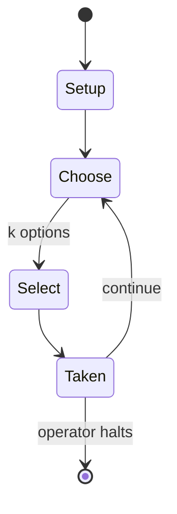

# Buzkashi

`buzkashi` &nbsp; state: **DEEPENED** &nbsp; method: **heuristic**

## Found layer (recorded, not trusted)

| field | value |
| --- | --- |
| wikidata | Q745218 |
| wikipedia | Buzkashi |
| genres (source) | -- |
| instance of (source) | -- |
| country of origin | -- |

## Declared layer (orders bench work)

| field | value |
| --- | --- |
| year created | -- |
| epoch | -- |
| region | -- |
| media | SPORT |
| players | -- |
| age band | -- |
| exogenous process | NONE |
| loss shape | OPPORTUNITY_ONLY |
| live axes | COMMIT_BLIND, ORDER, SELECT |
| horizon | OPEN_ENDED |
| scoring shape | -- |
| information | SIMULTANEOUS |
| interaction | SOLITAIRE |
| turn structure | -- |
| tractability | SAMPLING_ONLY |
| randomness | SIMULTANEOUS_CHOICE |
| luck factor | 0.35 |
| rules complexity | 2.01 |
| strategic depth | 2.25 |
| novelty | 0.398 |
| solved status | -- |
| strategies | memory_recall |
| algorithms | -- |

## Object model

```
Episode
  players      : ?
  turn_structure: ?
  horizon       : OPEN_ENDED
  scoring       : ?

Pitch          -- bounded physical region
Player         -- embodied agent with a foul count
Clock          -- counts down; stoppages are rule events
Official       -- detects infractions and applies penalties
SealedChoice   -- irrevocable choice made without observation
Sequence       -- the permutation under the player's control
OptionSet      -- the choices available after an exogenous draw
```

## State transition diagram



## Research item -- turn trace

```
# Buzkashi -- simulated turn events
# generated from the DECLARED vector, not from a rulebook.
# structure: exo=NONE loss=OPPORTUNITY_ONLY horizon=OPEN_ENDED scoring=None axes=COMMIT_BLIND,ORDER,SELECT

t=0    SETUP        players=2  pot=0  capacity=8
t=1    SELECT       p1 1 options; take #1  (pot_gain=+2.5, capacity=-0)
t=2    SELECT       p1 1 options; take #1  (pot_gain=+0.7, capacity=-0)
t=3    SELECT       p1 4 options; take #1  (pot_gain=+2.5, capacity=-2)
t=4    SELECT       p1 1 options; take #1  (pot_gain=+3.1, capacity=-0)
t=5    SELECT       p1 3 options; take #3  (pot_gain=+1.8, capacity=-1)
t=6    ENDTURN      turn passes to p2
t=7    SELECT       p2 2 options; take #2  (pot_gain=+3.1, capacity=-1)
t=8    ENDTURN      turn passes to p1
t=9    SELECT       p1 2 options; take #1  (pot_gain=+2.0, capacity=-1)
t=10   SELECT       p1 4 options; take #4  (pot_gain=+2.4, capacity=-2)
t=11   SELECT       p1 1 options; take #1  (pot_gain=+0.5, capacity=-0)
t=12   SELECT       p1 3 options; take #2  (pot_gain=+2.3, capacity=-1)
t=13   SELECT       p1 2 options; take #2  (pot_gain=+2.0, capacity=-0)
t=14   SELECT       p1 2 options; take #1  (pot_gain=+2.6, capacity=-1)
t=15   SELECT       p1 2 options; take #2  (pot_gain=+0.8, capacity=-0)
t=16   ENDTURN      turn passes to p2
t=17   SELECT       p2 2 options; take #2  (pot_gain=+1.7, capacity=-0)
t=18   SELECT       p2 3 options; take #3  (pot_gain=+2.8, capacity=-2)
t=19   SELECT       p2 2 options; take #1  (pot_gain=+2.6, capacity=-1)
t=20   SELECT       p2 2 options; take #1  (pot_gain=+1.5, capacity=-1)
t=21   SELECT       p2 3 options; take #1  (pot_gain=+2.8, capacity=-2)
t=22   SELECT       p2 2 options; take #1  (pot_gain=+2.8, capacity=-2)
t=23   SELECT       p2 3 options; take #2  (pot_gain=+2.3, capacity=-2)
t=24   SELECT       p2 3 options; take #2  (pot_gain=+1.7, capacity=-1)
t=25   SELECT       p2 2 options; take #1  (pot_gain=+0.6, capacity=-0)
t=26   ENDTURN      turn passes to p1

terminal: OPEN_ENDED
```

## Conditions

| kind | threshold | effect | trigger |
| --- | --- | --- | --- |
| PENALTY | -- | -- | Whitney Azoy notes in his book Buzkashi: Game and Power in Afghanistan that "leaders are men who can seize control by means foul and fair and then fight off their rivals. |

## Source extract

Buzkashi (Persian: بزکشی, lit. 'goat pulling') is the national sport of Afghanistan. It is a
traditional sport in which horse-mounted players attempt to place a goat or calf carcass in a
goal. Similar games are known as kokpar, kupkari, and ulak tartysh in Uzbekistan and Kazakhstan.
== History == Buzkashi began among the nomadic Asian tribes who came from farther north and east
spreading westward from China and Mongolia between the 10th and 15th centuries in a centuries-
long series of migrations that ended only in the 1930s. From Scythian times until recent
decades, buzkashi has remained a legacy of that bygone era.   == Events == World Nomad Games
2013 - The first Asian championship in kokpar, or buzkashi. 2018 - The inaugural weeklong world
championship ended in Astana. 2026 - After a nine year hiatus, the second world championship was
played out in Turkistan.   == Distribution == Games similar to buzkashi are played today by
several Central Asian ethnic groups such as the Hazaras, Uzbeks, Kyrgyz, Turkmens, Kazakhs,
Uyghurs, Tajiks, Wakhis and Pashtuns. In the West, the game is also played by Kyrgyz who
migrated to Ulupamir village in the Van district of Turkey from the Pamir r

<sub>Wikipedia, CC BY-SA. Retained as evidence for the structural
classification above. Every rule inferred from it is HYPOTHESIZED
until audited against a rulebook.</sub>
