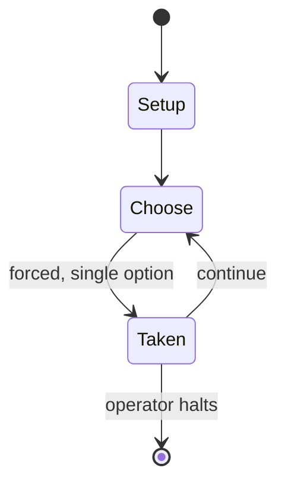

# C-Dogs

*arcade shoot-em-up computer game*

`c_dogs` &nbsp; state: **DEEPENED** &nbsp; method: **heuristic**

## Found layer (recorded, not trusted)

| field | value |
| --- | --- |
| wikidata | Q5005880 |
| wikipedia | C-Dogs |
| genres (source) | run and gun |
| instance of (source) | video game |
| country of origin | -- |

## Declared layer (orders bench work)

| field | value |
| --- | --- |
| year created | 1997 |
| epoch | DIGITAL |
| region | -- |
| media | VIDEO |
| players | -- |
| age band | -- |
| exogenous process | -- |
| loss shape | -- |
| live axes | - |
| horizon | OPEN_ENDED |
| scoring shape | -- |
| information | -- |
| interaction | COOPERATIVE |
| turn structure | -- |
| tractability | SAMPLING_ONLY |
| randomness | -- |
| luck factor | 0.35 |
| rules complexity | 1.71 |
| strategic depth | 2.0 |
| novelty | 0.6406 |
| solved status | -- |
| strategies | -- |
| algorithms | -- |

## Object model

```
Episode
  players      : ?
  turn_structure: ?
  horizon       : OPEN_ENDED
  scoring       : ?

WorldState     -- simulation state advanced by the engine
Avatar         -- player-controlled agent
Clock          -- frame or tick counter
```

## State transition diagram



## Research item -- turn trace

```
# C-Dogs -- simulated turn events
# generated from the DECLARED vector, not from a rulebook.
# structure: exo=None loss=None horizon=OPEN_ENDED scoring=None axes=-

t=0    SETUP        players=2  pot=0  capacity=7
t=1    FORCED       p1 single legal option taken (pot_gain=+1.1)
t=2    ENDTURN      turn passes to p2
t=3    FORCED       p2 single legal option taken (pot_gain=+0.6)
t=4    FORCED       p2 single legal option taken (pot_gain=+2.0)
t=5    FORCED       p2 single legal option taken (pot_gain=+1.9)
t=6    FORCED       p2 single legal option taken (pot_gain=+1.9)
t=7    ENDTURN      turn passes to p1
t=8    FORCED       p1 single legal option taken (pot_gain=+1.7)
t=9    FORCED       p1 single legal option taken (pot_gain=+0.9)
t=10   FORCED       p1 single legal option taken (pot_gain=+1.3)
t=11   FORCED       p1 single legal option taken (pot_gain=+0.8)
t=12   FORCED       p1 single legal option taken (pot_gain=+1.3)
t=13   FORCED       p1 single legal option taken (pot_gain=+0.9)
t=14   ENDTURN      turn passes to p2
t=15   FORCED       p2 single legal option taken (pot_gain=+1.9)
t=16   ENDTURN      turn passes to p1
t=17   FORCED       p1 single legal option taken (pot_gain=+1.8)
t=18   FORCED       p1 single legal option taken (pot_gain=+1.5)
t=19   FORCED       p1 single legal option taken (pot_gain=+0.5)
t=20   ENDTURN      turn passes to p2
t=21   FORCED       p2 single legal option taken (pot_gain=+0.7)
t=22   FORCED       p2 single legal option taken (pot_gain=+1.1)
t=23   FORCED       p2 single legal option taken (pot_gain=+0.5)
t=24   FORCED       p2 single legal option taken (pot_gain=+0.6)
t=25   FORCED       p2 single legal option taken (pot_gain=+1.4)
t=26   FORCED       p2 single legal option taken (pot_gain=+0.9)
t=27   ENDTURN      turn passes to p1

terminal: OPEN_ENDED
```

## Source extract

C-Dogs, the sequel to Cyberdogs, is a shoot 'em up video game where players work cooperatively
during missions and against each other in "dogfight" deathmatch mode.   == Gameplay ==  In
C-Dogs, players play through a number of campaigns made of a variable number of missions. Each
mission has a selection of weapons and different objectives, such as killing enemies, collecting
items, destroying objects, or rescuing a hostages. The campaigns can be played by a single
player or with one cooperative player. Other features include color-coded keys to access locked
rooms, friendly characters, and neutral civilians that penalize the players if attacked. C-Dogs
also includes a 2-player, split-screen deathmatch mode called "dogfight": players attempt to
kill each other for a fixed number of rounds, and the player winning the most rounds wins.
Players can be controlled by keyboard, joysticks or gamepads. Compared to Cyberdogs, C-Dogs
includes the following enhancements:  Multiple campaigns - 5 included, with user-created
missions available for download online. Missions also include short story-driven briefings.
Different level layouts Deathmatch mode More NPC types: friendlies that attack ene

<sub>Wikipedia, CC BY-SA. Retained as evidence for the structural
classification above. Every rule inferred from it is HYPOTHESIZED
until audited against a rulebook.</sub>
