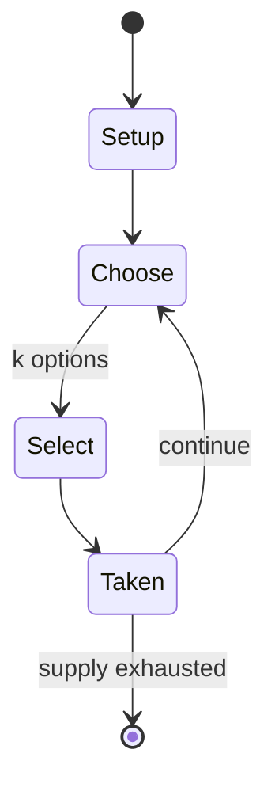

# C-evo

*1999 video game*

`c_evo` &nbsp; state: **DEEPENED** &nbsp; method: **heuristic**

## Found layer (recorded, not trusted)

| field | value |
| --- | --- |
| wikidata | Q1022328 |
| wikipedia | C-evo |
| genres (source) | 4X, turn-based strategy video game |
| instance of (source) | source-available software, video game |
| country of origin | Germany |

## Declared layer (orders bench work)

| field | value |
| --- | --- |
| year created | 1999 |
| epoch | DIGITAL |
| region | EUROPE_WEST |
| media | VIDEO |
| players | -- |
| age band | -- |
| exogenous process | -- |
| loss shape | -- |
| live axes | NEGOTIATE, SELECT |
| horizon | -- |
| scoring shape | -- |
| information | -- |
| interaction | NEGOTIATION |
| turn structure | -- |
| tractability | SAMPLING_ONLY |
| randomness | -- |
| luck factor | 0.35 |
| rules complexity | 3.29 |
| strategic depth | 2.25 |
| novelty | 0.5117 |
| solved status | -- |
| strategies | coalition_forming |
| algorithms | -- |

## Object model

```
Episode
  players      : ?
  turn_structure: ?
  horizon       : ?
  scoring       : ?

WorldState     -- simulation state advanced by the engine
Avatar         -- player-controlled agent
Clock          -- frame or tick counter
Agreement      -- non-binding or binding commitment between agents
OptionSet      -- the choices available after an exogenous draw
```

## State transition diagram



## Research item -- turn trace

```
# C-evo -- simulated turn events
# generated from the DECLARED vector, not from a rulebook.
# structure: exo=None loss=None horizon=None scoring=None axes=NEGOTIATE,SELECT

t=0    SETUP        players=2  pot=0  capacity=3
t=1    SELECT       p1 1 options; take #1  (pot_gain=+3.4, capacity=-0)
t=2    SELECT       p1 4 options; take #2  (pot_gain=+2.2, capacity=-2)
t=3    SELECT       p1 3 options; take #1  (pot_gain=+1.9, capacity=-1)
t=4    SELECT       p1 2 options; take #2  (pot_gain=+1.9, capacity=-0)
t=5    SELECT       p1 4 options; take #4  (pot_gain=+0.5, capacity=-0)
t=6    ENDTURN      turn passes to p2
t=7    SELECT       p2 4 options; take #1  (pot_gain=+0.8, capacity=-1)
t=8    SELECT       p2 1 options; take #1  (pot_gain=+1.5, capacity=-0)
t=9    SELECT       p2 1 options; take #1  (pot_gain=+3.0, capacity=-0)
t=10   SELECT       p2 1 options; take #1  (pot_gain=+0.6, capacity=-2)
t=11   SELECT       p2 2 options; take #2  (pot_gain=+1.7, capacity=-1)
t=12   SELECT       p2 1 options; take #1  (pot_gain=+1.9, capacity=-0)
t=13   SELECT       p2 2 options; take #2  (pot_gain=+2.2, capacity=-0)
t=14   SELECT       p2 4 options; take #2  (pot_gain=+2.1, capacity=-1)
t=15   SELECT       p2 1 options; take #1  (pot_gain=+1.4, capacity=-2)
t=16   SELECT       p2 4 options; take #4  (pot_gain=+1.6, capacity=-1)
t=17   SELECT       p2 1 options; take #1  (pot_gain=+2.0, capacity=-0)
t=18   SELECT       p2 1 options; take #1  (pot_gain=+3.2, capacity=-1)
t=19   SELECT       p2 4 options; take #4  (pot_gain=+0.9, capacity=-1)
t=20   ENDTURN      turn passes to p1
t=21   SELECT       p1 2 options; take #1  (pot_gain=+1.5, capacity=-2)
t=22   SELECT       p1 3 options; take #1  (pot_gain=+2.4, capacity=-0)
t=23   SELECT       p1 4 options; take #1  (pot_gain=+2.7, capacity=-0)
t=24   SELECT       p1 1 options; take #1  (pot_gain=+2.0, capacity=-0)
t=25   SELECT       p1 2 options; take #1  (pot_gain=+3.3, capacity=-2)
t=26   SELECT       p1 2 options; take #2  (pot_gain=+0.6, capacity=-0)

terminal: VARIABLE
```

## Conditions

| kind | threshold | effect | trigger |
| --- | --- | --- | --- |
| TERMINATE | -- | -- | The game starts with the development of primitive technologies such as the wheel, and ends when the first player has successfully constructed an spaceship going to outer space. |

## Source extract

C-evo is a free turn-based strategy computer game whose source code is in the public domain by
German programmer and designer Steffen Gerlach. It was written in Delphi and later ported to
Lazarus instead. C-evo is an empire building game based on Civilization II, but with a different
focus; it aims to be a pure "game" with all players playing to win, rather than the more
simulationist side of the Civilization series.  As a result, it is known for tough and
uncompromising artificial intelligence computer opponents; some of these AIs have been
contributed by the player base and are separately downloadable.   == Gameplay == C-evo is an
empire building game, dealing with the history of humans from antiquity into the future. This
includes aspects of exploration and expansion, war and diplomacy, cultivation and pollution,
industry and agriculture, research and administration.   Players must constantly make decisions
such as whether and where to build cities, roads, irrigation, fortresses, and whether to form an
alliance with a neighboring country or risk attacking it, and whether to devote scarce resources
to research, production, warfare, or the morale of the populace.  A successful pla

<sub>Wikipedia, CC BY-SA. Retained as evidence for the structural
classification above. Every rule inferred from it is HYPOTHESIZED
until audited against a rulebook.</sub>
