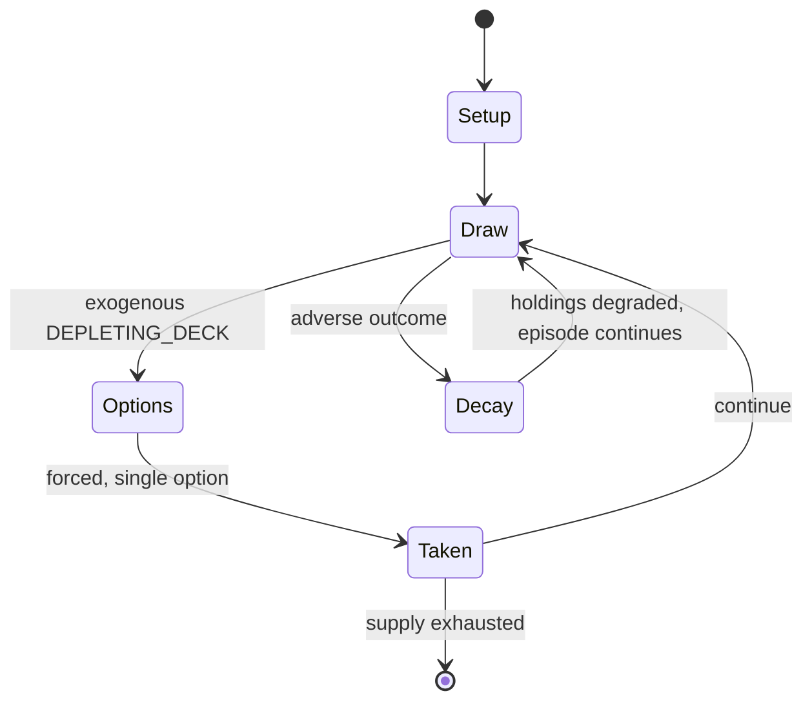

# Cabo

*commercial card game*

`cabo` &nbsp; state: **DEEPENED** &nbsp; method: **heuristic**

## Found layer (recorded, not trusted)

| field | value |
| --- | --- |
| wikidata | Q3514630 |
| wikipedia | Cabo (game) |
| genres (source) | -- |
| instance of (source) | card game |
| country of origin | -- |

## Declared layer (orders bench work)

| field | value |
| --- | --- |
| year created | 2019 |
| epoch | CONTEMPORARY |
| region | -- |
| media | CARD |
| players | 2-4 |
| age band | -- |
| exogenous process | DEPLETING_DECK |
| loss shape | PARTIAL_DECAY |
| live axes | DISCARD |
| horizon | -- |
| scoring shape | NEGATIVE_AVOIDANCE |
| information | -- |
| interaction | TRAITOR |
| turn structure | -- |
| tractability | EXACT_WITH_CUT |
| randomness | DECK_SHUFFLE, HIDDEN_INFO |
| luck factor | 0.53 |
| rules complexity | 2.09 |
| strategic depth | 1.95 |
| novelty | 0.7795 |
| solved status | -- |
| strategies | -- |
| algorithms | -- |

## Object model

```
Episode
  players      : 2-4
  turn_structure: ?
  horizon       : ?
  scoring       : NEGATIVE_AVOIDANCE

Deck           -- ordered multiset, drawn without replacement
Hand           -- private multiset held by one player
DiscardPile    -- public accumulation of spent cards
DiscardChoice  -- what is given up to satisfy a limit
```

## State transition diagram



## Research item -- turn trace

```
# Cabo -- simulated turn events
# generated from the DECLARED vector, not from a rulebook.
# structure: exo=DEPLETING_DECK loss=PARTIAL_DECAY horizon=None scoring=NEGATIVE_AVOIDANCE axes=DISCARD

t=0    SETUP        players=2  pot=0  capacity=7
t=1    DRAW         p1 draw from deck -> outcome #6  (p=0.092)
t=2    FORCED       p1 single legal option taken (pot_gain=+0.8)
t=3    DISCARD      p1 discards to hand limit
t=4    DRAW         p1 draw from deck -> outcome #1  (p=0.292)
t=5    FORCED       p1 single legal option taken (pot_gain=+1.7)
t=6    DRAW         p1 draw from deck -> outcome #3  (p=0.002)
t=7    FORCED       p1 single legal option taken (pot_gain=+0.9)
t=8    DISCARD      p1 discards to hand limit
t=9    DRAW         p1 draw from deck -> outcome #1  (p=0.049)
t=10   FORCED       p1 single legal option taken (pot_gain=+1.1)
t=11   DRAW         p1 draw from deck -> outcome #6  (p=0.031)
t=12   FORCED       p1 single legal option taken (pot_gain=+0.8)
t=13   DISCARD      p1 discards to hand limit
t=14   ENDTURN      turn passes to p2
t=15   DRAW         p2 draw from deck -> outcome #4  (p=0.173)
t=16   FORCED       p2 single legal option taken (pot_gain=+1.6)
t=17   DISCARD      p2 discards to hand limit
t=18   DRAW         p2 draw from deck -> outcome #3  (p=0.294)
t=19   FORCED       p2 single legal option taken (pot_gain=+1.8)
t=20   ENDTURN      turn passes to p1
t=21   DRAW         p1 draw from deck -> outcome #1  (p=0.280)
t=22   FORCED       p1 single legal option taken (pot_gain=+1.9)
t=23   DRAW         p1 draw from deck -> outcome #1  (p=0.238)
t=24   FORCED       p1 single legal option taken (pot_gain=+1.4)
t=25   DISCARD      p1 discards to hand limit
t=26   DRAW         p1 draw from deck -> outcome #1  (p=0.266)
t=27   FORCED       p1 single legal option taken (pot_gain=+1.4)

terminal: VARIABLE
```

## Conditions

| kind | threshold | effect | trigger |
| --- | --- | --- | --- |
| PENALTY | 10 point | -- | 10 point penalty for missing a cabo call (instead of 5) |
| TERMINATE | -- | -- | The round ends after a call or when the deck runs out (instead of just when Cabo is called) |
| BOUNDARY | -- | -- | Limit of one reset to 50 when your score = 100 exactly (instead of unlimited resets) |
| PENALTY | -- | -- | Penalty for non-matching cards: Keep all cards including the one drawn — one more per additional cards that do not match (instead of no penalty) |
| PENALTY | -- | -- | A penalty for failing to match cards in an exchange |

## Source extract

Cabo is a 2010 card game by Melissa Limes and Mandy Henning that  involves memory and
manipulation based on the classic Golf card game and is similar to Rat-a-Tat Cat (1995). The
game uses a dedicated deck of cards with each suit numbered from 0 to 13, and certain numbers
being marked as "Peek", "Spy" or "Swap". The objective of the game is for each player to
minimize the sum of their own cards, four of which are played face-down to the table at the
start of a round. Face-down cards may be revealed and swapped by card effects. Cabo combines
elements from shedding and matching type card games. It is similar to the traditional card game
Golf and the 1995 Mensa Select award-winner Rat-a-Tat Cat. Cabo can also be played with a
standard playing card deck, and goes under names including Cambio, Pablo and Cactus.   ==
Gameplay == Each player is dealt 4 cards, face down. After each deal, players may peek at any 2
of their own cards. In clockwise order, players do any of three things:  pick a card from the
draw pile, and either keep the card (placing one of their own cards on the discard pile) or
discard it (if the card drawn and discarded is a choice card, the choice card can be used if so

<sub>Wikipedia, CC BY-SA. Retained as evidence for the structural
classification above. Every rule inferred from it is HYPOTHESIZED
until audited against a rulebook.</sub>
