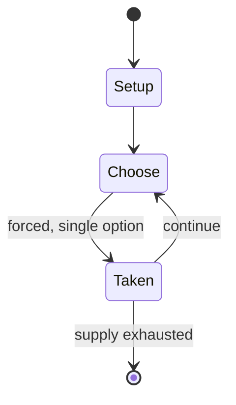

# Café International

*board game*

`caf_international` &nbsp; state: **DEEPENED** &nbsp; method: **heuristic**

## Found layer (recorded, not trusted)

| field | value |
| --- | --- |
| wikidata | Q1025620 |
| wikipedia | Café International |
| genres (source) | -- |
| instance of (source) | board game |
| country of origin | -- |

## Declared layer (orders bench work)

| field | value |
| --- | --- |
| year created | -- |
| epoch | -- |
| region | -- |
| media | BOARD, TILE |
| players | -- |
| age band | -- |
| exogenous process | -- |
| loss shape | -- |
| live axes | - |
| horizon | -- |
| scoring shape | LINEAR_ACCUMULATION |
| information | -- |
| interaction | -- |
| turn structure | -- |
| tractability | SAMPLING_ONLY |
| randomness | -- |
| luck factor | 0.35 |
| rules complexity | 1.74 |
| strategic depth | 2.0 |
| novelty | 0.4992 |
| solved status | -- |
| strategies | -- |
| algorithms | -- |

## Object model

```
Episode
  players      : ?
  turn_structure: ?
  horizon       : ?
  scoring       : LINEAR_ACCUMULATION

Board          -- spatial substrate; cells carry position and occupancy
Piece          -- movable token owned by a player
TileBag        -- unordered draw source
Layout         -- placed tiles and their adjacencies
```

## State transition diagram



## Research item -- turn trace

```
# Café International -- simulated turn events
# generated from the DECLARED vector, not from a rulebook.
# structure: exo=None loss=None horizon=None scoring=LINEAR_ACCUMULATION axes=-

t=0    SETUP        players=2  pot=0  capacity=5
t=1    FORCED       p1 single legal option taken (pot_gain=+0.9)
t=2    FORCED       p1 single legal option taken (pot_gain=+1.0)
t=3    FORCED       p1 single legal option taken (pot_gain=+2.0)
t=4    FORCED       p1 single legal option taken (pot_gain=+0.7)
t=5    FORCED       p1 single legal option taken (pot_gain=+1.0)
t=6    FORCED       p1 single legal option taken (pot_gain=+0.9)
t=7    FORCED       p1 single legal option taken (pot_gain=+0.5)
t=8    ENDTURN      turn passes to p2
t=9    FORCED       p2 single legal option taken (pot_gain=+1.0)
t=10   ENDTURN      turn passes to p1
t=11   FORCED       p1 single legal option taken (pot_gain=+1.1)
t=12   ENDTURN      turn passes to p2
t=13   FORCED       p2 single legal option taken (pot_gain=+0.6)
t=14   FORCED       p2 single legal option taken (pot_gain=+1.4)
t=15   ENDTURN      turn passes to p1
t=16   FORCED       p1 single legal option taken (pot_gain=+1.9)
t=17   FORCED       p1 single legal option taken (pot_gain=+1.6)
t=18   ENDTURN      turn passes to p2
t=19   FORCED       p2 single legal option taken (pot_gain=+1.3)
t=20   FORCED       p2 single legal option taken (pot_gain=+0.6)
t=21   ENDTURN      turn passes to p1
t=22   FORCED       p1 single legal option taken (pot_gain=+1.4)
t=23   FORCED       p1 single legal option taken (pot_gain=+0.9)
t=24   FORCED       p1 single legal option taken (pot_gain=+1.4)
t=25   ENDTURN      turn passes to p2
t=26   FORCED       p2 single legal option taken (pot_gain=+0.5)
t=27   ENDTURN      turn passes to p1

terminal: VARIABLE
```

## Conditions

| kind | threshold | effect | trigger |
| --- | --- | --- | --- |
| WIN | -- | -- | The player who has accumulated the most points is the winner. |
| TERMINATE | -- | -- | The game ends immediately when any one of four situations occurs: |

## Source extract

Café International is a 1989 tile-laying board game created by Rudi Hoffmann that won the Spiel
des Jahres in 1989.   == History == The game was designed by Rudi Hoffman, and was published in
1989 by Mattel. It was re-released in 1998 by Relaxx, and then by Amigo in 1999.   == The game
==   === Components === 100 tiles  representing 96 "customers": four men and four women from 12
countries (Central African Republic, China, Cuba, France, Germany, India, Italy, Russia, Spain,
Turkey, United Kingdom and United States), plus four jokers (wild cards) a board with 24
different tables. Each table has a specific nationality that is allowed to sit there, but some
chairs are shared between two tables, allowing two nationalities to sit at either linked table.
coloured chips to keep track of scores a bag to hold the tiles   === Setup === The tiles are
placed in the bag, and each player draws five customer tiles at random from the bag, and places
them face up on the table. This becomes the player's hand, and is always visible to the other
players.   === Gameplay === Each player must seat a customer at a table in the cafe, but only at
a table representing the customer's nationality, and keeping

<sub>Wikipedia, CC BY-SA. Retained as evidence for the structural
classification above. Every rule inferred from it is HYPOTHESIZED
until audited against a rulebook.</sub>
