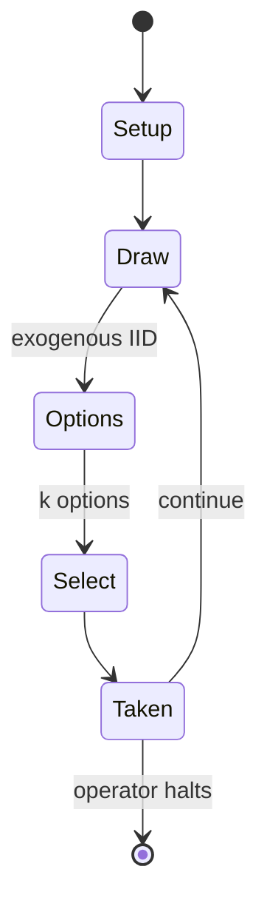

# Call of Cthulhu

*Tabletop horror role-playing game*

`call_of_cthulhu` &nbsp; state: **DEEPENED** &nbsp; method: **heuristic**

## Found layer (recorded, not trusted)

| field | value |
| --- | --- |
| wikidata | Q1027121 |
| wikipedia | Call of Cthulhu (role-playing game) |
| genres (source) | Lovecraftian horror |
| instance of (source) | group of works, tabletop role-playing game, tabletop role-playing game family |
| country of origin | United States |

## Declared layer (orders bench work)

| field | value |
| --- | --- |
| year created | 1981 |
| epoch | DIGITAL |
| region | NORTH_AMERICA |
| media | BOARD, RPG |
| players | -- |
| age band | -- |
| exogenous process | IID |
| loss shape | -- |
| live axes | SELECT |
| horizon | OPEN_ENDED |
| scoring shape | SURVIVAL |
| information | -- |
| interaction | COMPETITIVE |
| turn structure | -- |
| tractability | SAMPLING_ONLY |
| randomness | DICE |
| luck factor | 0.58 |
| rules complexity | 3.12 |
| strategic depth | 2.37 |
| novelty | 0.5665 |
| solved status | -- |
| strategies | probability_estimation, signalling |
| algorithms | -- |

## Object model

```
Episode
  players      : ?
  turn_structure: ?
  horizon       : OPEN_ENDED
  scoring       : SURVIVAL

Board          -- spatial substrate; cells carry position and occupancy
Piece          -- movable token owned by a player
Character      -- persistent stat block owned by a player
GameMaster     -- adjudicating agent outside the scoring loop
Scenario       -- authored state the players traverse
OptionSet      -- the choices available after an exogenous draw
```

## State transition diagram



## Research item -- turn trace

```
# Call of Cthulhu -- simulated turn events
# generated from the DECLARED vector, not from a rulebook.
# structure: exo=IID loss=None horizon=OPEN_ENDED scoring=SURVIVAL axes=SELECT

t=0    SETUP        players=2  pot=0  capacity=3
t=1    DRAW         p1 roll from d6 pool -> outcome #3  (p=0.139)
t=2    SELECT       p1 1 options; take #1  (pot_gain=+2.6, capacity=-0)
t=3    DRAW         p1 roll from d6 pool -> outcome #3  (p=0.242)
t=4    SELECT       p1 3 options; take #3  (pot_gain=+0.9, capacity=-2)
t=5    DRAW         p1 roll from d6 pool -> outcome #6  (p=0.186)
t=6    SELECT       p1 1 options; take #1  (pot_gain=+3.1, capacity=-2)
t=7    DRAW         p1 roll from d6 pool -> outcome #3  (p=0.019)
t=8    SELECT       p1 1 options; take #1  (pot_gain=+0.7, capacity=-2)
t=9    DRAW         p1 roll from d6 pool -> outcome #1  (p=0.078)
t=10   SELECT       p1 2 options; take #1  (pot_gain=+1.0, capacity=-1)
t=11   DRAW         p1 roll from d6 pool -> outcome #6  (p=0.275)
t=12   SELECT       p1 2 options; take #1  (pot_gain=+2.9, capacity=-0)
t=13   DRAW         p1 roll from d6 pool -> outcome #1  (p=0.230)
t=14   SELECT       p1 1 options; take #1  (pot_gain=+2.2, capacity=-0)
t=15   DRAW         p1 roll from d6 pool -> outcome #6  (p=0.199)
t=16   SELECT       p1 1 options; take #1  (pot_gain=+1.7, capacity=-2)
t=17   DRAW         p1 roll from d6 pool -> outcome #6  (p=0.300)
t=18   SELECT       p1 1 options; take #1  (pot_gain=+2.6, capacity=-1)
t=19   DRAW         p1 roll from d6 pool -> outcome #3  (p=0.234)
t=20   SELECT       p1 2 options; take #1  (pot_gain=+1.5, capacity=-0)
t=21   DRAW         p1 roll from d6 pool -> outcome #6  (p=0.019)
t=22   SELECT       p1 4 options; take #1  (pot_gain=+0.9, capacity=-2)
t=23   DRAW         p1 roll from d6 pool -> outcome #6  (p=0.031)
t=24   SELECT       p1 3 options; take #3  (pot_gain=+0.9, capacity=-0)
t=25   DRAW         p1 roll from d6 pool -> outcome #5  (p=0.137)
t=26   SELECT       p1 2 options; take #2  (pot_gain=+2.7, capacity=-1)

terminal: OPEN_ENDED
```

## Conditions

| kind | threshold | effect | trigger |
| --- | --- | --- | --- |
| BOUNDARY | -- | -- | Among the stretch goals was the second $50 expansion, devoted to the Mythos, with miniatures such as Cultists, Deep Ones, Mi'Go, and an extra $15 Shub-Niggurath "miniature" (it is, at least, 6x4 squares). |
| PENALTY | -- | -- | In this work, the characters come upon a secret society's foul plot to destroy mankind, and pursue it first near to home and then in a series of exotic locations. |

## Source extract

Call of Cthulhu is a horror fiction role-playing game based on H. P. Lovecraft's story of the
same name and the associated Cthulhu Mythos. The game, often abbreviated as CoC, is published by
Chaosium and was originally created by Sandy Petersen; it was first released in 1981 and is in
its seventh edition, with licensed foreign language editions available as well. Its game system
is based on Chaosium's Basic Role-Playing (BRP) with additions for the horror genre. These
include special rules for sanity and luck. It is one of the longest-running tabletop role-
playing games still in publication. In Call of Cthulhu, players control ordinary people:
investigators, typically in the game's default historical 1920s setting, seeking to solve and
uncover paranormal mysteries, usually linked to the Cthulhu Mythos, and survive its deadly
creatures that are harmful to their lives and the human psyche. At its release in 1981, the game
was notable for its emphasis on psychological horror, investigation, and character vulnerability
rather than combat and heroic adventures, departing from the conventions of many contemporary
role-playing games. Widely regarded as a pioneering horror role-playing gam

<sub>Wikipedia, CC BY-SA. Retained as evidence for the structural
classification above. Every rule inferred from it is HYPOTHESIZED
until audited against a rulebook.</sub>
