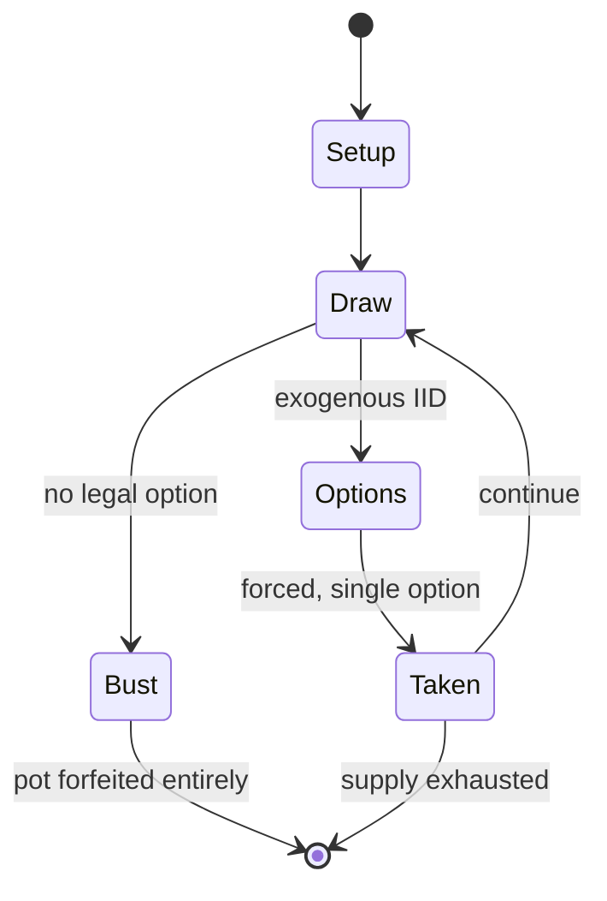

# Can't Stop (board game)

`can_t_stop_board_game` &nbsp; state: **DEEPENED** &nbsp; method: **heuristic**

## Found layer (recorded, not trusted)

| field | value |
| --- | --- |
| wikidata | Q1034057 |
| wikipedia | Can't Stop (board game) |
| genres (source) | -- |
| instance of (source) | -- |
| country of origin | -- |

## Declared layer (orders bench work)

| field | value |
| --- | --- |
| year created | 1980 |
| epoch | DIGITAL |
| region | -- |
| media | BOARD, DICE |
| players | -- |
| age band | -- |
| exogenous process | IID |
| loss shape | TOTAL_RUIN |
| live axes | - |
| horizon | -- |
| scoring shape | SET_COLLECTION_CONVEX |
| information | -- |
| interaction | COMPETITIVE |
| turn structure | -- |
| tractability | EXACT_WITH_CUT |
| randomness | DICE |
| luck factor | 0.58 |
| rules complexity | 1.89 |
| strategic depth | 2.12 |
| novelty | 0.728 |
| solved status | -- |
| strategies | set_collection |
| algorithms | -- |

## Object model

```
Episode
  players      : ?
  turn_structure: ?
  horizon       : ?
  scoring       : SET_COLLECTION_CONVEX

Board          -- spatial substrate; cells carry position and occupancy
Piece          -- movable token owned by a player
DicePool       -- n dice, each an iid categorical draw
Roll           -- realised outcome of a pool
```

## State transition diagram



## Research item -- turn trace

```
# Can't Stop (board game) -- simulated turn events
# generated from the DECLARED vector, not from a rulebook.
# structure: exo=IID loss=TOTAL_RUIN horizon=None scoring=SET_COLLECTION_CONVEX axes=-

t=0    SETUP        players=2  pot=0  capacity=6
t=1    DRAW         p1 roll from d6 pool -> outcome #3  (p=0.173)
t=2    FORCED       p1 single legal option taken (pot_gain=+1.6)
t=3    DRAW         p1 roll from d6 pool -> outcome #1  (p=0.253)
t=4    FORCED       p1 single legal option taken (pot_gain=+1.3)
t=5    DRAW         p1 roll from d6 pool -> outcome #5  (p=0.000)
t=6    DEATH        p1 no legal option -- BUST. pot 2.9 -> 0.0
t=7    NOTE         loss_shape=TOTAL_RUIN: entire pot forfeited

terminal: VARIABLE
```

## Conditions

| kind | threshold | effect | trigger |
| --- | --- | --- | --- |
| WIN | 3 columns | -- | A player claims three columns to win the game. |

## Source extract

Can't Stop is a board game designed by Sid Sackson originally published by Parker Brothers in
1980; however, that edition has been long out of print in the United States. It was reprinted by
Face 2 Face Games in 2007. An iOS version was developed by Playdek and released in 2012. The
goal of the game is to "claim" (get to the top of) three of the columns before any of the other
players can. But the more that the player risks rolling the dice during a turn, the greater the
risk of losing the advances made during that turn.   == Equipment == The game equipment consists
of four dice, a board, a set of eleven markers for each player, and three neutral-colored
markers. The board consists of eleven columns of spaces, one column for each of the numbers 2
through 12.  The columns (respectively) have 3, 5, 7, 9, 11, 13, 11, 9, 7, 5 and 3 spaces each.
The number of spaces in each column roughly corresponds to the likelihood of rolling them on two
dice.   == Rules == On each turn, the player rolls the four dice, then divides them into two
pairs, adding up each pair. (For example, a player rolling a 1, 2, 3, and 6 could group them as
5 and 7, 4 and 8, or 3 and 9.) If the neutral markers are of

<sub>Wikipedia, CC BY-SA. Retained as evidence for the structural
classification above. Every rule inferred from it is HYPOTHESIZED
until audited against a rulebook.</sub>
