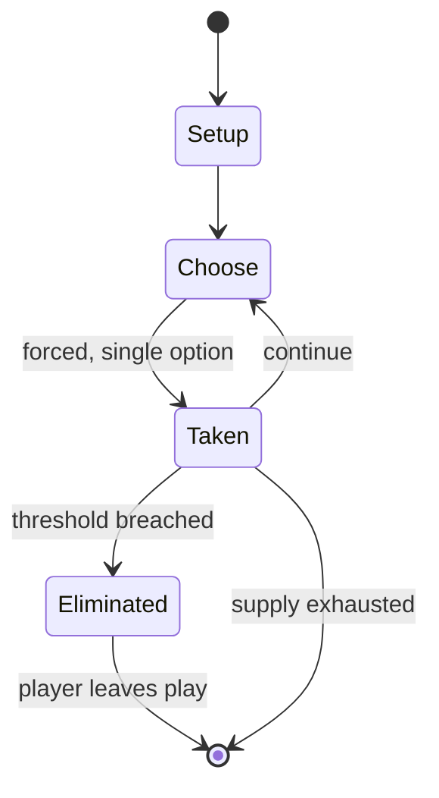

# Candy Crush Saga

`candy_crush_saga` &nbsp; state: **DEEPENED** &nbsp; method: **heuristic**

## Found layer (recorded, not trusted)

| field | value |
| --- | --- |
| wikidata | Q8768018 |
| wikipedia | Candy Crush Saga |
| genres (source) | -- |
| instance of (source) | -- |
| country of origin | -- |

## Declared layer (orders bench work)

| field | value |
| --- | --- |
| year created | 2012 |
| epoch | CONTEMPORARY |
| region | -- |
| media | BOARD, DEXTERITY, VIDEO |
| players | -- |
| age band | -- |
| exogenous process | -- |
| loss shape | ELIMINATION |
| live axes | ORDER, SPATIAL |
| horizon | -- |
| scoring shape | SET_COLLECTION_CONVEX |
| information | -- |
| interaction | TEAM |
| turn structure | -- |
| tractability | SAMPLING_ONLY |
| randomness | -- |
| luck factor | 0.35 |
| rules complexity | 2.98 |
| strategic depth | 2.25 |
| novelty | 0.5401 |
| solved status | -- |
| strategies | set_collection |
| algorithms | -- |

## Object model

```
Episode
  players      : ?
  turn_structure: ?
  horizon       : ?
  scoring       : SET_COLLECTION_CONVEX

Board          -- spatial substrate; cells carry position and occupancy
Piece          -- movable token owned by a player
WorldState     -- simulation state advanced by the engine
Avatar         -- player-controlled agent
Clock          -- frame or tick counter
Sequence       -- the permutation under the player's control
Placement      -- position subject to geometric legality
```

## State transition diagram



## Research item -- turn trace

```
# Candy Crush Saga -- simulated turn events
# generated from the DECLARED vector, not from a rulebook.
# structure: exo=None loss=ELIMINATION horizon=None scoring=SET_COLLECTION_CONVEX axes=ORDER,SPATIAL

t=0    SETUP        players=2  pot=0  capacity=5
t=1    FORCED       p1 single legal option taken (pot_gain=+1.9)
t=2    ENDTURN      turn passes to p2
t=3    FORCED       p2 single legal option taken (pot_gain=+1.5)
t=4    FORCED       p2 single legal option taken (pot_gain=+1.5)
t=5    FORCED       p2 single legal option taken (pot_gain=+1.7)
t=6    SPATIAL      p2 places at (4,4); adjacency legal
t=7    ENDTURN      turn passes to p1
t=8    FORCED       p1 single legal option taken (pot_gain=+1.3)
t=9    SPATIAL      p1 places at (2,0); adjacency legal
t=10   FORCED       p1 single legal option taken (pot_gain=+1.9)
t=11   FORCED       p1 single legal option taken (pot_gain=+1.4)
t=12   SPATIAL      p1 places at (0,6); adjacency legal
t=13   FORCED       p1 single legal option taken (pot_gain=+1.0)
t=14   FORCED       p1 single legal option taken (pot_gain=+1.2)
t=15   ENDTURN      turn passes to p2
t=16   FORCED       p2 single legal option taken (pot_gain=+0.8)
t=17   SPATIAL      p2 places at (4,7); adjacency legal
t=18   FORCED       p2 single legal option taken (pot_gain=+1.4)
t=19   SPATIAL      p2 places at (6,2); adjacency legal
t=20   FORCED       p2 single legal option taken (pot_gain=+1.2)
t=21   FORCED       p2 single legal option taken (pot_gain=+0.7)
t=22   FORCED       p2 single legal option taken (pot_gain=+1.9)
t=23   SPATIAL      p2 places at (3,7); adjacency legal
t=24   FORCED       p2 single legal option taken (pot_gain=+0.6)
t=25   FORCED       p2 single legal option taken (pot_gain=+1.8)
t=26   SPATIAL      p2 places at (5,0); adjacency legal

terminal: VARIABLE
```

## Conditions

| kind | threshold | effect | trigger |
| --- | --- | --- | --- |
| ELIMINATE | -- | -- | In the game, players complete levels by swapping colored pieces of candy on a game board to make a match of three or more of the same color, eliminating those candies from the board and replacing them with new ones, whic |
| BOUNDARY | -- | -- | Candy Crush Saga is a "match three" game, where the core gameplay is based on swapping two adjacent candies among several on the gameboard to make a row or column of at least three matching-colored candies. |
| BOUNDARY | -- | -- | At certain points, primarily at the start of new "episodes", users must also either purchase or receive a request from at least three friends before they may access the next set of levels. |
| BOUNDARY | -- | -- | It was considered the most downloaded app from the Apple App Store, and had at least 6.7 million active users on a daily basis; the game had a daily revenue of $633,000 from the United States section of the iOS App Store |

## Source extract

Candy Crush Saga is a free-to-play tile-matching video game released by King on April 12, 2012,
originally for Facebook; other versions for iOS, Android, Windows Phone, and Windows 10
followed. It is a variation of their browser game Candy Crush. In the game, players complete
levels by swapping colored pieces of candy on a game board to make a match of three or more of
the same color, eliminating those candies from the board and replacing them with new ones, which
could potentially create further matches. Matches of four or more candies create unique candies
that act as power-ups with larger board-clearing abilities. Boards have various goals that must
be completed within a fixed number of moves, such as collecting a specific number of a type of
candy. The game uses a freemium model; while it can be played completely through without
spending money, players can buy special actions to help clear more difficult boards, from which
King makes its revenues—at its peak, the company was reportedly earning almost $1 million per
day. Around 2014, over 93 million people were playing Candy Crush Saga, while revenue over a
three-month period as reported by King was over $493 million. Five years

<sub>Wikipedia, CC BY-SA. Retained as evidence for the structural
classification above. Every rule inferred from it is HYPOTHESIZED
until audited against a rulebook.</sub>
