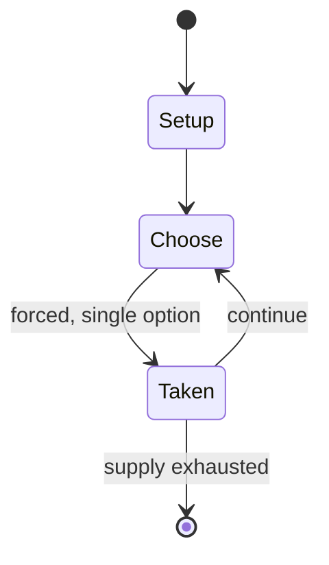

# Capablanca random chess

*chess variant*

`capablanca_random_chess` &nbsp; state: **DEEPENED** &nbsp; method: **heuristic**

## Found layer (recorded, not trusted)

| field | value |
| --- | --- |
| wikidata | Q1034183 |
| wikipedia | Capablanca random chess |
| genres (source) | -- |
| instance of (source) | chess variant |
| country of origin | -- |

## Declared layer (orders bench work)

| field | value |
| --- | --- |
| year created | -- |
| epoch | -- |
| region | -- |
| media | BOARD, MEMORY |
| players | -- |
| age band | -- |
| exogenous process | -- |
| loss shape | -- |
| live axes | - |
| horizon | -- |
| scoring shape | WINNER_TAKE_ALL |
| information | -- |
| interaction | -- |
| turn structure | -- |
| tractability | SAMPLING_ONLY |
| randomness | -- |
| luck factor | 0.35 |
| rules complexity | 1.9 |
| strategic depth | 2.8 |
| novelty | 0.5265 |
| solved status | -- |
| strategies | memory_recall, opening_theory |
| algorithms | opening_book |

## Object model

```
Episode
  players      : ?
  turn_structure: ?
  horizon       : ?
  scoring       : WINNER_TAKE_ALL

Board          -- spatial substrate; cells carry position and occupancy
Piece          -- movable token owned by a player
```

## State transition diagram



## Research item -- turn trace

```
# Capablanca random chess -- simulated turn events
# generated from the DECLARED vector, not from a rulebook.
# structure: exo=None loss=None horizon=None scoring=WINNER_TAKE_ALL axes=-

t=0    SETUP        players=2  pot=0  capacity=6
t=1    FORCED       p1 single legal option taken (pot_gain=+1.9)
t=2    FORCED       p1 single legal option taken (pot_gain=+1.1)
t=3    FORCED       p1 single legal option taken (pot_gain=+1.2)
t=4    FORCED       p1 single legal option taken (pot_gain=+0.8)
t=5    FORCED       p1 single legal option taken (pot_gain=+1.5)
t=6    FORCED       p1 single legal option taken (pot_gain=+0.7)
t=7    FORCED       p1 single legal option taken (pot_gain=+2.0)
t=8    FORCED       p1 single legal option taken (pot_gain=+1.5)
t=9    FORCED       p1 single legal option taken (pot_gain=+0.6)
t=10   FORCED       p1 single legal option taken (pot_gain=+1.4)
t=11   ENDTURN      turn passes to p2
t=12   FORCED       p2 single legal option taken (pot_gain=+1.3)
t=13   ENDTURN      turn passes to p1
t=14   FORCED       p1 single legal option taken (pot_gain=+1.3)
t=15   FORCED       p1 single legal option taken (pot_gain=+0.5)
t=16   ENDTURN      turn passes to p2
t=17   FORCED       p2 single legal option taken (pot_gain=+0.7)
t=18   FORCED       p2 single legal option taken (pot_gain=+1.8)
t=19   FORCED       p2 single legal option taken (pot_gain=+1.5)
t=20   FORCED       p2 single legal option taken (pot_gain=+1.1)
t=21   FORCED       p2 single legal option taken (pot_gain=+1.5)
t=22   FORCED       p2 single legal option taken (pot_gain=+1.6)
t=23   FORCED       p2 single legal option taken (pot_gain=+0.5)
t=24   FORCED       p2 single legal option taken (pot_gain=+0.6)
t=25   FORCED       p2 single legal option taken (pot_gain=+1.6)
t=26   ENDTURN      turn passes to p1

terminal: VARIABLE
```

## Conditions

| kind | threshold | effect | trigger |
| --- | --- | --- | --- |
| BOUNDARY | 1 piece | -- | Because of this, several chess variants postdating Capablanca chess were designed with initial arrangements where all pawns are protected by at least one piece; these include Universal chess, Grand Chess, Embassy chess,  |
| BOUNDARY | 1 piece | -- | All pawns in the starting positions must be protected by at least one piece. |
| PENALTY | -- | -- | If the player moves all his pieces from the first rank without placing one or both in hand pieces, he forfeits the right to do so. |

## Source extract

Capablanca chess, also called Knighted chess, is a family of over twenty Western chess variants
which incorporate two new pieces. The family includes Capablanca chess (usually played on a 10×8
board, but Capablanca preferred a 10×10 board), Seirawan chess (on a 8×8 board), Embassy chess,
Grand chess (10×10 board), and Gothic chess. The two new pieces combine the powers of knight
with that of bishop or rook, hence the term "knighted chess" as used by Cazaux & Knowlton. The
new compound pieces are the archbishop or princess  which combines moves of a bishop and a
knight, and the chancellor or empress which combines moves of a rook and a knight. These new
pieces (which go by various other names depending on the variant) allow new strategies and
possibilities that provide an interesting change to the game of chess while also retaining the
original style and aesthetic. For example, the archbishop by itself can checkmate a lone king in
a corner (when placed diagonally with one square in between). A few variants also add another
compound piece, the amazon (queen+knight).  The first knighted chess variant was introduced by
Italian chess player Pietro Carrera in his 1617 book Il Gioco de gl

<sub>Wikipedia, CC BY-SA. Retained as evidence for the structural
classification above. Every rule inferred from it is HYPOTHESIZED
until audited against a rulebook.</sub>
