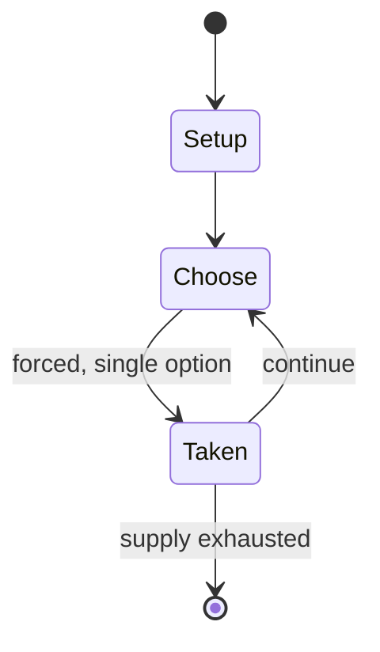

# Capitol

*board game*

`capitol` &nbsp; state: **DEEPENED** &nbsp; method: **heuristic**

## Found layer (recorded, not trusted)

| field | value |
| --- | --- |
| wikidata | Q1034689 |
| wikipedia | Capitol (board game) |
| genres (source) | -- |
| instance of (source) | board game |
| country of origin | -- |

## Declared layer (orders bench work)

| field | value |
| --- | --- |
| year created | 2001 |
| epoch | CONTEMPORARY |
| region | -- |
| media | BOARD, CARD |
| players | -- |
| age band | -- |
| exogenous process | -- |
| loss shape | -- |
| live axes | BID |
| horizon | -- |
| scoring shape | NONLINEAR |
| information | -- |
| interaction | -- |
| turn structure | PHASE_STRUCTURED |
| tractability | SAMPLING_ONLY |
| randomness | -- |
| luck factor | 0.35 |
| rules complexity | 2.77 |
| strategic depth | 2.0 |
| novelty | 0.6458 |
| solved status | -- |
| strategies | -- |
| algorithms | -- |

## Object model

```
Episode
  players      : ?
  turn_structure: PHASE_STRUCTURED
  horizon       : ?
  scoring       : NONLINEAR

Board          -- spatial substrate; cells carry position and occupancy
Piece          -- movable token owned by a player
Deck           -- ordered multiset, drawn without replacement
Hand           -- private multiset held by one player
DiscardPile    -- public accumulation of spent cards
Auction        -- priced competition resolving to one winner
```

## State transition diagram



## Research item -- turn trace

```
# Capitol -- simulated turn events
# generated from the DECLARED vector, not from a rulebook.
# structure: exo=None loss=None horizon=None scoring=NONLINEAR axes=BID

t=0    SETUP        players=2  pot=0  capacity=7
t=1    FORCED       p1 single legal option taken (pot_gain=+0.9)
t=2    ENDTURN      turn passes to p2
t=3    FORCED       p2 single legal option taken (pot_gain=+1.3)
t=4    BID          p2 sealed bid of 7 against 1 rivals
t=5    FORCED       p2 single legal option taken (pot_gain=+0.6)
t=6    BID          p2 sealed bid of 3 against 1 rivals
t=7    FORCED       p2 single legal option taken (pot_gain=+1.7)
t=8    FORCED       p2 single legal option taken (pot_gain=+1.0)
t=9    FORCED       p2 single legal option taken (pot_gain=+1.8)
t=10   FORCED       p2 single legal option taken (pot_gain=+1.4)
t=11   FORCED       p2 single legal option taken (pot_gain=+0.6)
t=12   BID          p2 sealed bid of 9 against 1 rivals
t=13   FORCED       p2 single legal option taken (pot_gain=+1.0)
t=14   ENDTURN      turn passes to p1
t=15   FORCED       p1 single legal option taken (pot_gain=+0.6)
t=16   FORCED       p1 single legal option taken (pot_gain=+1.6)
t=17   BID          p1 sealed bid of 6 against 1 rivals
t=18   FORCED       p1 single legal option taken (pot_gain=+1.7)
t=19   BID          p1 sealed bid of 4 against 1 rivals
t=20   FORCED       p1 single legal option taken (pot_gain=+1.7)
t=21   ENDTURN      turn passes to p2
t=22   FORCED       p2 single legal option taken (pot_gain=+1.2)
t=23   FORCED       p2 single legal option taken (pot_gain=+1.4)
t=24   FORCED       p2 single legal option taken (pot_gain=+1.1)
t=25   BID          p2 sealed bid of 4 against 1 rivals
t=26   FORCED       p2 single legal option taken (pot_gain=+1.9)

terminal: VARIABLE
```

## Conditions

| kind | threshold | effect | trigger |
| --- | --- | --- | --- |
| WIN | 4 rounds | -- | The player with the most points at the end of four rounds wins the game. |

## Source extract

Capitol is a German-style building game set in the ancient Roman Empire, designed by Aaron
Weissblum and Alan R. Moon. The game was published by Schmidt Spiele in 2001. It was redeveloped
into a quicker-playing card game named Clocktowers and published by Jolly Roger Games.   ==
Gameplay == Capitol is played in four rounds and each round is divided into four phases:
construction, improvement, scoring, and end phase. During the construction phase the players are
able to perform actions with their hand of building, roof, and permit cards.  Building cards
allow the player to take two floors (small wooden blocks). They can be added to an incomplete
building or used to create a new building. Roof cards allow the player to complete a building by
placing a round or triangular roof on their stack of floor blocks. Once the building is
complete, it can be placed onto the board with a permit card. The permit card comes in three
different types – pink, blue, and purple, each correlating to three sections of the board. Once
all the players have passed on playing cards, they then proceed to the improvement phase. This
is a very fast bidding phase in which players can win fountains, amphitheaters

<sub>Wikipedia, CC BY-SA. Retained as evidence for the structural
classification above. Every rule inferred from it is HYPOTHESIZED
until audited against a rulebook.</sub>
