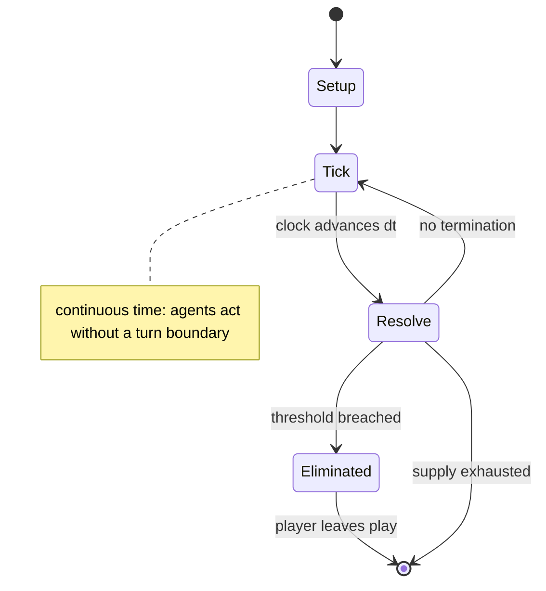

# Captain Sonar

`captain_sonar` &nbsp; state: **DEEPENED** &nbsp; method: **heuristic**

## Found layer (recorded, not trusted)

| field | value |
| --- | --- |
| wikidata | Q53768192 |
| wikipedia | Captain Sonar |
| genres (source) | -- |
| instance of (source) | -- |
| country of origin | -- |

## Declared layer (orders bench work)

| field | value |
| --- | --- |
| year created | 2017 |
| epoch | CONTEMPORARY |
| region | -- |
| media | BOARD |
| players | 2-4 |
| age band | -- |
| exogenous process | CONTINUOUS_TIME |
| loss shape | ELIMINATION |
| live axes | SELECT |
| horizon | -- |
| scoring shape | -- |
| information | ASYMMETRIC |
| interaction | TEAM |
| turn structure | REAL_TIME |
| tractability | SAMPLING_ONLY |
| randomness | REAL_TIME_PHYSICAL |
| luck factor | 0.3 |
| rules complexity | 1.73 |
| strategic depth | 2.0 |
| novelty | 0.7652 |
| solved status | -- |
| strategies | -- |
| algorithms | -- |

## Object model

```
Episode
  players      : 2-4
  turn_structure: REAL_TIME
  horizon       : ?
  scoring       : ?

Board          -- spatial substrate; cells carry position and occupancy
Piece          -- movable token owned by a player
OptionSet      -- the choices available after an exogenous draw
```

## State transition diagram



## Research item -- clock trace

```
# Captain Sonar -- simulated clock trace (no turn boundary)
# generated from the DECLARED vector, not from a rulebook.
# structure: exo=CONTINUOUS_TIME loss=ELIMINATION horizon=None scoring=None axes=SELECT

clk=0.000s  START        agents=4  clock=free running
clk=1.755s  CONTEST      a1 and a2 contend for the same resource
clk=2.572s  CONTEST      a3 and a4 contend for the same resource
clk=4.431s  ACTION       a1 acts continuously; no turn boundary crossed
clk=4.982s  ACTION       a2 acts continuously; no turn boundary crossed
clk=6.744s  ACTION       a4 acts continuously; no turn boundary crossed
clk=7.906s  ACTION       a4 acts continuously; no turn boundary crossed
clk=10.646s  INFRACTION   a3 commits infraction (count=1)
clk=13.518s  CONTEST      a4 and a1 contend for the same resource
clk=14.209s  ACTION       a3 acts continuously; no turn boundary crossed
clk=14.814s  ACTION       a3 acts continuously; no turn boundary crossed
clk=16.394s  SCORE        a1 scores (+2)
clk=18.609s  CONTEST      a3 and a4 contend for the same resource
clk=20.098s  ACTION       a3 acts continuously; no turn boundary crossed
clk=22.095s  CONTEST      a4 and a1 contend for the same resource
clk=23.970s  SCORE        a1 scores (+2)
clk=24.422s  STOPPAGE     clock halts; state frozen
clk=25.186s  STOPPAGE     clock halts; state frozen
clk=26.897s  ACTION       a3 acts continuously; no turn boundary crossed
clk=27.902s  INFRACTION   a3 commits infraction (count=2)
clk=30.624s  CONTEST      a2 and a3 contend for the same resource
clk=32.152s  ACTION       a2 acts continuously; no turn boundary crossed
clk=33.973s  STOPPAGE     clock halts; state frozen
clk=34.694s  ACTION       a2 acts continuously; no turn boundary crossed
clk=35.135s  ACTION       a1 acts continuously; no turn boundary crossed
clk=35.733s  SCORE        a3 scores (+2)
clk=36.772s  STOPPAGE     clock halts; state frozen

note: elapsed time, not move count, is the episode's ordering variable.
```

## Conditions

| kind | threshold | effect | trigger |
| --- | --- | --- | --- |
| ELIMINATE | -- | -- | Teams of players attempt to locate the map coordinates of the opposing team's submersible, and damage it using their weapons systems in order to eliminate the other vessel. |

## Source extract

Captain Sonar is a strategy board game about submarine warfare designed by Roberto Fraga and
Yohan Lemonnier, and launched in 2016 by Matagot at Gen Con. Teams of players attempt to locate
the map coordinates of the opposing team's submersible, and damage it using their weapons
systems in order to eliminate the other vessel.   == Gameplay == Two teams of up to four players
sit on either side of a divider in the middle. The players on each team fill four different
roles.   === Turn-by-turn === Each turn, the Captain chooses one action to take: move, use an
ability, or surface, each of which must be announced for both crews to hear. The submarine can
move one space at a time, but cannot move onto a space it has already been to, a space with an
island, or a space with its own mine. Surfacing allows restart their entire path and refresh
their energy gauges, but they must announce their sector to the opposing team and skip three
turns. If a submarine cannot move to a valid space, it must surface.   === Real-time === The
real-time mode functions much the same as turn-by-turn, but rather than waiting for the opposing
team to complete their actions before starting theirs, a team takes thei

<sub>Wikipedia, CC BY-SA. Retained as evidence for the structural
classification above. Every rule inferred from it is HYPOTHESIZED
until audited against a rulebook.</sub>
