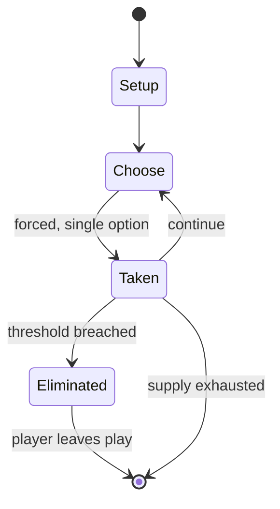

# Capture the flag

`capture_the_flag` &nbsp; state: **DEEPENED** &nbsp; method: **heuristic**

## Found layer (recorded, not trusted)

| field | value |
| --- | --- |
| wikidata | Q1035213 |
| wikipedia | Capture the flag |
| genres (source) | -- |
| instance of (source) | -- |
| country of origin | -- |

## Declared layer (orders bench work)

| field | value |
| --- | --- |
| year created | -- |
| epoch | -- |
| region | -- |
| media | SPORT, VIDEO |
| players | -- |
| age band | -- |
| exogenous process | -- |
| loss shape | ELIMINATION |
| live axes | - |
| horizon | -- |
| scoring shape | -- |
| information | -- |
| interaction | SOLITAIRE |
| turn structure | -- |
| tractability | SAMPLING_ONLY |
| randomness | HIDDEN_INFO |
| luck factor | 0.35 |
| rules complexity | 2.23 |
| strategic depth | 2.25 |
| novelty | 0.5262 |
| solved status | -- |
| strategies | route_optimisation |
| algorithms | -- |

## Object model

```
Episode
  players      : ?
  turn_structure: ?
  horizon       : ?
  scoring       : ?

Pitch          -- bounded physical region
Player         -- embodied agent with a foul count
Clock          -- counts down; stoppages are rule events
Official       -- detects infractions and applies penalties
WorldState     -- simulation state advanced by the engine
Avatar         -- player-controlled agent
```

## State transition diagram



## Research item -- turn trace

```
# Capture the flag -- simulated turn events
# generated from the DECLARED vector, not from a rulebook.
# structure: exo=None loss=ELIMINATION horizon=None scoring=None axes=-

t=0    SETUP        players=2  pot=0  capacity=3
t=1    FORCED       p1 single legal option taken (pot_gain=+1.4)
t=2    FORCED       p1 single legal option taken (pot_gain=+1.4)
t=3    FORCED       p1 single legal option taken (pot_gain=+0.8)
t=4    FORCED       p1 single legal option taken (pot_gain=+1.2)
t=5    FORCED       p1 single legal option taken (pot_gain=+1.7)
t=6    FORCED       p1 single legal option taken (pot_gain=+1.7)
t=7    FORCED       p1 single legal option taken (pot_gain=+1.3)
t=8    ENDTURN      turn passes to p2
t=9    FORCED       p2 single legal option taken (pot_gain=+0.6)
t=10   FORCED       p2 single legal option taken (pot_gain=+1.3)
t=11   FORCED       p2 single legal option taken (pot_gain=+1.6)
t=12   ENDTURN      turn passes to p1
t=13   FORCED       p1 single legal option taken (pot_gain=+1.9)
t=14   FORCED       p1 single legal option taken (pot_gain=+1.7)
t=15   FORCED       p1 single legal option taken (pot_gain=+0.7)
t=16   FORCED       p1 single legal option taken (pot_gain=+1.4)
t=17   FORCED       p1 single legal option taken (pot_gain=+1.9)
t=18   FORCED       p1 single legal option taken (pot_gain=+1.1)
t=19   FORCED       p1 single legal option taken (pot_gain=+1.9)
t=20   ENDTURN      turn passes to p2
t=21   FORCED       p2 single legal option taken (pot_gain=+1.3)
t=22   ENDTURN      turn passes to p1
t=23   FORCED       p1 single legal option taken (pot_gain=+0.6)
t=24   ENDTURN      turn passes to p2
t=25   FORCED       p2 single legal option taken (pot_gain=+1.4)
t=26   ENDTURN      turn passes to p1

terminal: VARIABLE
```

## Conditions

| kind | threshold | effect | trigger |
| --- | --- | --- | --- |
| ELIMINATE | -- | -- | Enemy players can be "tagged" by players when out of their home territory and, depending on the rules, they may be out of the game, become members of the opposite team, be sent back to their own territory, be frozen in p |
| PENALTY | -- | -- | A player who commits a foul or illegal check is placed in a penalty box for a specified amount of time, depending on the severity of the foul. |

## Source extract

Capture the Flag  (CTF) is a traditional outdoor sport where two or more teams each have a flag
(or other markers) and the objective is to capture the other team's flag, located at the team's
"base" (or hidden or even buried somewhere in the territory), and bring it safely back to their
own base. Enemy players can be "tagged" by players when out of their home territory and,
depending on the rules, they may be out of the game, become members of the opposite team, be
sent back to their own territory, be frozen in place, or be sent to "jail" until freed by a
member of their own team.   == Overview == Capture the Flag requires a playing field. In both
indoor and outdoor versions, the field is divided into two clearly designated halves, known as
territories. Players form two teams, one for each territory. Each side has a "flag", which is
most often a piece of fabric, but can be any object small enough to be easily carried by a
person (night time games might use flashlights, glowsticks or lanterns as the "flags").
Sometimes teams wear dark colors at night to make it more difficult for their opponents to see
them. The objective of the game is for players to venture into the opposing team'

<sub>Wikipedia, CC BY-SA. Retained as evidence for the structural
classification above. Every rule inferred from it is HYPOTHESIZED
until audited against a rulebook.</sub>
