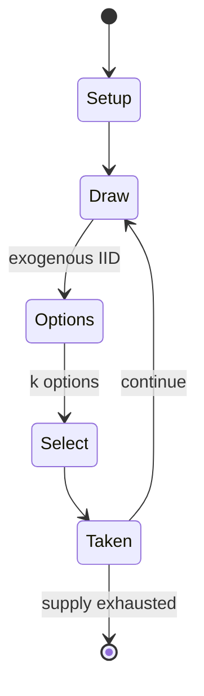

# Car Wars

*boardgame*

`car_wars` &nbsp; state: **DEEPENED** &nbsp; method: **heuristic**

## Found layer (recorded, not trusted)

| field | value |
| --- | --- |
| wikidata | Q1035253 |
| wikipedia | Car Wars |
| genres (source) | science fiction |
| instance of (source) | board game |
| country of origin | -- |

## Declared layer (orders bench work)

| field | value |
| --- | --- |
| year created | 1980 |
| epoch | DIGITAL |
| region | -- |
| media | BOARD, DICE, MINIATURES |
| players | 2-+ |
| age band | -- |
| exogenous process | IID |
| loss shape | -- |
| live axes | COMMIT_BLIND, SELECT, TIMING |
| horizon | -- |
| scoring shape | SET_COLLECTION_CONVEX |
| information | SIMULTANEOUS |
| interaction | COMPETITIVE |
| turn structure | PHASE_STRUCTURED |
| tractability | SAMPLING_ONLY |
| randomness | DICE, SIMULTANEOUS_CHOICE |
| luck factor | 0.58 |
| rules complexity | 3.86 |
| strategic depth | 2.37 |
| novelty | 0.6523 |
| solved status | -- |
| strategies | signalling, tempo |
| algorithms | -- |

## Object model

```
Episode
  players      : 2-+
  turn_structure: PHASE_STRUCTURED
  horizon       : ?
  scoring       : SET_COLLECTION_CONVEX

Board          -- spatial substrate; cells carry position and occupancy
Piece          -- movable token owned by a player
DicePool       -- n dice, each an iid categorical draw
Roll           -- realised outcome of a pool
SealedChoice   -- irrevocable choice made without observation
OptionSet      -- the choices available after an exogenous draw
Initiative     -- who acts, and when, relative to others
```

## State transition diagram



## Research item -- turn trace

```
# Car Wars -- simulated turn events
# generated from the DECLARED vector, not from a rulebook.
# structure: exo=IID loss=None horizon=None scoring=SET_COLLECTION_CONVEX axes=COMMIT_BLIND,SELECT,TIMING

t=0    SETUP        players=2  pot=0  capacity=4
t=1    DRAW         p1 roll from d6 pool -> outcome #4  (p=0.020)
t=2    SELECT       p1 2 options; take #1  (pot_gain=+3.0, capacity=-2)
t=3    DRAW         p1 roll from d6 pool -> outcome #3  (p=0.277)
t=4    SELECT       p1 3 options; take #2  (pot_gain=+3.3, capacity=-0)
t=5    DRAW         p1 roll from d6 pool -> outcome #2  (p=0.178)
t=6    SELECT       p1 1 options; take #1  (pot_gain=+1.7, capacity=-0)
t=7    DRAW         p1 roll from d6 pool -> outcome #5  (p=0.148)
t=8    SELECT       p1 2 options; take #2  (pot_gain=+1.5, capacity=-2)
t=9    DRAW         p1 roll from d6 pool -> outcome #2  (p=0.285)
t=10   SELECT       p1 3 options; take #2  (pot_gain=+1.8, capacity=-2)
t=11   DRAW         p1 roll from d6 pool -> outcome #4  (p=0.214)
t=12   SELECT       p1 3 options; take #2  (pot_gain=+2.2, capacity=-2)
t=13   ENDTURN      turn passes to p2
t=14   DRAW         p2 roll from d6 pool -> outcome #2  (p=0.025)
t=15   SELECT       p2 3 options; take #3  (pot_gain=+2.8, capacity=-1)
t=16   DRAW         p2 roll from d6 pool -> outcome #1  (p=0.274)
t=17   SELECT       p2 4 options; take #4  (pot_gain=+1.3, capacity=-1)
t=18   DRAW         p2 roll from d6 pool -> outcome #1  (p=0.260)
t=19   SELECT       p2 3 options; take #2  (pot_gain=+2.4, capacity=-1)
t=20   ENDTURN      turn passes to p1
t=21   DRAW         p1 roll from d6 pool -> outcome #3  (p=0.291)
t=22   SELECT       p1 2 options; take #2  (pot_gain=+0.7, capacity=-0)
t=23   DRAW         p1 roll from d6 pool -> outcome #1  (p=0.035)
t=24   SELECT       p1 1 options; take #1  (pot_gain=+1.2, capacity=-0)
t=25   DRAW         p1 roll from d6 pool -> outcome #5  (p=0.192)
t=26   SELECT       p1 2 options; take #2  (pot_gain=+1.2, capacity=-1)

terminal: VARIABLE
```

## Conditions

| kind | threshold | effect | trigger |
| --- | --- | --- | --- |
| TERMINATE | -- | -- | Typically, a game is over after a few turns, which represents a combat of a few seconds, but because every action in the game must be resolved a typical game takes a few hours to play. |

## Source extract

Car Wars is a vehicle combat simulation game developed by Steve Jackson Games, first published
in 1980. Players control armed vehicles in a post-apocalyptic future.   == Game play == In Car
Wars, players assume control of one or more cars or other powered vehicles, from motorcycles to
semi trucks. Optional rules include piloting helicopters, ultralights, balloons, boats,
submarines, and tanks. The vehicles are typically outfitted with weapons (such as missiles and
machine guns), souped-up components (including heavy-duty fire-proof wheels, and nitro
injectors), and defensive elements (armor plating and radar tracking systems). Within any number
of settings, the players then direct their vehicles in combat. The published games use cardstock
counters to represent vehicles in a simulated battle upon printed battlemaps. While the game
rules allow for any scale, most editions of the game were published to use a 1-inch = 15-feet
scale (1:180 scale), although the Fifth Edition switched to 1-inch = 5-feet (1:60 scale). At
this larger scale, players can use miniature toy vehicles such as Hot Wheels or Matchbox cars, S
gauge model railroading scenery, or 28mm-30mm scale wargaming miniatures.

<sub>Wikipedia, CC BY-SA. Retained as evidence for the structural
classification above. Every rule inferred from it is HYPOTHESIZED
until audited against a rulebook.</sub>
