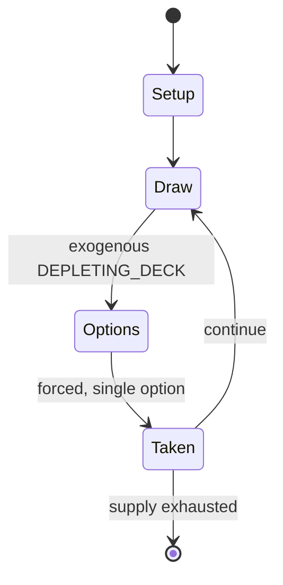

# Carcassonne (board game)

`carcassonne_board_game` &nbsp; state: **DEEPENED** &nbsp; method: **heuristic**

## Found layer (recorded, not trusted)

| field | value |
| --- | --- |
| wikidata | Q17262 |
| wikipedia | Carcassonne (board game) |
| genres (source) | -- |
| instance of (source) | -- |
| country of origin | -- |

## Declared layer (orders bench work)

| field | value |
| --- | --- |
| year created | 2000 |
| epoch | CONTEMPORARY |
| region | -- |
| media | BOARD, TILE, VIDEO |
| players | -- |
| age band | -- |
| exogenous process | DEPLETING_DECK |
| loss shape | -- |
| live axes | SPATIAL |
| horizon | VARIABLE |
| scoring shape | LINEAR_ACCUMULATION |
| information | -- |
| interaction | -- |
| turn structure | PHASE_STRUCTURED |
| tractability | SAMPLING_ONLY |
| randomness | DECK_SHUFFLE |
| luck factor | 0.48 |
| rules complexity | 3.41 |
| strategic depth | 2.0 |
| novelty | 0.0938 |
| solved status | -- |
| strategies | -- |
| algorithms | -- |

## Object model

```
Episode
  players      : ?
  turn_structure: PHASE_STRUCTURED
  horizon       : VARIABLE
  scoring       : LINEAR_ACCUMULATION

Board          -- spatial substrate; cells carry position and occupancy
Piece          -- movable token owned by a player
TileBag        -- unordered draw source
Layout         -- placed tiles and their adjacencies
WorldState     -- simulation state advanced by the engine
Avatar         -- player-controlled agent
Clock          -- frame or tick counter
Placement      -- position subject to geometric legality
```

## State transition diagram



## Research item -- turn trace

```
# Carcassonne (board game) -- simulated turn events
# generated from the DECLARED vector, not from a rulebook.
# structure: exo=DEPLETING_DECK loss=None horizon=VARIABLE scoring=LINEAR_ACCUMULATION axes=SPATIAL

t=0    SETUP        players=2  pot=0  capacity=7
t=1    DRAW         p1 draw from deck -> outcome #4  (p=0.284)
t=2    FORCED       p1 single legal option taken (pot_gain=+0.6)
t=3    DRAW         p1 draw from deck -> outcome #1  (p=0.085)
t=4    FORCED       p1 single legal option taken (pot_gain=+1.6)
t=5    SPATIAL      p1 places at (1,3); adjacency legal
t=6    DRAW         p1 draw from deck -> outcome #6  (p=0.188)
t=7    FORCED       p1 single legal option taken (pot_gain=+0.8)
t=8    DRAW         p1 draw from deck -> outcome #1  (p=0.228)
t=9    FORCED       p1 single legal option taken (pot_gain=+1.8)
t=10   DRAW         p1 draw from deck -> outcome #4  (p=0.198)
t=11   FORCED       p1 single legal option taken (pot_gain=+2.0)
t=12   DRAW         p1 draw from deck -> outcome #5  (p=0.249)
t=13   FORCED       p1 single legal option taken (pot_gain=+1.0)
t=14   SPATIAL      p1 places at (6,3); adjacency legal
t=15   DRAW         p1 draw from deck -> outcome #3  (p=0.155)
t=16   FORCED       p1 single legal option taken (pot_gain=+1.2)
t=17   DRAW         p1 draw from deck -> outcome #3  (p=0.187)
t=18   FORCED       p1 single legal option taken (pot_gain=+0.7)
t=19   ENDTURN      turn passes to p2
t=20   DRAW         p2 draw from deck -> outcome #6  (p=0.076)
t=21   FORCED       p2 single legal option taken (pot_gain=+1.2)
t=22   SPATIAL      p2 places at (3,6); adjacency legal
t=23   ENDTURN      turn passes to p1
t=24   DRAW         p1 draw from deck -> outcome #3  (p=0.192)
t=25   FORCED       p1 single legal option taken (pot_gain=+0.8)
t=26   DRAW         p1 draw from deck -> outcome #2  (p=0.088)
t=27   FORCED       p1 single legal option taken (pot_gain=+1.3)
t=28   SPATIAL      p1 places at (1,4); adjacency legal
t=29   ENDTURN      turn passes to p2

terminal: VARIABLE
```

## Conditions

| kind | threshold | effect | trigger |
| --- | --- | --- | --- |
| ELIMINATE | -- | -- | The rules are simple, no one is ever eliminated, and the play is fast. |
| ELIMINATE | -- | -- | This game attempted to rectify some perceived faults in the original by eliminating cloisters, introducing a "special tile" system to encourage players to complete cities (now forests) owned by other players, and making  |
| WIN | -- | -- | The player with the most points wins the game. |
| TERMINATE | -- | -- | The game ends when the last tile has been placed. |
| PENALTY | -- | -- | Players may choose to remove a follower from, and score for, a terrain feature before it is completed, albeit for fewer points; followers remaining on the map at the end of the game also suffer a score penalty even if th |

## Source extract

Carcassonne () is a tile-based Eurogame for two to five players, designed by Klaus-Jürgen Wrede
and published in 2000 by Hans im Glück in German and by Rio Grande Games (until 2012) and Z-Man
Games (currently) in English. It received the Spiel des Jahres and the Deutscher Spiele Preis
awards in 2001. It is named after the medieval fortified town of Carcassonne in southern France,
famed for its city walls. The game has spawned many expansions and spin-offs, and several PC,
console, and mobile versions. A new edition, with updated artwork on the tiles and the box, was
released in 2014.   == Gameplay ==  The game board is a medieval landscape built by the players
as the game progresses. The game starts with a single specific terrain tile face up and 71
others shuffled face down for the players to draw from. Each player's turn consists of three
distinct phases:  To start each turn, a player draws a new terrain tile and places it adjacent
to tiles that are already face up. The new tile must be placed in a way that extends terrain
features on the tiles it touches: roads must connect to roads, fields to fields, and cities to
cities. Connections are made across adjacent edges only; corners

<sub>Wikipedia, CC BY-SA. Retained as evidence for the structural
classification above. Every rule inferred from it is HYPOTHESIZED
until audited against a rulebook.</sub>
