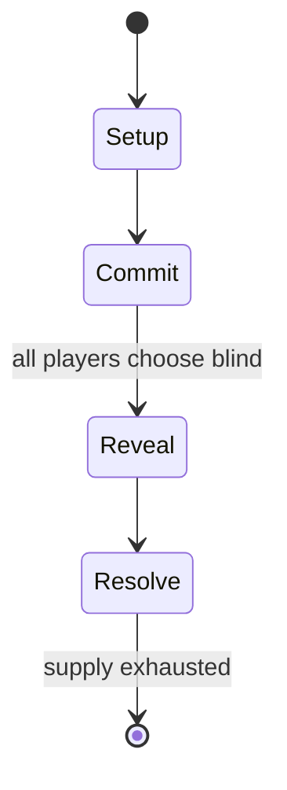

# Cardfight!! Vanguard

*Japanese collectible card game*

`cardfight_vanguard` &nbsp; state: **DEEPENED** &nbsp; method: **heuristic**

## Found layer (recorded, not trusted)

| field | value |
| --- | --- |
| wikidata | Q1188003 |
| wikipedia | Cardfight!! Vanguard |
| genres (source) | -- |
| instance of (source) | collectible card game |
| country of origin | Japan |

## Declared layer (orders bench work)

| field | value |
| --- | --- |
| year created | 2014 |
| epoch | CONTEMPORARY |
| region | EAST_ASIA |
| media | CARD, COLLECTIBLE, VIDEO |
| players | -- |
| age band | -- |
| exogenous process | -- |
| loss shape | -- |
| live axes | TRADE |
| horizon | -- |
| scoring shape | -- |
| information | SIMULTANEOUS |
| interaction | TEAM |
| turn structure | SIMULTANEOUS |
| tractability | SAMPLING_ONLY |
| randomness | SIMULTANEOUS_CHOICE |
| luck factor | 0.3 |
| rules complexity | 2.7 |
| strategic depth | 3.0 |
| novelty | 0.6158 |
| solved status | -- |
| strategies | blocking, coalition_forming, memory_recall, opponent_modelling |
| algorithms | -- |

## Object model

```
Episode
  players      : ?
  turn_structure: SIMULTANEOUS
  horizon       : ?
  scoring       : ?

Deck           -- ordered multiset, drawn without replacement
Hand           -- private multiset held by one player
DiscardPile    -- public accumulation of spent cards
WorldState     -- simulation state advanced by the engine
Avatar         -- player-controlled agent
Clock          -- frame or tick counter
Offer          -- proposed exchange between two agents
```

## State transition diagram



## Research item -- turn trace

```
# Cardfight!! Vanguard -- simulated turn events
# generated from the DECLARED vector, not from a rulebook.
# structure: exo=None loss=None horizon=None scoring=None axes=TRADE

t=0    SETUP        players=2  pot=0  capacity=4
t=1    FORCED       p1 single legal option taken (pot_gain=+0.6)
t=2    FORCED       p1 single legal option taken (pot_gain=+1.9)
t=3    FORCED       p1 single legal option taken (pot_gain=+1.6)
t=4    TRADE        p1 offers 2:1 exchange to p2
t=5    FORCED       p1 single legal option taken (pot_gain=+1.1)
t=6    ENDTURN      turn passes to p2
t=7    FORCED       p2 single legal option taken (pot_gain=+1.7)
t=8    FORCED       p2 single legal option taken (pot_gain=+0.7)
t=9    FORCED       p2 single legal option taken (pot_gain=+1.4)
t=10   FORCED       p2 single legal option taken (pot_gain=+0.7)
t=11   FORCED       p2 single legal option taken (pot_gain=+1.4)
t=12   ENDTURN      turn passes to p1
t=13   FORCED       p1 single legal option taken (pot_gain=+1.1)
t=14   TRADE        p1 offers 2:1 exchange to p2
t=15   ENDTURN      turn passes to p2
t=16   FORCED       p2 single legal option taken (pot_gain=+0.6)
t=17   TRADE        p2 offers 2:1 exchange to p1
t=18   FORCED       p2 single legal option taken (pot_gain=+1.9)
t=19   ENDTURN      turn passes to p1
t=20   FORCED       p1 single legal option taken (pot_gain=+1.7)
t=21   ENDTURN      turn passes to p2
t=22   FORCED       p2 single legal option taken (pot_gain=+0.9)
t=23   FORCED       p2 single legal option taken (pot_gain=+1.2)
t=24   ENDTURN      turn passes to p1
t=25   FORCED       p1 single legal option taken (pot_gain=+1.4)
t=26   FORCED       p1 single legal option taken (pot_gain=+1.4)
t=27   TRADE        p1 offers 2:1 exchange to p2

terminal: VARIABLE
```

## Source extract

Cardfight!! Vanguard (Japanese: カードファイト!! ヴァンガード, Hepburn: Kādofaito!! Vangādo) is a Japanese
multimedia franchise jointly created by Akira Itō, Satoshi Nakamura, Mitsuhisa Tamura, and
Bushiroad president Takaaki Kidani. It currently consists of multiple anime television series,
an official trading card game, multiple manga series, and an anime/live action film.   == Anime
== In July 2010, an anime television series was commissioned by TMS Entertainment under the
directorial supervision of Hatsuki Tsuji. The soundtrack was composed by Takayuki Negishi with
character designs provided by Mari Tominaga. The series began airing in Japan on TV Aichi
beginning on January 8, 2011, and was rebroadcast by the AT-X, TV Tokyo, TV Osaka, and TV
Setouchi systems. The media-streaming website Crunchyroll simulcast the first season to the
United States, Canada, the United Kingdom, and Ireland. Crunchyroll began streaming the second
season to the United States, Canada, and the United Kingdom on June 30, 2012 and continues to
stream the series. It was announced on November 17, 2013, that Hanabee Entertainment licensed
the anime and released it on March 5, 2014, in Australia and New Zealand. The seri

<sub>Wikipedia, CC BY-SA. Retained as evidence for the structural
classification above. Every rule inferred from it is HYPOTHESIZED
until audited against a rulebook.</sub>
