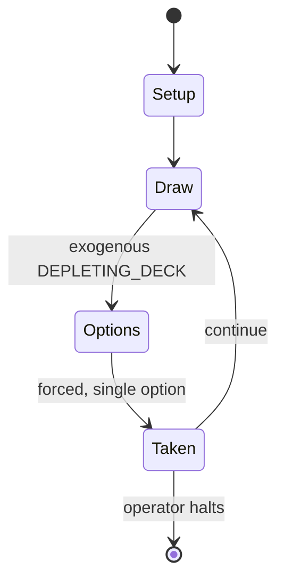

# Cards Against Humanity

*party game*

`cards_against_humanity` &nbsp; state: **DEEPENED** &nbsp; method: **heuristic**

## Found layer (recorded, not trusted)

| field | value |
| --- | --- |
| wikidata | Q5038791 |
| wikipedia | Cards Against Humanity |
| genres (source) | party game |
| instance of (source) | business, dedicated deck card game, party game |
| country of origin | -- |

## Declared layer (orders bench work)

| field | value |
| --- | --- |
| year created | 2011 |
| epoch | CONTEMPORARY |
| region | -- |
| media | CARD, PARTY, PUZZLE |
| players | 3-+ |
| age band | FAMILY |
| exogenous process | DEPLETING_DECK |
| loss shape | -- |
| live axes | TIMING, TRADE |
| horizon | OPEN_ENDED |
| scoring shape | RACE_POSITION |
| information | -- |
| interaction | TEAM |
| turn structure | -- |
| tractability | EXACT_WITH_CUT |
| randomness | DECK_SHUFFLE, HIDDEN_INFO |
| luck factor | 0.53 |
| rules complexity | 3.4 |
| strategic depth | 2.7 |
| novelty | 0.9287 |
| solved status | -- |
| strategies | coalition_forming, route_optimisation, spatial_packing |
| algorithms | -- |

## Object model

```
Episode
  players      : 3-+
  turn_structure: ?
  horizon       : OPEN_ENDED
  scoring       : RACE_POSITION

Deck           -- ordered multiset, drawn without replacement
Hand           -- private multiset held by one player
DiscardPile    -- public accumulation of spent cards
Configuration  -- the arrangement to be resolved
Constraint     -- predicate a legal configuration must satisfy
Initiative     -- who acts, and when, relative to others
Offer          -- proposed exchange between two agents
```

## State transition diagram



## Research item -- turn trace

```
# Cards Against Humanity -- simulated turn events
# generated from the DECLARED vector, not from a rulebook.
# structure: exo=DEPLETING_DECK loss=None horizon=OPEN_ENDED scoring=RACE_POSITION axes=TIMING,TRADE

t=0    SETUP        players=3  pot=0  capacity=4
t=1    DRAW         p1 draw from deck -> outcome #5  (p=0.004)
t=2    FORCED       p1 single legal option taken (pot_gain=+1.5)
t=3    TRADE        p1 offers 2:1 exchange to p2
t=4    DRAW         p1 draw from deck -> outcome #6  (p=0.243)
t=5    FORCED       p1 single legal option taken (pot_gain=+1.3)
t=6    DRAW         p1 draw from deck -> outcome #4  (p=0.215)
t=7    FORCED       p1 single legal option taken (pot_gain=+0.6)
t=8    DRAW         p1 draw from deck -> outcome #6  (p=0.188)
t=9    FORCED       p1 single legal option taken (pot_gain=+1.8)
t=10   TRADE        p1 offers 2:1 exchange to p2
t=11   DRAW         p1 draw from deck -> outcome #4  (p=0.197)
t=12   FORCED       p1 single legal option taken (pot_gain=+1.9)
t=13   TRADE        p1 offers 2:1 exchange to p2
t=14   DRAW         p1 draw from deck -> outcome #1  (p=0.264)
t=15   FORCED       p1 single legal option taken (pot_gain=+1.2)
t=16   ENDTURN      turn passes to p2
t=17   DRAW         p2 draw from deck -> outcome #5  (p=0.098)
t=18   FORCED       p2 single legal option taken (pot_gain=+1.8)
t=19   DRAW         p2 draw from deck -> outcome #2  (p=0.140)
t=20   FORCED       p2 single legal option taken (pot_gain=+0.8)
t=21   TRADE        p2 offers 2:1 exchange to p3
t=22   ENDTURN      turn passes to p3
t=23   DRAW         p3 draw from deck -> outcome #1  (p=0.291)
t=24   FORCED       p3 single legal option taken (pot_gain=+1.4)
t=25   ENDTURN      turn passes to p1
t=26   DRAW         p1 draw from deck -> outcome #6  (p=0.212)
t=27   FORCED       p1 single legal option taken (pot_gain=+1.6)
t=28   TRADE        p1 offers 2:1 exchange to p2

terminal: OPEN_ENDED
```

## Conditions

| kind | threshold | effect | trigger |
| --- | --- | --- | --- |
| WIN | -- | -- | The rules do not state how to win the game, but a popular way to win for most players is whoever has the most black cards or points at the end of the game (black cards are obtained by whoever is funniest at the end of a  |
| BOUNDARY | -- | -- | The Chicago Sun-Times estimated that CAH earned at least $12 million in profit, and according to the company, customers have downloaded the PDF file 1.5 million times in the year since they began tracking the numbers. |

## Source extract

Cards Against Humanity is an American adult card-based party game in which players complete
fill-in-the-blank statements, using words or phrases typically deemed offensive, risqué, or
politically incorrect, printed on playing cards. It has been compared to the card game Apples to
Apples (1999). The game originated with a Kickstarter campaign in 2011. The game's title refers
to the phrase "crimes against humanity", reflecting its politically incorrect content.   ==
Development == Cards Against Humanity was created by a group of eight Highland Park High School
alumni. Heavily influenced by the popular Apples to Apples card game, it was initially named
Cardenfreude (a pun on the German concept Schadenfreude) and involved a group of players writing
out the most abstract and, often, humorous response to the topic question. The name was later
changed to Cards Against Humanity, with the answers pre-written on the white cards known today.
Co-creator Ben Hantoot cited experiences with various games such as Magic: The Gathering,
Balderdash, and charades as inspiration, also noting that Mad Libs was "the most direct
influence" for the game. The game was financed with a Kickstarter crowdfundin

<sub>Wikipedia, CC BY-SA. Retained as evidence for the structural
classification above. Every rule inferred from it is HYPOTHESIZED
until audited against a rulebook.</sub>
