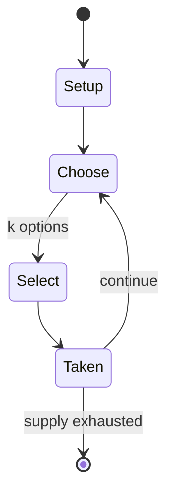

# Caribbean stud poker

`caribbean_stud_poker` &nbsp; state: **DEEPENED** &nbsp; method: **heuristic**

## Found layer (recorded, not trusted)

| field | value |
| --- | --- |
| wikidata | Q1589554 |
| wikipedia | Caribbean stud poker |
| genres (source) | -- |
| instance of (source) | -- |
| country of origin | -- |

## Declared layer (orders bench work)

| field | value |
| --- | --- |
| year created | -- |
| epoch | -- |
| region | -- |
| media | GAMBLING |
| players | -- |
| age band | -- |
| exogenous process | -- |
| loss shape | -- |
| live axes | BLUFF, SELECT |
| horizon | -- |
| scoring shape | -- |
| information | IMPERFECT |
| interaction | -- |
| turn structure | -- |
| tractability | SAMPLING_ONLY |
| randomness | -- |
| luck factor | 0.35 |
| rules complexity | 2.46 |
| strategic depth | 2.5 |
| novelty | 0.4894 |
| solved status | -- |
| strategies | bluffing, probability_estimation |
| algorithms | -- |

## Object model

```
Episode
  players      : ?
  turn_structure: ?
  horizon       : ?
  scoring       : ?

Belief         -- what an observer is induced to think is true
OptionSet      -- the choices available after an exogenous draw
```

## State transition diagram



## Research item -- turn trace

```
# Caribbean stud poker -- simulated turn events
# generated from the DECLARED vector, not from a rulebook.
# structure: exo=None loss=None horizon=None scoring=None axes=BLUFF,SELECT

t=0    SETUP        players=2  pot=0  capacity=5
t=1    SELECT       p1 4 options; take #1  (pot_gain=+2.7, capacity=-0)
t=2    SELECT       p1 2 options; take #1  (pot_gain=+1.2, capacity=-1)
t=3    BLUFF        p1 represents a holding it does not have
t=4    ENDTURN      turn passes to p2
t=5    SELECT       p2 4 options; take #3  (pot_gain=+2.5, capacity=-0)
t=6    SELECT       p2 3 options; take #2  (pot_gain=+0.7, capacity=-2)
t=7    SELECT       p2 1 options; take #1  (pot_gain=+1.8, capacity=-0)
t=8    ENDTURN      turn passes to p1
t=9    SELECT       p1 1 options; take #1  (pot_gain=+1.7, capacity=-2)
t=10   ENDTURN      turn passes to p2
t=11   SELECT       p2 3 options; take #2  (pot_gain=+3.0, capacity=-1)
t=12   SELECT       p2 3 options; take #1  (pot_gain=+3.4, capacity=-0)
t=13   SELECT       p2 2 options; take #1  (pot_gain=+0.5, capacity=-1)
t=14   BLUFF        p2 represents a holding it does not have
t=15   SELECT       p2 1 options; take #1  (pot_gain=+3.2, capacity=-2)
t=16   SELECT       p2 4 options; take #1  (pot_gain=+3.0, capacity=-0)
t=17   ENDTURN      turn passes to p1
t=18   SELECT       p1 1 options; take #1  (pot_gain=+2.7, capacity=-2)
t=19   SELECT       p1 3 options; take #2  (pot_gain=+2.6, capacity=-1)
t=20   BLUFF        p1 represents a holding it does not have
t=21   SELECT       p1 4 options; take #4  (pot_gain=+0.7, capacity=-2)
t=22   SELECT       p1 2 options; take #2  (pot_gain=+0.7, capacity=-1)
t=23   SELECT       p1 3 options; take #2  (pot_gain=+2.7, capacity=-1)
t=24   SELECT       p1 3 options; take #2  (pot_gain=+1.7, capacity=-2)
t=25   ENDTURN      turn passes to p2
t=26   SELECT       p2 4 options; take #2  (pot_gain=+1.5, capacity=-1)

terminal: VARIABLE
```

## Conditions

| kind | threshold | effect | trigger |
| --- | --- | --- | --- |
| BOUNDARY | -- | -- | The basic rules are the same in the UK as the US, although the payouts differ – the maximum bet is generally £100 on the ante and £200 on the raise, and all payouts are paid on the raise, meaning the maximum payout can p |
| BOUNDARY | -- | -- | If a player's cards beat the dealer's cards, that player will receive even money (1-to-1) on the ante, and the following on their bet (with a maximum payout of 5,000 U.S. |
| PENALTY | -- | -- | Any player who chooses to fold forfeits their ante. |

## Source extract

Caribbean stud poker, also called casino stud poker, is a casino table game with rules derived
from five-card stud poker. However, unlike standard poker games, Caribbean stud poker is played
against the house rather than against other players. There is no option to bluff or deceive as
this is played against the house and not other players.   == History == As a result of the
popularity of poker, casinos created house-banked games in order to entice poker fans to play
more table games. The birth of the game is not well recorded, which is unusual for a relatively
new game. Professional poker player David Sklansky has claimed that he invented the game in 1982
using the name “Casino Poker”. This early version had some differences, for example the dealer
having two cards revealed instead of only one. Likewise, there was no progressive jackpot in the
game he allegedly founded. Due to patent laws, Sklansky was allegedly unable to patent "Casino
Poker". A few years afterwards he was approached by a poker player who brought the game to The
King International Casino in Aruba (now known as the Excelsior Casino) and had it patented. The
rules were shifted slightly to create current Caribbean st

<sub>Wikipedia, CC BY-SA. Retained as evidence for the structural
classification above. Every rule inferred from it is HYPOTHESIZED
until audited against a rulebook.</sub>
