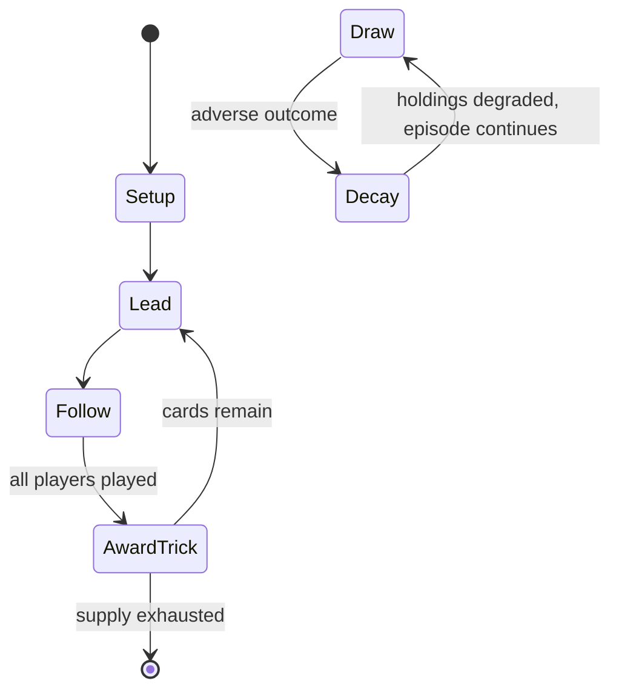

# écarté

*card game*

`cart` &nbsp; state: **DEEPENED** &nbsp; method: **heuristic**

## Found layer (recorded, not trusted)

| field | value |
| --- | --- |
| wikidata | Q273305 |
| wikipedia | Écarté |
| genres (source) | -- |
| instance of (source) | card game |
| country of origin | France |

## Declared layer (orders bench work)

| field | value |
| --- | --- |
| year created | -- |
| epoch | -- |
| region | EUROPE_WEST |
| media | CARD, TRICK_TAKING |
| players | 2 |
| age band | -- |
| exogenous process | DEPLETING_DECK |
| loss shape | PARTIAL_DECAY |
| live axes | DISCARD, SELECT, TRADE |
| horizon | -- |
| scoring shape | -- |
| information | -- |
| interaction | COMPETITIVE |
| turn structure | TRICK_ROUND |
| tractability | SAMPLING_ONLY |
| randomness | DECK_SHUFFLE |
| luck factor | 0.48 |
| rules complexity | 3.3 |
| strategic depth | 2.25 |
| novelty | 0.6494 |
| solved status | -- |
| strategies | spatial_packing |
| algorithms | -- |

## Object model

```
Episode
  players      : 2
  turn_structure: TRICK_ROUND
  horizon       : ?
  scoring       : ?

Deck           -- ordered multiset, drawn without replacement
Hand           -- private multiset held by one player
DiscardPile    -- public accumulation of spent cards
Trick          -- one card per player; a winner is determined
Trump          -- suit that dominates the ordering
DiscardChoice  -- what is given up to satisfy a limit
OptionSet      -- the choices available after an exogenous draw
Offer          -- proposed exchange between two agents
```

## State transition diagram



## Research item -- turn trace

```
# écarté -- simulated turn events
# generated from the DECLARED vector, not from a rulebook.
# structure: exo=DEPLETING_DECK loss=PARTIAL_DECAY horizon=None scoring=None axes=DISCARD,SELECT,TRADE

t=0    SETUP        players=2  pot=0  capacity=7
t=1    DRAW         p1 draw from deck -> outcome #4  (p=0.125)
t=2    SELECT       p1 3 options; take #1  (pot_gain=+2.5, capacity=-1)
t=3    TRADE        p1 offers 2:1 exchange to p2
t=4    DRAW         p1 draw from deck -> outcome #1  (p=0.007)
t=5    SELECT       p1 4 options; take #4  (pot_gain=+1.0, capacity=-1)
t=6    TRADE        p1 offers 2:1 exchange to p2
t=7    DISCARD      p1 discards to hand limit
t=8    ENDTURN      turn passes to p2
t=9    DRAW         p2 draw from deck -> outcome #3  (p=0.270)
t=10   SELECT       p2 1 options; take #1  (pot_gain=+2.1, capacity=-1)
t=11   TRADE        p2 offers 2:1 exchange to p1
t=12   DISCARD      p2 discards to hand limit
t=13   DRAW         p2 draw from deck -> outcome #4  (p=0.158)
t=14   SELECT       p2 1 options; take #1  (pot_gain=+2.7, capacity=-1)
t=15   DISCARD      p2 discards to hand limit
t=16   DRAW         p2 draw from deck -> outcome #2  (p=0.233)
t=17   SELECT       p2 4 options; take #3  (pot_gain=+0.9, capacity=-1)
t=18   ENDTURN      turn passes to p1
t=19   DRAW         p1 draw from deck -> outcome #5  (p=0.055)
t=20   SELECT       p1 4 options; take #2  (pot_gain=+1.9, capacity=-2)
t=21   ENDTURN      turn passes to p2
t=22   DRAW         p2 draw from deck -> outcome #4  (p=0.089)
t=23   SELECT       p2 4 options; take #2  (pot_gain=+0.7, capacity=-2)
t=24   TRADE        p2 offers 2:1 exchange to p1
t=25   ENDTURN      turn passes to p1
t=26   DRAW         p1 draw from deck -> outcome #4  (p=0.277)
t=27   SELECT       p1 3 options; take #3  (pot_gain=+1.3, capacity=-1)
t=28   DISCARD      p1 discards to hand limit

terminal: VARIABLE
```

## Conditions

| kind | threshold | effect | trigger |
| --- | --- | --- | --- |
| WIN | 5 points | -- | Five points wins the game. |
| BOUNDARY | 1 card | -- | If the dealer accepts then the elder hand must propose a discard and the dealer should deal the same number of fresh cards from the pack; following which the dealer must then also make an exchange of at least one card. |
| BOUNDARY | 2 cards | -- | A cut must consist of at least two cards, and at least two must be left in the lower packet. |
| BOUNDARY | 1 trick | -- | If the opponent declines the offer, however, they are "bound to win the vole." If they do so, scoring proceeds as normal, but if the player declining the offer fails to win the vole (i.e., if the player who initially off |
| BOUNDARY | -- | -- | One of the best known descriptions of Écarté - a treatise by Cavendish written in 1886 that describes the then-current state-of-play in certain London clubs - discusses at least two different variants: Pool Écarté and Fr |
| BOUNDARY | -- | -- | Logic would seem to dictate that the offer must come at least prior to the midpoint of the hand (i.e., the third trick), or the offering player would not be offering anything of value to their opponent. |
| PENALTY | -- | -- | He does not have to do so, but forfeits the right if he forgets to do so before starting play. |
| PENALTY | -- | -- | But if the adversary himself hold the king, there is no penalty. |
| PENALTY | -- | -- | But if a player throw down his cards, claiming to score, the hand is not abandoned, and there is no penalty. |
| PENALTY | -- | -- | Should the card played in error be taken up again prior to another card being led (as provided by Rule 39), there is no penalty. |

## Source extract

Écarté (French: [ekaʁte]) is an old French casino game for two players that is still played
today. It is a trick-taking game, similar to whist, but with a special and eponymous discarding
phase; the word écarté means "discarded". Écarté was popular in the 19th century, but is now
rarely played. It is described as "an elegant two-player derivative of Triomphe [that is] quite
fun to play" and a "classic that should be known to all educated card players."   == Play ==
All cards from two to six are removed from a 52-card pack, to produce the Piquet pack of thirty-
two cards, which rank from the lowest 7, 8, 9, 10, ace, knave, queen, to king high.  Note that
the ace ranks between ten and knave, making the king the highest card. The players cut to
determine the dealer, who deals five cards each in packets of two and three, or three and two,
either to whim or some agreement.  The eleventh card is dealt face up to determine the trump
suit.  If this card is a king, the dealer can immediately mark an extra point for himself. The
elder hand (the player opposite the dealer) is then entitled, if that player so desires, to
begin the exchange—a crucial part of the game.  This involves discarding

<sub>Wikipedia, CC BY-SA. Retained as evidence for the structural
classification above. Every rule inferred from it is HYPOTHESIZED
until audited against a rulebook.</sub>
