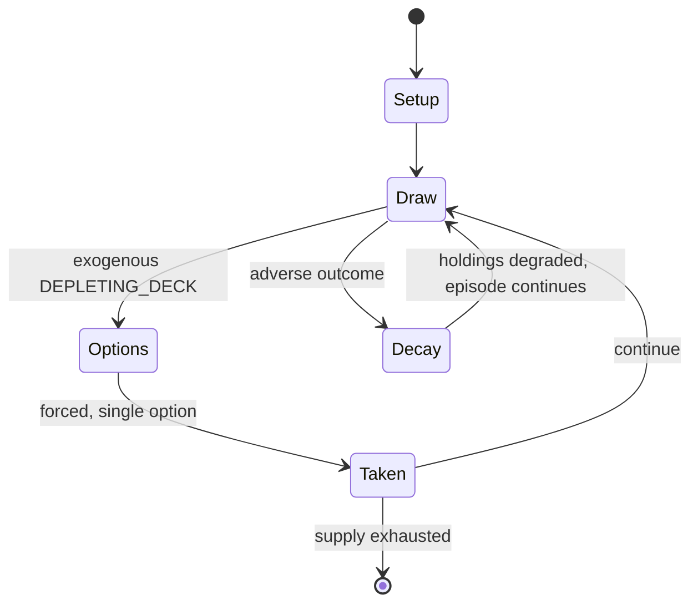

# Cartographers (board game)

`cartographers_board_game` &nbsp; state: **DEEPENED** &nbsp; method: **heuristic**

## Found layer (recorded, not trusted)

| field | value |
| --- | --- |
| wikidata | Q99295337 |
| wikipedia | Cartographers (board game) |
| genres (source) | -- |
| instance of (source) | -- |
| country of origin | -- |

## Declared layer (orders bench work)

| field | value |
| --- | --- |
| year created | 2019 |
| epoch | CONTEMPORARY |
| region | -- |
| media | BOARD |
| players | -- |
| age band | -- |
| exogenous process | DEPLETING_DECK |
| loss shape | PARTIAL_DECAY |
| live axes | SPATIAL |
| horizon | -- |
| scoring shape | LINEAR_ACCUMULATION |
| information | -- |
| interaction | PARALLEL |
| turn structure | PHASE_STRUCTURED |
| tractability | EXACT_WITH_CUT |
| randomness | DECK_SHUFFLE |
| luck factor | 0.48 |
| rules complexity | 2.83 |
| strategic depth | 2.0 |
| novelty | 0.841 |
| solved status | -- |
| strategies | -- |
| algorithms | -- |

## Object model

```
Episode
  players      : ?
  turn_structure: PHASE_STRUCTURED
  horizon       : ?
  scoring       : LINEAR_ACCUMULATION

Board          -- spatial substrate; cells carry position and occupancy
Piece          -- movable token owned by a player
Placement      -- position subject to geometric legality
```

## State transition diagram



## Research item -- turn trace

```
# Cartographers (board game) -- simulated turn events
# generated from the DECLARED vector, not from a rulebook.
# structure: exo=DEPLETING_DECK loss=PARTIAL_DECAY horizon=None scoring=LINEAR_ACCUMULATION axes=SPATIAL

t=0    SETUP        players=2  pot=0  capacity=3
t=1    DRAW         p1 draw from deck -> outcome #1  (p=0.243)
t=2    FORCED       p1 single legal option taken (pot_gain=+1.7)
t=3    SPATIAL      p1 places at (1,7); adjacency legal
t=4    DRAW         p1 draw from deck -> outcome #5  (p=0.190)
t=5    FORCED       p1 single legal option taken (pot_gain=+0.6)
t=6    DRAW         p1 draw from deck -> outcome #2  (p=0.162)
t=7    FORCED       p1 single legal option taken (pot_gain=+1.1)
t=8    DRAW         p1 draw from deck -> outcome #3  (p=0.045)
t=9    FORCED       p1 single legal option taken (pot_gain=+0.5)
t=10   SPATIAL      p1 places at (6,1); adjacency legal
t=11   DRAW         p1 draw from deck -> outcome #4  (p=0.279)
t=12   FORCED       p1 single legal option taken (pot_gain=+1.4)
t=13   DRAW         p1 draw from deck -> outcome #5  (p=0.034)
t=14   FORCED       p1 single legal option taken (pot_gain=+0.7)
t=15   SPATIAL      p1 places at (4,0); adjacency legal
t=16   ENDTURN      turn passes to p2
t=17   DRAW         p2 draw from deck -> outcome #4  (p=0.254)
t=18   FORCED       p2 single legal option taken (pot_gain=+0.9)
t=19   DRAW         p2 draw from deck -> outcome #2  (p=0.097)
t=20   FORCED       p2 single legal option taken (pot_gain=+1.8)
t=21   ENDTURN      turn passes to p1
t=22   DRAW         p1 draw from deck -> outcome #4  (p=0.115)
t=23   FORCED       p1 single legal option taken (pot_gain=+1.1)
t=24   SPATIAL      p1 places at (0,6); adjacency legal
t=25   DRAW         p1 draw from deck -> outcome #3  (p=0.247)
t=26   FORCED       p1 single legal option taken (pot_gain=+1.8)
t=27   SPATIAL      p1 places at (1,7); adjacency legal

terminal: VARIABLE
```

## Source extract

Cartographers is a roll and write board game designed by Jordy Adan and published in 2019 by
Thunderworks Games. It is part of the Roll Player universe. In the game, players aim to draw
terrains based on drawn cards that award points based on the relevant letter cards. The game
received positive reviews, and was nominated for the Kennerspiel des Jahres, but lost to The
Crew. It was also runner-up to Parks for the Best Family Game of the 2019 Board Game Quests
Awards. An app for solitary play was released in 2020.   == Gameplay == The object of the game
is to establish a seat of power for the monarch Queen Gimnax of the Kingdom of Nalos by
reclaiming the northern lands taken by the Dragul. The selected location must satisfy several
criteria, among them that the surrounding area provides natural defenses and resources. Players
assume the role of a surveyor scout that travels into the Dragul lands to find a suitable
location. Each player receives a pencil and the same double-sided map, agreeing before the start
of the game which side to use. The number of players is limited only by the number of available
score sheets; each box includes 100. To set up, letter cards are arranged in ord

<sub>Wikipedia, CC BY-SA. Retained as evidence for the structural
classification above. Every rule inferred from it is HYPOTHESIZED
until audited against a rulebook.</sub>
