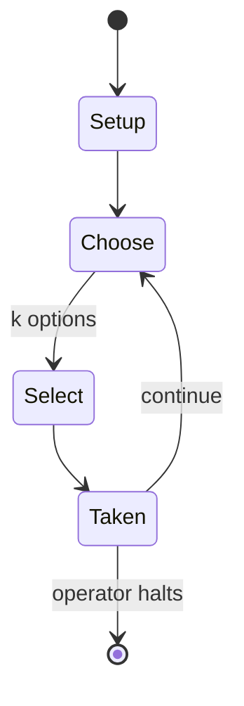

# Cascadia

*2021 board game*

`cascadia` &nbsp; state: **DEEPENED** &nbsp; method: **heuristic**

## Found layer (recorded, not trusted)

| field | value |
| --- | --- |
| wikidata | Q111340775 |
| wikipedia | Cascadia (board game) |
| genres (source) | tile-based game |
| instance of (source) | board game, tile-based game |
| country of origin | -- |

## Declared layer (orders bench work)

| field | value |
| --- | --- |
| year created | -- |
| epoch | -- |
| region | -- |
| media | BOARD, PUZZLE, TILE |
| players | 1-4 |
| age band | -- |
| exogenous process | -- |
| loss shape | -- |
| live axes | SELECT, SPATIAL |
| horizon | OPEN_ENDED |
| scoring shape | -- |
| information | -- |
| interaction | -- |
| turn structure | -- |
| tractability | SAMPLING_ONLY |
| randomness | -- |
| luck factor | 0.35 |
| rules complexity | 2.46 |
| strategic depth | 2.25 |
| novelty | 1.0 |
| solved status | -- |
| strategies | area_control |
| algorithms | -- |

## Object model

```
Episode
  players      : 1-4
  turn_structure: ?
  horizon       : OPEN_ENDED
  scoring       : ?

Board          -- spatial substrate; cells carry position and occupancy
Piece          -- movable token owned by a player
Configuration  -- the arrangement to be resolved
Constraint     -- predicate a legal configuration must satisfy
TileBag        -- unordered draw source
Layout         -- placed tiles and their adjacencies
OptionSet      -- the choices available after an exogenous draw
Placement      -- position subject to geometric legality
```

## State transition diagram



## Research item -- turn trace

```
# Cascadia -- simulated turn events
# generated from the DECLARED vector, not from a rulebook.
# structure: exo=None loss=None horizon=OPEN_ENDED scoring=None axes=SELECT,SPATIAL

t=0    SETUP        players=1  pot=0  capacity=8
t=1    SELECT       p1 4 options; take #4  (pot_gain=+2.6, capacity=-2)
t=2    SPATIAL      p1 places at (7,0); adjacency legal
t=3    SELECT       p1 3 options; take #3  (pot_gain=+2.0, capacity=-1)
t=4    SPATIAL      p1 places at (6,2); adjacency legal
t=5    SELECT       p1 1 options; take #1  (pot_gain=+1.3, capacity=-0)
t=6    SELECT       p1 1 options; take #1  (pot_gain=+1.9, capacity=-0)
t=7    SPATIAL      p1 places at (1,1); adjacency legal
t=8    SELECT       p1 1 options; take #1  (pot_gain=+2.2, capacity=-0)
t=9    SPATIAL      p1 places at (6,5); adjacency legal
t=10   SELECT       p1 4 options; take #3  (pot_gain=+0.7, capacity=-1)
t=11   SPATIAL      p1 places at (7,7); adjacency legal
t=12   ENDTURN      turn passes to p1
t=13   SELECT       p1 1 options; take #1  (pot_gain=+2.1, capacity=-2)
t=14   SELECT       p1 3 options; take #1  (pot_gain=+2.3, capacity=-0)
t=15   SPATIAL      p1 places at (6,7); adjacency legal
t=16   SELECT       p1 2 options; take #1  (pot_gain=+1.6, capacity=-1)
t=17   SPATIAL      p1 places at (4,3); adjacency legal
t=18   SELECT       p1 1 options; take #1  (pot_gain=+2.3, capacity=-2)
t=19   SELECT       p1 2 options; take #1  (pot_gain=+1.0, capacity=-2)
t=20   SELECT       p1 2 options; take #2  (pot_gain=+3.0, capacity=-2)
t=21   SPATIAL      p1 places at (4,4); adjacency legal
t=22   SELECT       p1 1 options; take #1  (pot_gain=+1.5, capacity=-1)
t=23   SPATIAL      p1 places at (2,2); adjacency legal
t=24   SELECT       p1 2 options; take #2  (pot_gain=+1.3, capacity=-0)
t=25   SPATIAL      p1 places at (5,2); adjacency legal
t=26   ENDTURN      turn passes to p1

terminal: OPEN_ENDED
```

## Conditions

| kind | threshold | effect | trigger |
| --- | --- | --- | --- |
| TERMINATE | -- | -- | After each turn, habitat and wildlife tokens are replenished; once all habitat tokens are used, the game ends, and players earn points based on contiguous habitat tile corridor groups and varying wildlife scoring cards w |

## Source extract

Cascadia is a 2021 board game designed by Randy Flynn and published by Flatout Games. In
Cascadia, players draft and add habitat tokens and matching wildlife tokens to score victory
points based on various scoring conditions. Upon its release, Cascadia received critical
success, with reviewers praising its components, accessibility, and strategy, but also noting
its lack of player interaction. Cascadia won the 2022 Spiel des Jahres and the 2023
International Gamers Award for the Best solo game.   == Gameplay == In Cascadia, which is set in
the Cascadia region of the Pacific Northwest, players select one of the four available
combinations of habitat and wildlife tokens to add to their existing habitat tokens. If three or
four wildlife tokens are identical, players may choose to replace the four wildlife tokens with
new ones. Habitat tokens must be placed adjacent to an existing habitat token, whereas a
wildlife token is placed on a habitat token with the matching terrain. After each turn, habitat
and wildlife tokens are replenished; once all habitat tokens are used, the game ends, and
players earn points based on contiguous habitat tile corridor groups and varying wildlife
scoring c

<sub>Wikipedia, CC BY-SA. Retained as evidence for the structural
classification above. Every rule inferred from it is HYPOTHESIZED
until audited against a rulebook.</sub>
