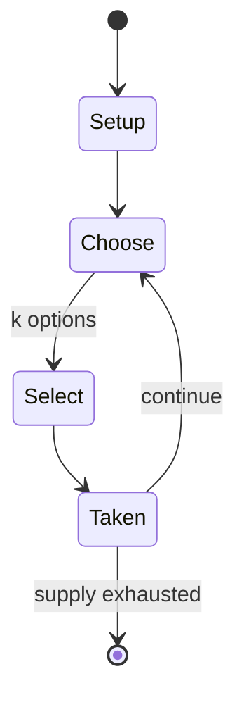

# Cassino

*fishing card game*

`cassino` &nbsp; state: **DEEPENED** &nbsp; method: **heuristic**

## Found layer (recorded, not trusted)

| field | value |
| --- | --- |
| wikidata | Q1047595 |
| wikipedia | Cassino (card game) |
| genres (source) | -- |
| instance of (source) | capturing game, card game |
| country of origin | -- |

## Declared layer (orders bench work)

| field | value |
| --- | --- |
| year created | -- |
| epoch | -- |
| region | -- |
| media | CARD |
| players | -- |
| age band | -- |
| exogenous process | -- |
| loss shape | -- |
| live axes | SELECT |
| horizon | -- |
| scoring shape | LINEAR_ACCUMULATION |
| information | -- |
| interaction | COMPETITIVE |
| turn structure | STRICT_TURN |
| tractability | SAMPLING_ONLY |
| randomness | -- |
| luck factor | -- |
| rules complexity | 2.14 |
| strategic depth | 2.25 |
| novelty | 0.5962 |
| solved status | -- |
| strategies | spatial_packing |
| algorithms | -- |

## Object model

```
Episode
  players      : ?
  turn_structure: STRICT_TURN
  horizon       : ?
  scoring       : LINEAR_ACCUMULATION

Deck           -- ordered multiset, drawn without replacement
Hand           -- private multiset held by one player
DiscardPile    -- public accumulation of spent cards
OptionSet      -- the choices available after an exogenous draw
```

## State transition diagram



## Research item -- turn trace

```
# Cassino -- simulated turn events
# generated from the DECLARED vector, not from a rulebook.
# structure: exo=None loss=None horizon=None scoring=LINEAR_ACCUMULATION axes=SELECT

t=0    SETUP        players=2  pot=0  capacity=4
t=1    SELECT       p1 2 options; take #1  (pot_gain=+1.8, capacity=-0)
t=2    SELECT       p1 4 options; take #1  (pot_gain=+1.7, capacity=-0)
t=3    SELECT       p1 4 options; take #3  (pot_gain=+3.0, capacity=-2)
t=4    SELECT       p1 4 options; take #2  (pot_gain=+1.6, capacity=-2)
t=5    SELECT       p1 3 options; take #3  (pot_gain=+3.2, capacity=-0)
t=6    SELECT       p1 3 options; take #2  (pot_gain=+2.7, capacity=-0)
t=7    SELECT       p1 2 options; take #1  (pot_gain=+1.3, capacity=-0)
t=8    SELECT       p1 4 options; take #4  (pot_gain=+3.3, capacity=-0)
t=9    SELECT       p1 3 options; take #3  (pot_gain=+0.7, capacity=-1)
t=10   SELECT       p1 1 options; take #1  (pot_gain=+2.5, capacity=-2)
t=11   SELECT       p1 2 options; take #1  (pot_gain=+1.4, capacity=-0)
t=12   SELECT       p1 1 options; take #1  (pot_gain=+1.7, capacity=-1)
t=13   SELECT       p1 2 options; take #2  (pot_gain=+1.7, capacity=-1)
t=14   SELECT       p1 3 options; take #3  (pot_gain=+2.6, capacity=-1)
t=15   SELECT       p1 3 options; take #2  (pot_gain=+2.4, capacity=-0)
t=16   SELECT       p1 4 options; take #2  (pot_gain=+1.9, capacity=-1)
t=17   SELECT       p1 2 options; take #1  (pot_gain=+1.8, capacity=-0)
t=18   ENDTURN      turn passes to p2
t=19   SELECT       p2 2 options; take #1  (pot_gain=+0.9, capacity=-2)
t=20   SELECT       p2 2 options; take #2  (pot_gain=+2.3, capacity=-0)
t=21   SELECT       p2 3 options; take #1  (pot_gain=+0.8, capacity=-0)
t=22   SELECT       p2 1 options; take #1  (pot_gain=+3.2, capacity=-1)
t=23   SELECT       p2 3 options; take #2  (pot_gain=+2.1, capacity=-0)
t=24   SELECT       p2 3 options; take #3  (pot_gain=+2.3, capacity=-2)
t=25   SELECT       p2 1 options; take #1  (pot_gain=+3.4, capacity=-1)
t=26   SELECT       p2 4 options; take #3  (pot_gain=+2.4, capacity=-1)

terminal: VARIABLE
```

## Conditions

| kind | threshold | effect | trigger |
| --- | --- | --- | --- |
| TERMINATE | -- | -- | Game ends when a player finally clears all the cards from the table. |
| LOSE | -- | -- | A player who erroneously claims to have won loses the game. |
| BOUNDARY | -- | -- | Rules continued to be published in German until at least 1975, but the game seems to have waned in Germany and Austria towards the end of the 19th century. |

## Source extract

Cassino, sometimes spelt Casino, is an English card game for two to four players using a
standard, 52-card, French-suited pack. It is played with slight variations in various parts of
the world, sometimes also under the names of Wippen, Basra, Tablanette and Pasur.  Cassino is
the only fishing game to have penetrated the English-speaking world. It is similar to the
Italian game of Scopa and is often said, without substantiation, to be of Italian origin.   ==
History == Although Cassino is often claimed to be of Italian origin, detailed research by
Franco Pratesi has shown that there is no evidence of it ever being played in Italy and the
earliest references to its Italian cousins, Scopa and Scopone, post-date those of Cassino. The
spelling "Cassino" is used in the earliest rules of 1792 and is the most persistent spelling
since, although German sources invariably use the spelling "Casino" along with some English
sources. Likewise an origin in gambling dens appears unlikely since a casino in the late 18th
century was a summer house or country villa; the name was not transferred to gambling
establishments until later. In fact, as "Cassino", the game is first recorded in 1792 in Engla

<sub>Wikipedia, CC BY-SA. Retained as evidence for the structural
classification above. Every rule inferred from it is HYPOTHESIZED
until audited against a rulebook.</sub>
