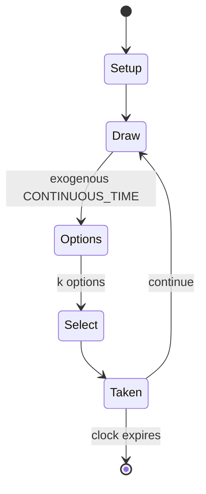

# Castlevania (1986 video game)

`castlevania_1986_video_game` &nbsp; state: **DEEPENED** &nbsp; method: **heuristic**

## Found layer (recorded, not trusted)

| field | value |
| --- | --- |
| wikidata | Q1043375 |
| wikipedia | Castlevania (1986 video game) |
| genres (source) | -- |
| instance of (source) | -- |
| country of origin | -- |

## Declared layer (orders bench work)

| field | value |
| --- | --- |
| year created | 1991 |
| epoch | DIGITAL |
| region | -- |
| media | VIDEO |
| players | -- |
| age band | -- |
| exogenous process | CONTINUOUS_TIME |
| loss shape | -- |
| live axes | SELECT, TIMING |
| horizon | CLOCK_LIMITED |
| scoring shape | -- |
| information | -- |
| interaction | -- |
| turn structure | -- |
| tractability | SAMPLING_ONLY |
| randomness | HIDDEN_INFO, REAL_TIME_PHYSICAL |
| luck factor | 0.35 |
| rules complexity | 2.5 |
| strategic depth | 2.25 |
| novelty | 0.6488 |
| solved status | -- |
| strategies | tempo |
| algorithms | -- |

## Object model

```
Episode
  players      : ?
  turn_structure: ?
  horizon       : CLOCK_LIMITED
  scoring       : ?

WorldState     -- simulation state advanced by the engine
Avatar         -- player-controlled agent
Clock          -- frame or tick counter
OptionSet      -- the choices available after an exogenous draw
Initiative     -- who acts, and when, relative to others
```

## State transition diagram



## Research item -- turn trace

```
# Castlevania (1986 video game) -- simulated turn events
# generated from the DECLARED vector, not from a rulebook.
# structure: exo=CONTINUOUS_TIME loss=None horizon=CLOCK_LIMITED scoring=None axes=SELECT,TIMING

t=0    SETUP        players=2  pot=0  capacity=7
t=1    DRAW         p1 tick from clock -> outcome #4  (p=0.236)
t=2    SELECT       p1 1 options; take #1  (pot_gain=+2.2, capacity=-1)
t=3    DRAW         p1 tick from clock -> outcome #5  (p=0.155)
t=4    SELECT       p1 2 options; take #2  (pot_gain=+3.0, capacity=-2)
t=5    ENDTURN      turn passes to p2
t=6    DRAW         p2 tick from clock -> outcome #2  (p=0.205)
t=7    SELECT       p2 3 options; take #2  (pot_gain=+0.7, capacity=-2)
t=8    ENDTURN      turn passes to p1
t=9    DRAW         p1 tick from clock -> outcome #6  (p=0.228)
t=10   SELECT       p1 1 options; take #1  (pot_gain=+2.2, capacity=-2)
t=11   DRAW         p1 tick from clock -> outcome #6  (p=0.015)
t=12   SELECT       p1 2 options; take #2  (pot_gain=+2.1, capacity=-1)
t=13   DRAW         p1 tick from clock -> outcome #6  (p=0.210)
t=14   SELECT       p1 3 options; take #2  (pot_gain=+1.6, capacity=-1)
t=15   DRAW         p1 tick from clock -> outcome #3  (p=0.048)
t=16   SELECT       p1 2 options; take #1  (pot_gain=+2.7, capacity=-2)
t=17   ENDTURN      turn passes to p2
t=18   DRAW         p2 tick from clock -> outcome #6  (p=0.180)
t=19   SELECT       p2 4 options; take #3  (pot_gain=+1.4, capacity=-1)
t=20   ENDTURN      turn passes to p1
t=21   DRAW         p1 tick from clock -> outcome #3  (p=0.199)
t=22   SELECT       p1 1 options; take #1  (pot_gain=+2.7, capacity=-0)
t=23   ENDTURN      turn passes to p2
t=24   DRAW         p2 tick from clock -> outcome #3  (p=0.129)
t=25   SELECT       p2 1 options; take #1  (pot_gain=+0.5, capacity=-0)
t=26   DRAW         p2 tick from clock -> outcome #3  (p=0.176)
t=27   SELECT       p2 4 options; take #4  (pot_gain=+2.2, capacity=-0)

terminal: CLOCK_LIMITED
```

## Source extract

Castlevania, known in Japan as Akumajō Dracula, is a 1986 platform game developed and published
by Konami. It was originally released in Japan for the Famicom Disk System in September 1986,
before being ported to cartridge format and released in North America for the Nintendo
Entertainment System (NES) in 1987 and in Europe in 1988. It was also re-issued for the Family
Computer in cartridge format in 1993. It is the first installment in the Castlevania series.
Players control Simon Belmont, descendant of a legendary vampire hunter, who enters the castle
of Count Dracula to destroy him when he suddenly reappears 100 years after Simon's ancestor
vanquished him. Castlevania was developed in tandem with the MSX2 game Vampire Killer, which was
released a month later and uses the same characters and setting, but features different gameplay
mechanics. It was followed by a sequel, Castlevania II: Simon's Quest, and a prequel,
Castlevania III: Dracula's Curse, both of which were also released for the NES. Super
Castlevania IV was released in 1991 for the Super NES and follows the same story. A remake for
the X68000 was released in 1993, and was later re-released for the PlayStation as Cast

<sub>Wikipedia, CC BY-SA. Retained as evidence for the structural
classification above. Every rule inferred from it is HYPOTHESIZED
until audited against a rulebook.</sub>
