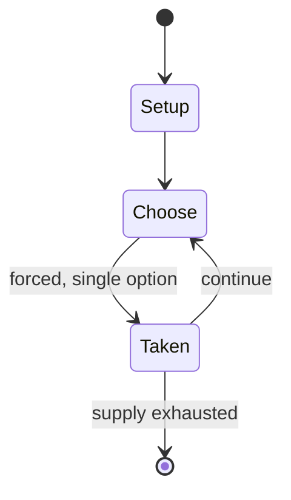

# Casualties: Unknown

*2026 scavenge-survival video game*

`casualties_unknown` &nbsp; state: **DEEPENED** &nbsp; method: **heuristic**

## Found layer (recorded, not trusted)

| field | value |
| --- | --- |
| wikidata | Q140325241 |
| wikipedia | Casualties: Unknown |
| genres (source) | -- |
| instance of (source) | video game |
| country of origin | -- |

## Declared layer (orders bench work)

| field | value |
| --- | --- |
| year created | 2026 |
| epoch | CONTEMPORARY |
| region | -- |
| media | VIDEO |
| players | -- |
| age band | -- |
| exogenous process | NONE |
| loss shape | OPPORTUNITY_ONLY |
| live axes | - |
| horizon | -- |
| scoring shape | SURVIVAL |
| information | PERFECT |
| interaction | -- |
| turn structure | -- |
| tractability | SAMPLING_ONLY |
| randomness | PROCEDURAL_GENERATION |
| luck factor | 0.3 |
| rules complexity | 1.74 |
| strategic depth | 2.0 |
| novelty | 0.5036 |
| solved status | -- |
| strategies | -- |
| algorithms | -- |

## Object model

```
Episode
  players      : ?
  turn_structure: ?
  horizon       : ?
  scoring       : SURVIVAL

WorldState     -- simulation state advanced by the engine
Avatar         -- player-controlled agent
Clock          -- frame or tick counter
```

## State transition diagram



## Research item -- turn trace

```
# Casualties: Unknown -- simulated turn events
# generated from the DECLARED vector, not from a rulebook.
# structure: exo=NONE loss=OPPORTUNITY_ONLY horizon=None scoring=SURVIVAL axes=-

t=0    SETUP        players=2  pot=0  capacity=3
t=1    FORCED       p1 single legal option taken (pot_gain=+1.2)
t=2    FORCED       p1 single legal option taken (pot_gain=+1.4)
t=3    FORCED       p1 single legal option taken (pot_gain=+1.1)
t=4    FORCED       p1 single legal option taken (pot_gain=+0.6)
t=5    FORCED       p1 single legal option taken (pot_gain=+1.9)
t=6    ENDTURN      turn passes to p2
t=7    FORCED       p2 single legal option taken (pot_gain=+1.7)
t=8    FORCED       p2 single legal option taken (pot_gain=+1.7)
t=9    FORCED       p2 single legal option taken (pot_gain=+1.0)
t=10   FORCED       p2 single legal option taken (pot_gain=+0.9)
t=11   ENDTURN      turn passes to p1
t=12   FORCED       p1 single legal option taken (pot_gain=+1.3)
t=13   FORCED       p1 single legal option taken (pot_gain=+1.2)
t=14   FORCED       p1 single legal option taken (pot_gain=+1.8)
t=15   ENDTURN      turn passes to p2
t=16   FORCED       p2 single legal option taken (pot_gain=+1.0)
t=17   FORCED       p2 single legal option taken (pot_gain=+1.0)
t=18   FORCED       p2 single legal option taken (pot_gain=+0.9)
t=19   ENDTURN      turn passes to p1
t=20   FORCED       p1 single legal option taken (pot_gain=+1.0)
t=21   FORCED       p1 single legal option taken (pot_gain=+0.5)
t=22   FORCED       p1 single legal option taken (pot_gain=+1.6)
t=23   FORCED       p1 single legal option taken (pot_gain=+1.3)
t=24   ENDTURN      turn passes to p2
t=25   FORCED       p2 single legal option taken (pot_gain=+0.8)
t=26   FORCED       p2 single legal option taken (pot_gain=+0.6)

terminal: VARIABLE
```

## Source extract

Casualties: Unknown is an upcoming survival video game developed by Orsoniks and published by
Oro Interactive that is scheduled to be released in 2026. Players play as an Experiment, a test
subject sent down to explore the depths of an alien planet. The game revolves around navigating
and safely descending the planet's cavernous layers while avoiding and treating injuries,
hunger, and thirst. The game centers around robust health systems and difficult resource
management, challenging players to avoid death in numerous ways as they go as far down as they
can. As of mid-2026 the game had not received a full release; a playable demo became available
on the digital storefront Steam on April 20, 2026.   == Gameplay == Casualties: Unknown is a
cave-exploration survival game in which the player controls a captive test subject called an
Experiment placed on a hostile alien planet and tasked with retrieving lost cargo. The full game
is planned to include eleven procedurally generated underground "layers" of increasing
difficulty; the public demo makes five of these layers available. A press release describes the
game as featuring a "fully simulated limb and cardiovascular system," requiring

<sub>Wikipedia, CC BY-SA. Retained as evidence for the structural
classification above. Every rule inferred from it is HYPOTHESIZED
until audited against a rulebook.</sub>
