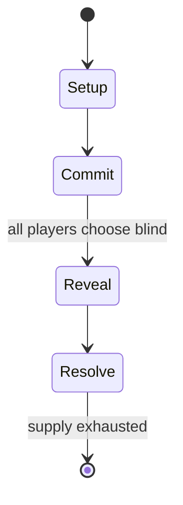

# Cat in the Box

`cat_in_the_box` &nbsp; state: **DEEPENED** &nbsp; method: **heuristic**

## Found layer (recorded, not trusted)

| field | value |
| --- | --- |
| wikidata | Q124386210 |
| wikipedia | Cat in the Box |
| genres (source) | -- |
| instance of (source) | -- |
| country of origin | -- |

## Declared layer (orders bench work)

| field | value |
| --- | --- |
| year created | 2020 |
| epoch | CONTEMPORARY |
| region | -- |
| media | CARD, TRICK_TAKING |
| players | -- |
| age band | -- |
| exogenous process | DEPLETING_DECK |
| loss shape | -- |
| live axes | COMMIT_BLIND |
| horizon | -- |
| scoring shape | SET_COLLECTION_CONVEX |
| information | SIMULTANEOUS |
| interaction | -- |
| turn structure | SIMULTANEOUS |
| tractability | EXACT_WITH_CUT |
| randomness | DECK_SHUFFLE, SIMULTANEOUS_CHOICE |
| luck factor | 0.48 |
| rules complexity | 2.17 |
| strategic depth | 2.25 |
| novelty | 0.7867 |
| solved status | -- |
| strategies | set_collection |
| algorithms | -- |

## Object model

```
Episode
  players      : ?
  turn_structure: SIMULTANEOUS
  horizon       : ?
  scoring       : SET_COLLECTION_CONVEX

Deck           -- ordered multiset, drawn without replacement
Hand           -- private multiset held by one player
DiscardPile    -- public accumulation of spent cards
Trick          -- one card per player; a winner is determined
Trump          -- suit that dominates the ordering
SealedChoice   -- irrevocable choice made without observation
```

## State transition diagram



## Research item -- turn trace

```
# Cat in the Box -- simulated turn events
# generated from the DECLARED vector, not from a rulebook.
# structure: exo=DEPLETING_DECK loss=None horizon=None scoring=SET_COLLECTION_CONVEX axes=COMMIT_BLIND

t=0    SETUP        players=2  pot=0  capacity=4
t=1    DRAW         p1 draw from deck -> outcome #3  (p=0.152)
t=2    FORCED       p1 single legal option taken (pot_gain=+0.8)
t=3    DRAW         p1 draw from deck -> outcome #4  (p=0.250)
t=4    FORCED       p1 single legal option taken (pot_gain=+1.4)
t=5    DRAW         p1 draw from deck -> outcome #4  (p=0.160)
t=6    FORCED       p1 single legal option taken (pot_gain=+0.8)
t=7    DRAW         p1 draw from deck -> outcome #1  (p=0.019)
t=8    FORCED       p1 single legal option taken (pot_gain=+1.8)
t=9    DRAW         p1 draw from deck -> outcome #4  (p=0.280)
t=10   FORCED       p1 single legal option taken (pot_gain=+1.6)
t=11   ENDTURN      turn passes to p2
t=12   DRAW         p2 draw from deck -> outcome #1  (p=0.142)
t=13   FORCED       p2 single legal option taken (pot_gain=+2.0)
t=14   ENDTURN      turn passes to p1
t=15   DRAW         p1 draw from deck -> outcome #5  (p=0.062)
t=16   FORCED       p1 single legal option taken (pot_gain=+0.5)
t=17   DRAW         p1 draw from deck -> outcome #2  (p=0.054)
t=18   FORCED       p1 single legal option taken (pot_gain=+0.5)
t=19   ENDTURN      turn passes to p2
t=20   DRAW         p2 draw from deck -> outcome #2  (p=0.026)
t=21   FORCED       p2 single legal option taken (pot_gain=+2.0)
t=22   DRAW         p2 draw from deck -> outcome #2  (p=0.232)
t=23   FORCED       p2 single legal option taken (pot_gain=+1.3)
t=24   DRAW         p2 draw from deck -> outcome #3  (p=0.124)
t=25   FORCED       p2 single legal option taken (pot_gain=+0.8)
t=26   ENDTURN      turn passes to p1

terminal: VARIABLE
```

## Conditions

| kind | threshold | effect | trigger |
| --- | --- | --- | --- |
| BOUNDARY | 45 cards | -- | Cat in the Box is played using a deck of cat cards labelled 1–9, where the number of copies of each type is determined by number of players to a maximum of 45 cards. |
| WIN | -- | -- | The player with the most points by the end of the game is the winner. |

## Source extract

Cat in the Box, is a trick-taking card game designed by Muneyuki Yokouchi (横内宗幸) and published
by Ayatsurare Ningyoukan (操られ人形館) in 2020 based on the Schrödinger's cat thought experiment. A
second edition, Cat in the Box: Deluxe Edition was released by Hobby Japan and Bézier Games in
2022.   == Publishing history == Cat in the Box was announced at Game Market in 2020 and
released in Japan by Ayatsurare Ningyoukan later that year for 3–4 players. A second edition,
Cat in the Box: Deluxe Edition, for 2–5 players was released by Hobby Japan in July 2022 with
updated game artwork and rules. This edition was also released in English by Bézier Games in
August 2022. Bézier Games released a Kickstarter for Colossal Cat in the Box, an edition where
all game pieces are four times larger than the base game, which was funded, and published in
2024.   == Gameplay == Cat in the Box is played using a deck of cat cards labelled 1–9, where
the number of copies of each type is determined by number of players to a maximum of 45 cards.
Each player begins with a player board with four colours on it (red, yellow, green, blue) and a
set of player tokens; player tokens are placed on each of the coloured s

<sub>Wikipedia, CC BY-SA. Retained as evidence for the structural
classification above. Every rule inferred from it is HYPOTHESIZED
until audited against a rulebook.</sub>
