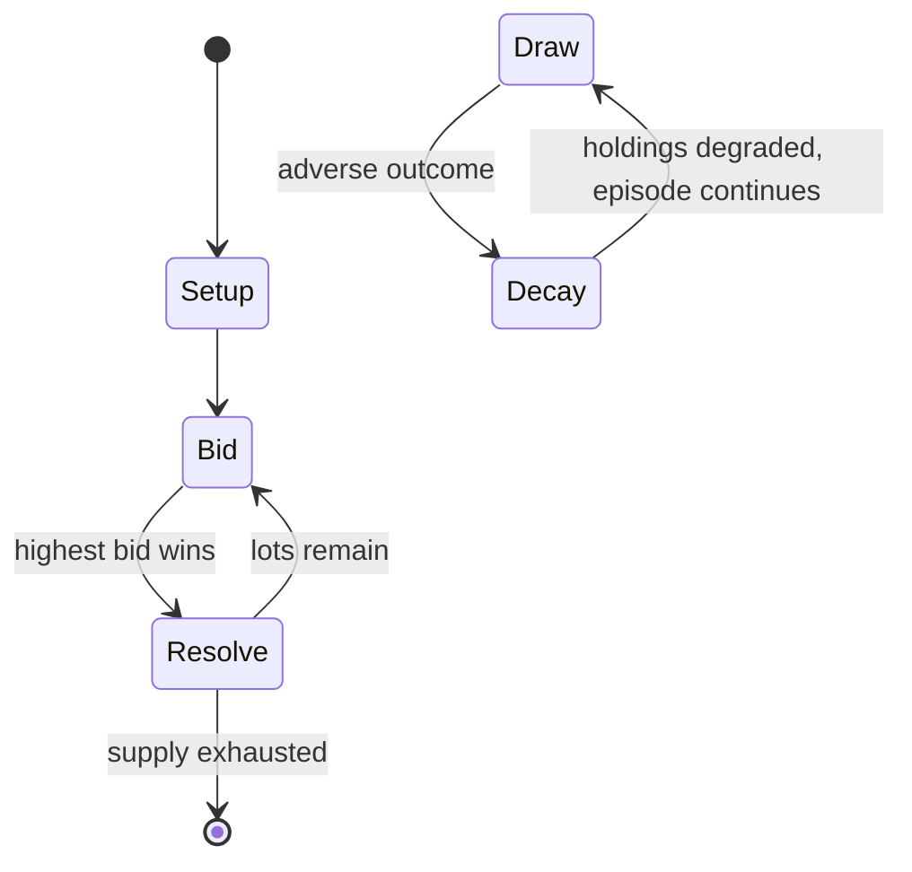

# Cego

*card game*

`cego` &nbsp; state: **DEEPENED** &nbsp; method: **heuristic**

## Found layer (recorded, not trusted)

| field | value |
| --- | --- |
| wikidata | Q1052690 |
| wikipedia | Cego |
| genres (source) | -- |
| instance of (source) | playing card, tarot card game |
| country of origin | -- |

## Declared layer (orders bench work)

| field | value |
| --- | --- |
| year created | 2022 |
| epoch | CONTEMPORARY |
| region | -- |
| media | CARD |
| players | 4 |
| age band | -- |
| exogenous process | DEPLETING_DECK |
| loss shape | PARTIAL_DECAY |
| live axes | COMMIT_BLIND, DISCARD |
| horizon | -- |
| scoring shape | -- |
| information | HIDDEN_PRIVATE |
| interaction | -- |
| turn structure | AUCTION_ROUND |
| tractability | SAMPLING_ONLY |
| randomness | HIDDEN_INFO |
| luck factor | 0.35 |
| rules complexity | 2.32 |
| strategic depth | 2.25 |
| novelty | 0.8293 |
| solved status | -- |
| strategies | probability_estimation |
| algorithms | -- |

## Object model

```
Episode
  players      : 4
  turn_structure: AUCTION_ROUND
  horizon       : ?
  scoring       : ?

Deck           -- ordered multiset, drawn without replacement
Hand           -- private multiset held by one player
DiscardPile    -- public accumulation of spent cards
SealedChoice   -- irrevocable choice made without observation
DiscardChoice  -- what is given up to satisfy a limit
```

## State transition diagram



## Research item -- turn trace

```
# Cego -- simulated turn events
# generated from the DECLARED vector, not from a rulebook.
# structure: exo=DEPLETING_DECK loss=PARTIAL_DECAY horizon=None scoring=None axes=COMMIT_BLIND,DISCARD

t=0    SETUP        players=4  pot=0  capacity=6
t=1    DRAW         p1 draw from deck -> outcome #3  (p=0.046)
t=2    FORCED       p1 single legal option taken (pot_gain=+1.5)
t=3    DISCARD      p1 discards to hand limit
t=4    DRAW         p1 draw from deck -> outcome #3  (p=0.083)
t=5    FORCED       p1 single legal option taken (pot_gain=+1.6)
t=6    DISCARD      p1 discards to hand limit
t=7    DRAW         p1 draw from deck -> outcome #4  (p=0.127)
t=8    FORCED       p1 single legal option taken (pot_gain=+1.3)
t=9    DRAW         p1 draw from deck -> outcome #4  (p=0.054)
t=10   FORCED       p1 single legal option taken (pot_gain=+1.3)
t=11   DRAW         p1 draw from deck -> outcome #1  (p=0.108)
t=12   FORCED       p1 single legal option taken (pot_gain=+0.9)
t=13   DRAW         p1 draw from deck -> outcome #1  (p=0.021)
t=14   FORCED       p1 single legal option taken (pot_gain=+1.2)
t=15   DISCARD      p1 discards to hand limit
t=16   DRAW         p1 draw from deck -> outcome #6  (p=0.024)
t=17   FORCED       p1 single legal option taken (pot_gain=+1.6)
t=18   DRAW         p1 draw from deck -> outcome #1  (p=0.027)
t=19   FORCED       p1 single legal option taken (pot_gain=+0.7)
t=20   DRAW         p1 draw from deck -> outcome #1  (p=0.093)
t=21   FORCED       p1 single legal option taken (pot_gain=+2.0)
t=22   ENDTURN      turn passes to p2
t=23   DRAW         p2 draw from deck -> outcome #5  (p=0.140)
t=24   FORCED       p2 single legal option taken (pot_gain=+0.6)
t=25   DRAW         p2 draw from deck -> outcome #3  (p=0.147)
t=26   FORCED       p2 single legal option taken (pot_gain=+0.7)

terminal: VARIABLE
```

## Conditions

| kind | threshold | effect | trigger |
| --- | --- | --- | --- |
| LOSE | 27 card | -- | If Anna loses the game with 27 card points, she pays each defender 3¢ x 2 = 6¢, paying out a total of 18¢. |
| BOUNDARY | 70 card | -- | There are 70 card points in total and the declarer needs at least 36 to win; a tie on 35-35 is win for the defenders. |
| BOUNDARY | -- | -- | Packs for Cego had been produced since at least 1852, but it is not known whether they were of the Animal Tarot type or another pattern that preceded the Encyclopaedic Tarot also used for Cego. |
| PENALTY | -- | -- | By pre-agreement, such an infraction may incur an eightfold loss of the game. |

## Source extract

Cego is a Tarot card game for three or four players played mainly in and around the Black Forest
region of Germany. It was probably derived from the three-player Badenese game of Dreierles when
soldiers deployed from the Iberian Peninsula during the Napoleonic Wars and, based on a Spanish
game they had encountered, introduced Cego's distinctive feature: a concealed hand, or blind
(Portuguese: cego). Cego has experienced a revival in recent years, being seen as part of the
culture of the Black Forest and surrounding region. It has been called the national game of
Baden and described as a "family classic".   == History and development == Sometimes called
Baden Tarock and, historically, also Zeco, Zego, Zigo, Caeco, Cäco and Ceco (Latin: caecus,
meaning blind), Cego is seen as part of the cultural heritage of the Black Forest and Baden
region.  After the defeat of Further Austria, in 1805 much of its territory was allocated to the
Grand Duchy of Baden. During the ensuing Napoleonic Wars, soldiers from Baden deployed with
Napoleon's troops to Spain where, among other things, they learnt a new card game, Ombre. Recent
research suggests that they took elements of this game back to Baden

<sub>Wikipedia, CC BY-SA. Retained as evidence for the structural
classification above. Every rule inferred from it is HYPOTHESIZED
until audited against a rulebook.</sub>
