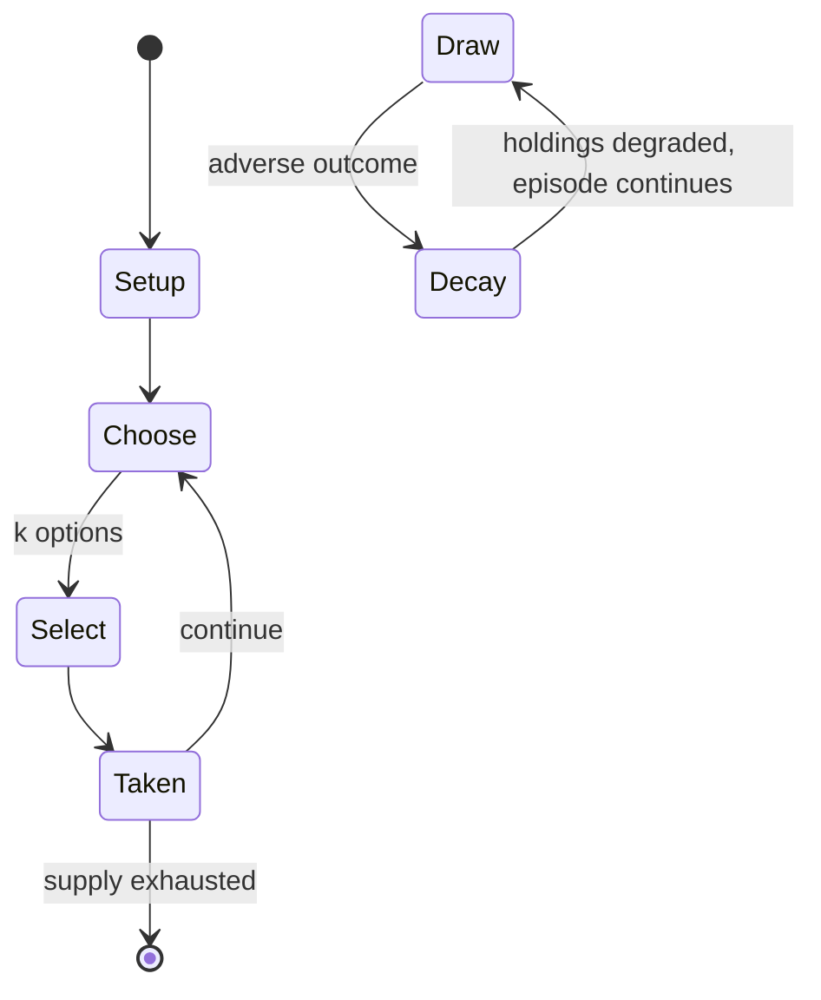

# Celebrity

*party game similar to Charades, where teams play against each other to guess as many celebrity names as possible before time runs out*

`celebrity` &nbsp; state: **DEEPENED** &nbsp; method: **heuristic**

## Found layer (recorded, not trusted)

| field | value |
| --- | --- |
| wikidata | Q5057667 |
| wikipedia | Celebrity (game) |
| genres (source) | -- |
| instance of (source) | party game |
| country of origin | -- |

## Declared layer (orders bench work)

| field | value |
| --- | --- |
| year created | -- |
| epoch | -- |
| region | -- |
| media | PARTY |
| players | -- |
| age band | -- |
| exogenous process | -- |
| loss shape | PARTIAL_DECAY |
| live axes | SELECT |
| horizon | -- |
| scoring shape | -- |
| information | -- |
| interaction | COMPETITIVE |
| turn structure | -- |
| tractability | SAMPLING_ONLY |
| randomness | -- |
| luck factor | 0.35 |
| rules complexity | 2.1 |
| strategic depth | 2.0 |
| novelty | 0.517 |
| solved status | -- |
| strategies | -- |
| algorithms | -- |

## Object model

```
Episode
  players      : ?
  turn_structure: ?
  horizon       : ?
  scoring       : ?

OptionSet      -- the choices available after an exogenous draw
```

## State transition diagram



## Research item -- turn trace

```
# Celebrity -- simulated turn events
# generated from the DECLARED vector, not from a rulebook.
# structure: exo=None loss=PARTIAL_DECAY horizon=None scoring=None axes=SELECT

t=0    SETUP        players=2  pot=0  capacity=7
t=1    SELECT       p1 4 options; take #4  (pot_gain=+2.6, capacity=-1)
t=2    SELECT       p1 2 options; take #1  (pot_gain=+1.1, capacity=-1)
t=3    SELECT       p1 1 options; take #1  (pot_gain=+2.4, capacity=-0)
t=4    SELECT       p1 3 options; take #3  (pot_gain=+2.0, capacity=-1)
t=5    SELECT       p1 4 options; take #3  (pot_gain=+1.6, capacity=-1)
t=6    SELECT       p1 1 options; take #1  (pot_gain=+2.4, capacity=-2)
t=7    SELECT       p1 4 options; take #1  (pot_gain=+1.3, capacity=-2)
t=8    SELECT       p1 1 options; take #1  (pot_gain=+3.3, capacity=-2)
t=9    ENDTURN      turn passes to p2
t=10   SELECT       p2 2 options; take #2  (pot_gain=+3.0, capacity=-0)
t=11   ENDTURN      turn passes to p1
t=12   SELECT       p1 3 options; take #2  (pot_gain=+2.0, capacity=-2)
t=13   ENDTURN      turn passes to p2
t=14   SELECT       p2 4 options; take #4  (pot_gain=+3.1, capacity=-1)
t=15   SELECT       p2 4 options; take #1  (pot_gain=+1.1, capacity=-2)
t=16   SELECT       p2 4 options; take #3  (pot_gain=+0.6, capacity=-1)
t=17   SELECT       p2 1 options; take #1  (pot_gain=+0.8, capacity=-0)
t=18   SELECT       p2 1 options; take #1  (pot_gain=+0.8, capacity=-1)
t=19   SELECT       p2 3 options; take #3  (pot_gain=+2.5, capacity=-0)
t=20   SELECT       p2 2 options; take #1  (pot_gain=+1.9, capacity=-2)
t=21   SELECT       p2 3 options; take #3  (pot_gain=+2.6, capacity=-0)
t=22   ENDTURN      turn passes to p1
t=23   SELECT       p1 2 options; take #1  (pot_gain=+1.8, capacity=-0)
t=24   SELECT       p1 1 options; take #1  (pot_gain=+1.3, capacity=-0)
t=25   SELECT       p1 1 options; take #1  (pot_gain=+2.8, capacity=-1)
t=26   SELECT       p1 1 options; take #1  (pot_gain=+3.4, capacity=-0)

terminal: VARIABLE
```

## Conditions

| kind | threshold | effect | trigger |
| --- | --- | --- | --- |
| TERMINATE | -- | -- | Alternatively, if an illegal clue is given, the round ends immediately. |

## Source extract

Celebrity (also known as Celebrities, The Hat Game, Lunchbox, Fish Bowl, Salad Bowl, or The Name
Game) is a party game similar to Charades, where teams play against each other to guess as many
celebrity names as possible before time runs out.   == Gameplay == One team is chosen to go
first, and that team selects a player to give clues to the rest of their team.  Play begins when
the clue-giver picks a name out of the hat.  From that moment, they have one minute to get their
team to correctly guess as many celebrity names as possible before time runs. The clue-giver can
say anything they want as long as it is not any part of the celebrity's name or a direct
reference to the name.  For Dolly Parton, it is acceptable to say, "She has her own theme park
in Tennessee", but not, "She has a themepark called 'Dollywood'."  It is also illegal to give
clues such as, "Her name begins with a 'D'."  It is permissible to use other similar named
people as clues.  For example, "President Madison's wife's first name is the same as this
person." When the team guesses the celebrity name correctly, the clue-giver draws another name
from the hat and continues until time is up or there are no more names

<sub>Wikipedia, CC BY-SA. Retained as evidence for the structural
classification above. Every rule inferred from it is HYPOTHESIZED
until audited against a rulebook.</sub>
