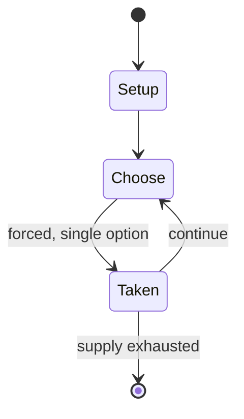

# Centaur

*pinball machine*

`centaur` &nbsp; state: **DEEPENED** &nbsp; method: **heuristic**

## Found layer (recorded, not trusted)

| field | value |
| --- | --- |
| wikidata | Q20874763 |
| wikipedia | Centaur (pinball) |
| genres (source) | -- |
| instance of (source) | video game |
| country of origin | -- |

## Declared layer (orders bench work)

| field | value |
| --- | --- |
| year created | 1983 |
| epoch | DIGITAL |
| region | -- |
| media | VIDEO |
| players | -- |
| age band | -- |
| exogenous process | -- |
| loss shape | -- |
| live axes | ORDER |
| horizon | -- |
| scoring shape | NONLINEAR |
| information | -- |
| interaction | SOLITAIRE |
| turn structure | -- |
| tractability | SAMPLING_ONLY |
| randomness | -- |
| luck factor | 0.35 |
| rules complexity | 2.06 |
| strategic depth | 2.25 |
| novelty | 0.5805 |
| solved status | -- |
| strategies | set_collection |
| algorithms | -- |

## Object model

```
Episode
  players      : ?
  turn_structure: ?
  horizon       : ?
  scoring       : NONLINEAR

WorldState     -- simulation state advanced by the engine
Avatar         -- player-controlled agent
Clock          -- frame or tick counter
Sequence       -- the permutation under the player's control
```

## State transition diagram



## Research item -- turn trace

```
# Centaur -- simulated turn events
# generated from the DECLARED vector, not from a rulebook.
# structure: exo=None loss=None horizon=None scoring=NONLINEAR axes=ORDER

t=0    SETUP        players=2  pot=0  capacity=7
t=1    FORCED       p1 single legal option taken (pot_gain=+1.3)
t=2    FORCED       p1 single legal option taken (pot_gain=+0.6)
t=3    ENDTURN      turn passes to p2
t=4    FORCED       p2 single legal option taken (pot_gain=+1.2)
t=5    FORCED       p2 single legal option taken (pot_gain=+1.5)
t=6    FORCED       p2 single legal option taken (pot_gain=+1.8)
t=7    ENDTURN      turn passes to p1
t=8    FORCED       p1 single legal option taken (pot_gain=+1.2)
t=9    FORCED       p1 single legal option taken (pot_gain=+1.2)
t=10   FORCED       p1 single legal option taken (pot_gain=+0.7)
t=11   ENDTURN      turn passes to p2
t=12   FORCED       p2 single legal option taken (pot_gain=+1.2)
t=13   ENDTURN      turn passes to p1
t=14   FORCED       p1 single legal option taken (pot_gain=+1.3)
t=15   FORCED       p1 single legal option taken (pot_gain=+1.9)
t=16   ENDTURN      turn passes to p2
t=17   FORCED       p2 single legal option taken (pot_gain=+1.4)
t=18   FORCED       p2 single legal option taken (pot_gain=+0.7)
t=19   ENDTURN      turn passes to p1
t=20   FORCED       p1 single legal option taken (pot_gain=+1.7)
t=21   FORCED       p1 single legal option taken (pot_gain=+1.5)
t=22   ENDTURN      turn passes to p2
t=23   FORCED       p2 single legal option taken (pot_gain=+0.6)
t=24   FORCED       p2 single legal option taken (pot_gain=+1.8)
t=25   FORCED       p2 single legal option taken (pot_gain=+1.1)
t=26   FORCED       p2 single legal option taken (pot_gain=+1.8)
t=27   ENDTURN      turn passes to p1

terminal: VARIABLE
```

## Conditions

| kind | threshold | effect | trigger |
| --- | --- | --- | --- |
| BOUNDARY | -- | -- | Two targets on the playfield releases all accumulated balls for a maximum of five ball multiball. |

## Source extract

Centaur is a pinball machine released by Bally, and the last pinball machine designed solely by
Jim Patla. The game was inspired by the classic Bally's 1956 Balls-A-Poppin, the first flipper
pinball machine with multiball. Because of its success, the pinball machine was re-released in
1983 as Centaur II. The re-release has only a different backbox and was otherwise unchanged.
== Design == In early stages of the design process the game was called "Video Classic". The idea
to make the playfield black and white came from the artist Paul Faris, along with the fantasy
theme of the centaur. The designer Jim Patla then worked out dialogue and features to fit the
theme. The game released after video game successes such as Pac-Man and Defender, and aspects of
the design were influenced by video games. Similar to attract modes in contemporary video games
Centaur implements an attract mode demonstrating its features when a flipper button is pushed;
balls are launched to show it is a multiball game, and the game demonstrates its main features.
The production of the artwork began with a sketch of the backglass which defined the look of the
game. The artwork for the cabinet and backbox was the

<sub>Wikipedia, CC BY-SA. Retained as evidence for the structural
classification above. Every rule inferred from it is HYPOTHESIZED
until audited against a rulebook.</sub>
