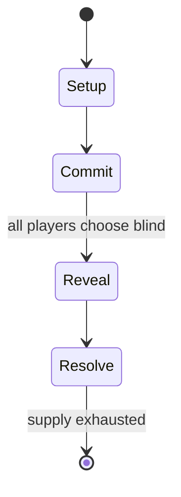

# Chainmail

*wargame which was the precursor to Dungeons & Dragons*

`chainmail` &nbsp; state: **DEEPENED** &nbsp; method: **heuristic**

## Found layer (recorded, not trusted)

| field | value |
| --- | --- |
| wikidata | Q1059132 |
| wikipedia | Chainmail (game) |
| genres (source) | miniature wargaming |
| instance of (source) | miniature wargaming |
| country of origin | -- |

## Declared layer (orders bench work)

| field | value |
| --- | --- |
| year created | 1971 |
| epoch | DIGITAL |
| region | -- |
| media | DICE, MINIATURES, WARGAME |
| players | -- |
| age band | -- |
| exogenous process | IID |
| loss shape | -- |
| live axes | COMMIT_BLIND |
| horizon | -- |
| scoring shape | SET_COLLECTION_CONVEX |
| information | SIMULTANEOUS |
| interaction | -- |
| turn structure | SIMULTANEOUS |
| tractability | SAMPLING_ONLY |
| randomness | DICE |
| luck factor | 0.58 |
| rules complexity | 3.88 |
| strategic depth | 2.12 |
| novelty | 0.6444 |
| solved status | -- |
| strategies | set_collection |
| algorithms | -- |

## Object model

```
Episode
  players      : ?
  turn_structure: SIMULTANEOUS
  horizon       : ?
  scoring       : SET_COLLECTION_CONVEX

DicePool       -- n dice, each an iid categorical draw
Roll           -- realised outcome of a pool
SealedChoice   -- irrevocable choice made without observation
```

## State transition diagram



## Research item -- turn trace

```
# Chainmail -- simulated turn events
# generated from the DECLARED vector, not from a rulebook.
# structure: exo=IID loss=None horizon=None scoring=SET_COLLECTION_CONVEX axes=COMMIT_BLIND

t=0    SETUP        players=2  pot=0  capacity=3
t=1    DRAW         p1 roll from d6 pool -> outcome #3  (p=0.275)
t=2    FORCED       p1 single legal option taken (pot_gain=+1.9)
t=3    DRAW         p1 roll from d6 pool -> outcome #4  (p=0.081)
t=4    FORCED       p1 single legal option taken (pot_gain=+0.8)
t=5    ENDTURN      turn passes to p2
t=6    DRAW         p2 roll from d6 pool -> outcome #2  (p=0.205)
t=7    FORCED       p2 single legal option taken (pot_gain=+1.1)
t=8    ENDTURN      turn passes to p1
t=9    DRAW         p1 roll from d6 pool -> outcome #6  (p=0.281)
t=10   FORCED       p1 single legal option taken (pot_gain=+1.1)
t=11   DRAW         p1 roll from d6 pool -> outcome #4  (p=0.174)
t=12   FORCED       p1 single legal option taken (pot_gain=+0.7)
t=13   DRAW         p1 roll from d6 pool -> outcome #1  (p=0.101)
t=14   FORCED       p1 single legal option taken (pot_gain=+2.0)
t=15   DRAW         p1 roll from d6 pool -> outcome #4  (p=0.173)
t=16   FORCED       p1 single legal option taken (pot_gain=+1.4)
t=17   ENDTURN      turn passes to p2
t=18   DRAW         p2 roll from d6 pool -> outcome #6  (p=0.086)
t=19   FORCED       p2 single legal option taken (pot_gain=+0.9)
t=20   DRAW         p2 roll from d6 pool -> outcome #3  (p=0.006)
t=21   FORCED       p2 single legal option taken (pot_gain=+1.6)
t=22   ENDTURN      turn passes to p1
t=23   DRAW         p1 roll from d6 pool -> outcome #1  (p=0.005)
t=24   FORCED       p1 single legal option taken (pot_gain=+1.4)
t=25   DRAW         p1 roll from d6 pool -> outcome #3  (p=0.186)
t=26   FORCED       p1 single legal option taken (pot_gain=+1.7)

terminal: VARIABLE
```

## Source extract

Chainmail is a medieval miniature wargame created by Gary Gygax and Jeff Perren. Gygax developed
the core medieval system of the game by expanding on rules authored by his fellow Lake Geneva
Tactical Studies Association (LGTSA) member Jeff Perren, a hobby-shop owner with whom he had
become friendly. Guidon Games released the first edition of Chainmail in 1971.   == Early
history ==   === Origins === In 1967, Henry Bodenstedt created the medieval wargame Siege of
Bodenburg, which was designed for use with 40mm miniatures. Gary Gygax first encountered Siege
of Bodenburg at Gen Con I (1968), and played the game during that convention. The rules for
Siege of Bodenburg had been published in Strategy & Tactics magazine, and Jeff Perren developed
his own medieval rules based on those and shared them with Gary Gygax. The original set of
medieval miniatures rules by Jeff Perren were just four pages. Gygax edited and expanded these
rules, which were published as "Geneva Medieval Miniatures", in Panzerfaust magazine (April
1970), using 1:20 figure scale. The rules were again revised, and then self-published in the
newsletter of the Castle & Crusade Society, The Domesday Book, as the "LGTSA Mi

<sub>Wikipedia, CC BY-SA. Retained as evidence for the structural
classification above. Every rule inferred from it is HYPOTHESIZED
until audited against a rulebook.</sub>
