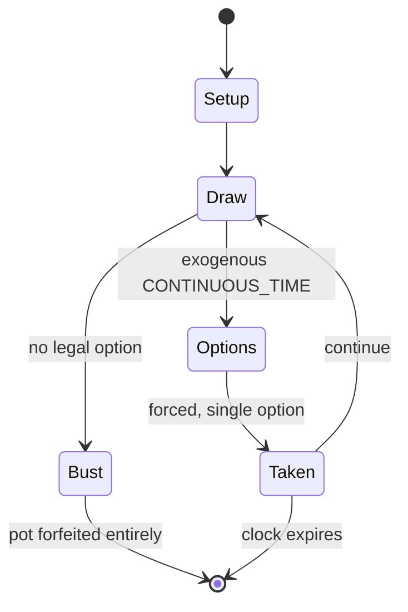

# charades

*word guessing game*

`charades` &nbsp; state: **DEEPENED** &nbsp; method: **heuristic**

## Found layer (recorded, not trusted)

| field | value |
| --- | --- |
| wikidata | Q2144077 |
| wikipedia | Charades |
| genres (source) | -- |
| instance of (source) | word game |
| country of origin | -- |

## Declared layer (orders bench work)

| field | value |
| --- | --- |
| year created | -- |
| epoch | -- |
| region | -- |
| media | WORD |
| players | -- |
| age band | -- |
| exogenous process | CONTINUOUS_TIME |
| loss shape | TOTAL_RUIN |
| live axes | - |
| horizon | CLOCK_LIMITED |
| scoring shape | -- |
| information | -- |
| interaction | TEAM |
| turn structure | -- |
| tractability | SAMPLING_ONLY |
| randomness | REAL_TIME_PHYSICAL |
| luck factor | 0.3 |
| rules complexity | 1.78 |
| strategic depth | 2.25 |
| novelty | 0.6429 |
| solved status | -- |
| strategies | signalling |
| algorithms | -- |

## Object model

```
Episode
  players      : ?
  turn_structure: ?
  horizon       : CLOCK_LIMITED
  scoring       : ?

State          -- opaque; no medium or axis evidence was found
Player         -- an agent that selects among legal successors
```

## State transition diagram



## Research item -- turn trace

```
# charades -- simulated turn events
# generated from the DECLARED vector, not from a rulebook.
# structure: exo=CONTINUOUS_TIME loss=TOTAL_RUIN horizon=CLOCK_LIMITED scoring=None axes=-

t=0    SETUP        players=2  pot=0  capacity=3
t=1    DRAW         p1 tick from clock -> outcome #1  (p=0.099)
t=2    FORCED       p1 single legal option taken (pot_gain=+0.7)
t=3    DRAW         p1 tick from clock -> outcome #6  (p=0.106)
t=4    FORCED       p1 single legal option taken (pot_gain=+1.7)
t=5    DRAW         p1 tick from clock -> outcome #3  (p=0.137)
t=6    FORCED       p1 single legal option taken (pot_gain=+1.1)
t=7    ENDTURN      turn passes to p2
t=8    DRAW         p2 tick from clock -> outcome #6  (p=0.253)
t=9    FORCED       p2 single legal option taken (pot_gain=+1.8)
t=10   ENDTURN      turn passes to p1
t=11   DRAW         p1 tick from clock -> outcome #2  (p=0.224)
t=12   FORCED       p1 single legal option taken (pot_gain=+0.6)
t=13   DRAW         p1 tick from clock -> outcome #1  (p=0.299)
t=14   FORCED       p1 single legal option taken (pot_gain=+0.6)
t=15   ENDTURN      turn passes to p2
t=16   DRAW         p2 tick from clock -> outcome #6  (p=0.003)
t=17   FORCED       p2 single legal option taken (pot_gain=+1.1)
t=18   DRAW         p2 tick from clock -> outcome #4  (p=0.079)
t=19   DEATH        p2 no legal option -- BUST. pot 7.6 -> 0.0
t=20   NOTE         loss_shape=TOTAL_RUIN: entire pot forfeited

terminal: CLOCK_LIMITED
```

## Conditions

| kind | threshold | effect | trigger |
| --- | --- | --- | --- |
| BOUNDARY | -- | -- | Alternation of teams until every player has acted at least once. |

## Source extract

Charades (UK: , US: ) is a parlor or party word guessing game. Originally, the game was a
dramatic form of literary charades: a single person would act out each syllable of a word or
phrase in order, followed by the whole phrase together, while the rest of the group guessed. A
variant was to have teams who acted scenes out together while the others guessed. Today, it is
common to require the actors to mime their hints without using any spoken words, which requires
some conventional gestures. Puns and visual puns were and remain common.   == History ==   ===
Literary charades ===  A charade was a form of literary riddle popularized in France in the 18th
century where each syllable of the answer was described enigmatically as a separate word before
the word as a whole was similarly described. The term charade was borrowed into English from
French in the second half of the eighteenth century, denoting a "kind of riddle in which each
syllable of a word, or a complete word or phrase, is enigmatically described or dramatically
represented".  Written forms of charade appeared in magazines and books, and on the folding fans
of the Regency. The answers were sometimes printed on the reverse

<sub>Wikipedia, CC BY-SA. Retained as evidence for the structural
classification above. Every rule inferred from it is HYPOTHESIZED
until audited against a rulebook.</sub>
