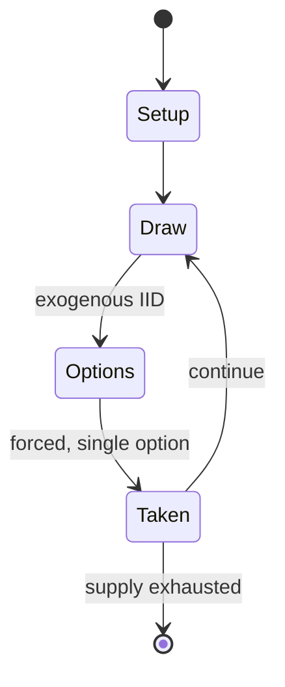

# Chase

*board game*

`chase` &nbsp; state: **DEEPENED** &nbsp; method: **heuristic**

## Found layer (recorded, not trusted)

| field | value |
| --- | --- |
| wikidata | Q104869724 |
| wikipedia | Chase (board game) |
| genres (source) | -- |
| instance of (source) | board game |
| country of origin | -- |

## Declared layer (orders bench work)

| field | value |
| --- | --- |
| year created | 1985 |
| epoch | DIGITAL |
| region | -- |
| media | BOARD, DICE |
| players | -- |
| age band | -- |
| exogenous process | IID |
| loss shape | -- |
| live axes | SPATIAL, TRADE |
| horizon | -- |
| scoring shape | -- |
| information | -- |
| interaction | COMPETITIVE |
| turn structure | STRICT_TURN |
| tractability | EXACT_WITH_CUT |
| randomness | DICE |
| luck factor | 0.58 |
| rules complexity | 2.51 |
| strategic depth | 1.87 |
| novelty | 0.6825 |
| solved status | -- |
| strategies | -- |
| algorithms | -- |

## Object model

```
Episode
  players      : ?
  turn_structure: STRICT_TURN
  horizon       : ?
  scoring       : ?

Board          -- spatial substrate; cells carry position and occupancy
Piece          -- movable token owned by a player
DicePool       -- n dice, each an iid categorical draw
Roll           -- realised outcome of a pool
Placement      -- position subject to geometric legality
Offer          -- proposed exchange between two agents
```

## State transition diagram



## Research item -- turn trace

```
# Chase -- simulated turn events
# generated from the DECLARED vector, not from a rulebook.
# structure: exo=IID loss=None horizon=None scoring=None axes=SPATIAL,TRADE

t=0    SETUP        players=2  pot=0  capacity=5
t=1    DRAW         p1 roll from d6 pool -> outcome #2  (p=0.138)
t=2    FORCED       p1 single legal option taken (pot_gain=+0.7)
t=3    DRAW         p1 roll from d6 pool -> outcome #5  (p=0.023)
t=4    FORCED       p1 single legal option taken (pot_gain=+1.2)
t=5    TRADE        p1 offers 2:1 exchange to p2
t=6    DRAW         p1 roll from d6 pool -> outcome #1  (p=0.219)
t=7    FORCED       p1 single legal option taken (pot_gain=+0.7)
t=8    DRAW         p1 roll from d6 pool -> outcome #6  (p=0.259)
t=9    FORCED       p1 single legal option taken (pot_gain=+1.1)
t=10   TRADE        p1 offers 2:1 exchange to p2
t=11   ENDTURN      turn passes to p2
t=12   DRAW         p2 roll from d6 pool -> outcome #3  (p=0.207)
t=13   FORCED       p2 single legal option taken (pot_gain=+1.3)
t=14   DRAW         p2 roll from d6 pool -> outcome #1  (p=0.080)
t=15   FORCED       p2 single legal option taken (pot_gain=+1.4)
t=16   DRAW         p2 roll from d6 pool -> outcome #4  (p=0.023)
t=17   FORCED       p2 single legal option taken (pot_gain=+1.7)
t=18   SPATIAL      p2 places at (4,7); adjacency legal
t=19   ENDTURN      turn passes to p1
t=20   DRAW         p1 roll from d6 pool -> outcome #4  (p=0.256)
t=21   FORCED       p1 single legal option taken (pot_gain=+1.0)
t=22   DRAW         p1 roll from d6 pool -> outcome #6  (p=0.182)
t=23   FORCED       p1 single legal option taken (pot_gain=+0.7)
t=24   SPATIAL      p1 places at (5,2); adjacency legal
t=25   DRAW         p1 roll from d6 pool -> outcome #2  (p=0.079)
t=26   FORCED       p1 single legal option taken (pot_gain=+1.2)

terminal: VARIABLE
```

## Conditions

| kind | threshold | effect | trigger |
| --- | --- | --- | --- |
| TERMINATE | 3 turns | -- | Draw: If both players repeat the same moves three turns in a row, the game ends in a draw. |
| BOUNDARY | -- | -- | Victory: A player wins by reducing their opponent to four dice, since this reduces the losing player's maximum total of pips to less than 25. |

## Source extract

Chase is a board game designed by Tom Kruszewski and published by TSR in 1985.   == Description
== Chase is a two-player abstract boardgame. The components are:  20 six-sided dice (10 red, 10
blue) board with a 9x9 hexagonal grid rulebook   === Set-up === Each player places 9 of their
dice on the end of the board closest to them, and turn the dice so that the values on the top of
the dice add up to 25. Each player must always have a total value of 25 on the board at all
times. The tenth die is held as a spare. Players then take turns either moving their dice to
capture the other player's dice, or exchanging dice values.   === Movement === The active player
can choose to move a die in any direction in a straight line for a number of hexes equal to the
number of pips showing on the die. The die cannot move through a space occupied by any other die
of either side, and cannot move through the center hex. If a die reaches the side of the board
and still has movement left, it "wraps" around the board (reappears in the analogous hex on the
opposite side of the board). If a die "hits" the end of the board and still has movement left,
it caroms off the end at a corresponding angle. If a die

<sub>Wikipedia, CC BY-SA. Retained as evidence for the structural
classification above. Every rule inferred from it is HYPOTHESIZED
until audited against a rulebook.</sub>
