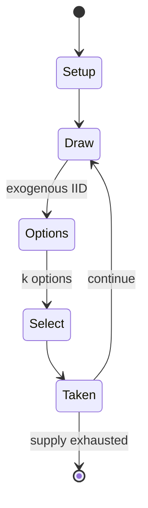

# Chaturaji

`chaturaji` &nbsp; state: **DEEPENED** &nbsp; method: **heuristic**

## Found layer (recorded, not trusted)

| field | value |
| --- | --- |
| wikidata | Q842543 |
| wikipedia | Chaturaji |
| genres (source) | -- |
| instance of (source) | -- |
| country of origin | -- |

## Declared layer (orders bench work)

| field | value |
| --- | --- |
| year created | -- |
| epoch | -- |
| region | -- |
| media | DICE |
| players | -- |
| age band | -- |
| exogenous process | IID |
| loss shape | -- |
| live axes | SELECT |
| horizon | -- |
| scoring shape | WINNER_TAKE_ALL |
| information | -- |
| interaction | COMPETITIVE |
| turn structure | -- |
| tractability | EXACT_WITH_CUT |
| randomness | DICE |
| luck factor | 0.58 |
| rules complexity | 2.18 |
| strategic depth | 1.87 |
| novelty | 0.7186 |
| solved status | -- |
| strategies | -- |
| algorithms | -- |

## Object model

```
Episode
  players      : ?
  turn_structure: ?
  horizon       : ?
  scoring       : WINNER_TAKE_ALL

DicePool       -- n dice, each an iid categorical draw
Roll           -- realised outcome of a pool
OptionSet      -- the choices available after an exogenous draw
```

## State transition diagram



## Research item -- turn trace

```
# Chaturaji -- simulated turn events
# generated from the DECLARED vector, not from a rulebook.
# structure: exo=IID loss=None horizon=None scoring=WINNER_TAKE_ALL axes=SELECT

t=0    SETUP        players=2  pot=0  capacity=7
t=1    DRAW         p1 roll from d6 pool -> outcome #2  (p=0.010)
t=2    SELECT       p1 3 options; take #2  (pot_gain=+3.4, capacity=-0)
t=3    ENDTURN      turn passes to p2
t=4    DRAW         p2 roll from d6 pool -> outcome #2  (p=0.016)
t=5    SELECT       p2 3 options; take #3  (pot_gain=+1.5, capacity=-0)
t=6    DRAW         p2 roll from d6 pool -> outcome #6  (p=0.173)
t=7    SELECT       p2 1 options; take #1  (pot_gain=+2.7, capacity=-0)
t=8    DRAW         p2 roll from d6 pool -> outcome #2  (p=0.277)
t=9    SELECT       p2 1 options; take #1  (pot_gain=+3.4, capacity=-2)
t=10   ENDTURN      turn passes to p1
t=11   DRAW         p1 roll from d6 pool -> outcome #5  (p=0.259)
t=12   SELECT       p1 2 options; take #1  (pot_gain=+1.2, capacity=-0)
t=13   DRAW         p1 roll from d6 pool -> outcome #5  (p=0.209)
t=14   SELECT       p1 2 options; take #1  (pot_gain=+2.1, capacity=-0)
t=15   ENDTURN      turn passes to p2
t=16   DRAW         p2 roll from d6 pool -> outcome #5  (p=0.221)
t=17   SELECT       p2 2 options; take #1  (pot_gain=+0.9, capacity=-2)
t=18   DRAW         p2 roll from d6 pool -> outcome #4  (p=0.215)
t=19   SELECT       p2 1 options; take #1  (pot_gain=+1.8, capacity=-2)
t=20   ENDTURN      turn passes to p1
t=21   DRAW         p1 roll from d6 pool -> outcome #5  (p=0.122)
t=22   SELECT       p1 1 options; take #1  (pot_gain=+2.7, capacity=-0)
t=23   DRAW         p1 roll from d6 pool -> outcome #6  (p=0.190)
t=24   SELECT       p1 1 options; take #1  (pot_gain=+2.5, capacity=-0)
t=25   ENDTURN      turn passes to p2
t=26   DRAW         p2 roll from d6 pool -> outcome #2  (p=0.285)
t=27   SELECT       p2 4 options; take #1  (pot_gain=+2.9, capacity=-2)
t=28   ENDTURN      turn passes to p1

terminal: VARIABLE
```

## Source extract

Chaturaji (meaning "four kings") is a four-player chess-like game. It was first described in
detail c. 1030 by Al-Biruni in his book India.  Originally, this was a game of chance: the
pieces to be moved were decided by rolling two dice. A diceless variant of the game was still
played in India at the close of the 19th century.   == History ==  The ancient Indian epic
Mahabharata contains a reference to a game which could be chaturaji:  Presenting myself as a
Brahmana, Kanka by name, skilled in dice and fond of play, I shall become a courtier of that
high-souled king. And moving upon chess-boards beautiful pawns made of ivory, of blue and yellow
and red and white hue, by throws of black and red dice, I shall entertain the king with his
courtiers and friends. There is no certainty, however, whether the mentioned game is really a
chess-like game like chaturaji, or a race game like Pachisi. The mention of a gaming board is
absent from the critical edition of the text, indicating it is a later addition.  I will become
“Kanka,” a brahmin fond of gambling and reveling in dice, and I will be the high-hearted king’s
games-playing courtier. I will set down cat’s-eye gem, gold and ivory game p

<sub>Wikipedia, CC BY-SA. Retained as evidence for the structural
classification above. Every rule inferred from it is HYPOTHESIZED
until audited against a rulebook.</sub>
