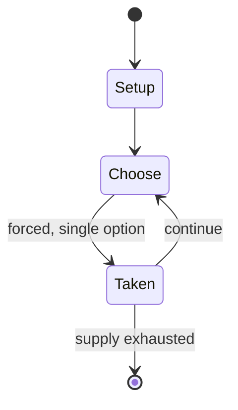

# chaturanga

*ancient Indian strategy game*

`chaturanga` &nbsp; state: **DEEPENED** &nbsp; method: **heuristic**

## Found layer (recorded, not trusted)

| field | value |
| --- | --- |
| wikidata | Q206230 |
| wikipedia | Chaturanga |
| genres (source) | -- |
| instance of (source) | board game, chess variant, mind game |
| country of origin | India |

## Declared layer (orders bench work)

| field | value |
| --- | --- |
| year created | 700 |
| epoch | MEDIEVAL |
| region | SOUTH_ASIA |
| media | BOARD |
| players | 2 |
| age band | -- |
| exogenous process | -- |
| loss shape | -- |
| live axes | - |
| horizon | -- |
| scoring shape | WINNER_TAKE_ALL |
| information | -- |
| interaction | COMPETITIVE |
| turn structure | STRICT_TURN |
| tractability | SAMPLING_ONLY |
| randomness | -- |
| luck factor | 0.35 |
| rules complexity | 1.74 |
| strategic depth | 2.0 |
| novelty | 0.6131 |
| solved status | -- |
| strategies | -- |
| algorithms | -- |

## Object model

```
Episode
  players      : 2
  turn_structure: STRICT_TURN
  horizon       : ?
  scoring       : WINNER_TAKE_ALL

Board          -- spatial substrate; cells carry position and occupancy
Piece          -- movable token owned by a player
```

## State transition diagram



## Research item -- turn trace

```
# chaturanga -- simulated turn events
# generated from the DECLARED vector, not from a rulebook.
# structure: exo=None loss=None horizon=None scoring=WINNER_TAKE_ALL axes=-

t=0    SETUP        players=2  pot=0  capacity=4
t=1    FORCED       p1 single legal option taken (pot_gain=+1.4)
t=2    FORCED       p1 single legal option taken (pot_gain=+1.0)
t=3    FORCED       p1 single legal option taken (pot_gain=+1.7)
t=4    FORCED       p1 single legal option taken (pot_gain=+0.8)
t=5    FORCED       p1 single legal option taken (pot_gain=+1.6)
t=6    FORCED       p1 single legal option taken (pot_gain=+0.6)
t=7    FORCED       p1 single legal option taken (pot_gain=+0.6)
t=8    FORCED       p1 single legal option taken (pot_gain=+0.6)
t=9    FORCED       p1 single legal option taken (pot_gain=+1.4)
t=10   FORCED       p1 single legal option taken (pot_gain=+1.7)
t=11   FORCED       p1 single legal option taken (pot_gain=+1.4)
t=12   ENDTURN      turn passes to p2
t=13   FORCED       p2 single legal option taken (pot_gain=+1.8)
t=14   FORCED       p2 single legal option taken (pot_gain=+0.6)
t=15   FORCED       p2 single legal option taken (pot_gain=+1.5)
t=16   FORCED       p2 single legal option taken (pot_gain=+1.1)
t=17   FORCED       p2 single legal option taken (pot_gain=+1.1)
t=18   FORCED       p2 single legal option taken (pot_gain=+0.6)
t=19   ENDTURN      turn passes to p1
t=20   FORCED       p1 single legal option taken (pot_gain=+1.0)
t=21   FORCED       p1 single legal option taken (pot_gain=+2.0)
t=22   FORCED       p1 single legal option taken (pot_gain=+1.9)
t=23   FORCED       p1 single legal option taken (pot_gain=+0.6)
t=24   FORCED       p1 single legal option taken (pot_gain=+1.9)
t=25   ENDTURN      turn passes to p2
t=26   FORCED       p2 single legal option taken (pot_gain=+1.3)

terminal: VARIABLE
```

## Conditions

| kind | threshold | effect | trigger |
| --- | --- | --- | --- |
| BOUNDARY | -- | -- | Another argument for chaturanga being older is the fact that the chariot is the most powerful piece on the board, although chariots appear to have been obsolete in warfare for at least five or six centuries, superseded b |

## Source extract

Chaturanga (Sanskrit: चतुरङ्ग, IAST: caturaṅga, pronounced [tɕɐt̪uˈɾɐŋɡɐ]) is an ancient Indian
strategy board game. It is first known from India around the seventh century CE. While there is
some uncertainty, the prevailing view among chess historians is that chaturanga is the common
ancestor of the board games chess, xiangqi (Chinese), janggi (Korean), shogi (Japanese),
sittuyin (Burmese), makruk (Thai), ouk chatrang (Cambodian) and modern Indian chess. It was
adopted as chatrang (shatranj) in Sassanid Persia, which in turn was the form of chess brought
to late-medieval Europe. Not all the rules of chaturanga are known with certainty. Chess
historians suppose that the game had rules similar to those of its successor, shatranj. In
particular, there is uncertainty as to the moves of the gaja (elephant).   == Etymology ==
Sanskrit caturaṅga is a bahuvrihi compound word, meaning "having four limbs or parts" and in
epic poetry often meaning "army". The name comes from a battle formation mentioned in the Indian
epic Mahabharata. Chaturanga refers to four divisions of an army, namely elephantry, chariotry,
cavalry and infantry. An ancient battle formation, akshauhini, is like the setup

<sub>Wikipedia, CC BY-SA. Retained as evidence for the structural
classification above. Every rule inferred from it is HYPOTHESIZED
until audited against a rulebook.</sub>
