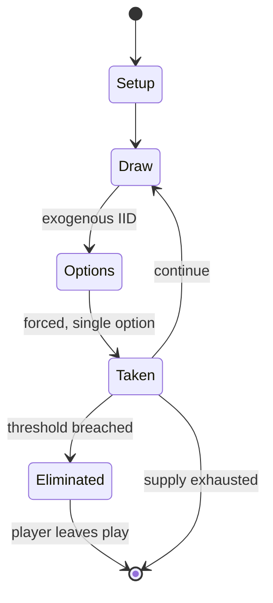

# Chaupar

`chaupar` &nbsp; state: **DEEPENED** &nbsp; method: **heuristic**

## Found layer (recorded, not trusted)

| field | value |
| --- | --- |
| wikidata | Q2091142 |
| wikipedia | Chaupar |
| genres (source) | -- |
| instance of (source) | -- |
| country of origin | -- |

## Declared layer (orders bench work)

| field | value |
| --- | --- |
| year created | -- |
| epoch | -- |
| region | -- |
| media | BOARD, DICE |
| players | -- |
| age band | -- |
| exogenous process | IID |
| loss shape | ELIMINATION |
| live axes | - |
| horizon | -- |
| scoring shape | -- |
| information | -- |
| interaction | COMPETITIVE |
| turn structure | STRICT_TURN |
| tractability | EXACT_WITH_CUT |
| randomness | DICE |
| luck factor | 0.58 |
| rules complexity | 1.82 |
| strategic depth | 1.87 |
| novelty | 0.6099 |
| solved status | -- |
| strategies | opponent_modelling |
| algorithms | -- |

## Object model

```
Episode
  players      : ?
  turn_structure: STRICT_TURN
  horizon       : ?
  scoring       : ?

Board          -- spatial substrate; cells carry position and occupancy
Piece          -- movable token owned by a player
DicePool       -- n dice, each an iid categorical draw
Roll           -- realised outcome of a pool
```

## State transition diagram



## Research item -- turn trace

```
# Chaupar -- simulated turn events
# generated from the DECLARED vector, not from a rulebook.
# structure: exo=IID loss=ELIMINATION horizon=None scoring=None axes=-

t=0    SETUP        players=2  pot=0  capacity=7
t=1    DRAW         p1 roll from d6 pool -> outcome #5  (p=0.082)
t=2    FORCED       p1 single legal option taken (pot_gain=+1.3)
t=3    DRAW         p1 roll from d6 pool -> outcome #1  (p=0.125)
t=4    FORCED       p1 single legal option taken (pot_gain=+0.6)
t=5    DRAW         p1 roll from d6 pool -> outcome #4  (p=0.153)
t=6    FORCED       p1 single legal option taken (pot_gain=+1.9)
t=7    DRAW         p1 roll from d6 pool -> outcome #3  (p=0.024)
t=8    FORCED       p1 single legal option taken (pot_gain=+0.6)
t=9    DRAW         p1 roll from d6 pool -> outcome #2  (p=0.118)
t=10   FORCED       p1 single legal option taken (pot_gain=+1.6)
t=11   DRAW         p1 roll from d6 pool -> outcome #5  (p=0.299)
t=12   FORCED       p1 single legal option taken (pot_gain=+1.6)
t=13   DRAW         p1 roll from d6 pool -> outcome #4  (p=0.237)
t=14   FORCED       p1 single legal option taken (pot_gain=+1.5)
t=15   DRAW         p1 roll from d6 pool -> outcome #2  (p=0.203)
t=16   FORCED       p1 single legal option taken (pot_gain=+1.6)
t=17   DRAW         p1 roll from d6 pool -> outcome #2  (p=0.199)
t=18   FORCED       p1 single legal option taken (pot_gain=+1.8)
t=19   DRAW         p1 roll from d6 pool -> outcome #4  (p=0.012)
t=20   FORCED       p1 single legal option taken (pot_gain=+0.7)
t=21   DRAW         p1 roll from d6 pool -> outcome #1  (p=0.147)
t=22   FORCED       p1 single legal option taken (pot_gain=+1.8)
t=23   DRAW         p1 roll from d6 pool -> outcome #3  (p=0.023)
t=24   FORCED       p1 single legal option taken (pot_gain=+1.0)
t=25   DRAW         p1 roll from d6 pool -> outcome #2  (p=0.023)
t=26   FORCED       p1 single legal option taken (pot_gain=+1.9)

terminal: VARIABLE
```

## Conditions

| kind | threshold | effect | trigger |
| --- | --- | --- | --- |
| BOUNDARY | 4 players | -- | A maximum of four players play this game, each sitting in front of an arm of the cross. |
| ELIMINATE | -- | -- | The knocked out man is taken out of play and has to be re-entered into the game the usual way. |
| WIN | -- | -- | The first player who brings all four of his men home is the winner. |
| BOUNDARY | -- | -- | If any of the players does not have his thore (to have killed at least one pawn) by the end of the game, then that player is known to have lost with a bay-thoree, which is the most disgraceful form of losing. |
| BOUNDARY | -- | -- | Before a player can bring any of his own men “home”, he has to knock out at least one man of another player. |
| BOUNDARY | -- | -- | Each player has to knock out at least one man of another player – do a “tohd” or "hit" - before he can bring any of his men home, Flower Motif of First strip players home arm. |
| BOUNDARY | -- | -- | The home column for each player can only be entered by his men if he has already made at least one “tohd”. |
| BOUNDARY | -- | -- | Players cannot move their pawns past the safe square outside their house (to go into their house) unless they have killed at least one pawn. |
| PENALTY | -- | -- | At any point in the game, if a player has no men who can move the amount of a throw, that throw is forfeited. |
| PENALTY | -- | -- | If the throw is higher than the required number of steps, and if it cannot be used by any other of his men still in play, that throw is forfeited. |
| PENALTY | -- | -- | Forfeiting the turn voluntarily is not allowed (unlike Pachisi). |

## Source extract

Chaupar (IAST: caupaṛ), chopad or chaupad or pagade (Kannada: ಪಗಡೆ) is a cross and circle board
game very similar to pachisi, played in India. The board is made of wool or cloth, with wooden
pawns and seven cowry shells to be used to determine each player's move, although others
distinguish chaupur from pachisi by the use of three four-sided long dice. Variations are played
throughout India. It is similar in some ways to Pachisi, Parcheesi and Ludo.    == History ==
Games similar to chaupar with difference in colour schemes along with dice have been identified
from Iron Age, Painted grey ware period from Mathura.  Pachisi originated from chaupar. Chopat
is claimed to be a variation of the game of dice played in the epic poem Mahabharata between
Yudhishthira and Duryodhan.   === Legends ===  There are famous stories passed on from
generation to generation about kings who played this magnificent game. One particular tale tells
of a King who had 2 trained mice called "Sundari and Mundari". This king would distract his
opponent with details, stories and tales. He would then casually utter "Sundari and Mundari"; at
this point the mice would come and move the pieces around without the op

<sub>Wikipedia, CC BY-SA. Retained as evidence for the structural
classification above. Every rule inferred from it is HYPOTHESIZED
until audited against a rulebook.</sub>
