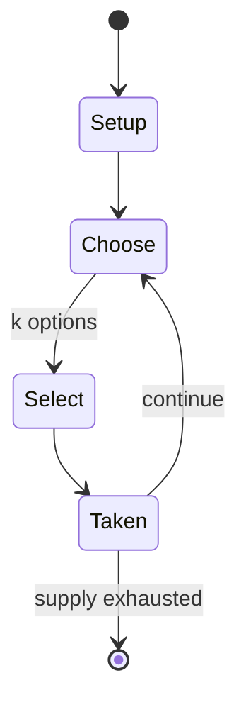

# chess

*strategy board game*

`chess` &nbsp; state: **DEEPENED** &nbsp; method: **heuristic**

## Found layer (recorded, not trusted)

| field | value |
| --- | --- |
| wikidata | Q718 |
| wikipedia | Chess |
| genres (source) | abstract strategy game, mind game |
| instance of (source) | abstract strategy game, board game, game-based sport, hobby, table sports, two-player game, type of sport |
| country of origin | Gupta Empire |

## Declared layer (orders bench work)

| field | value |
| --- | --- |
| year created | 601 |
| epoch | MEDIEVAL |
| region | -- |
| media | ABSTRACT, BOARD, SPORT |
| players | 2 |
| age band | -- |
| exogenous process | NONE |
| loss shape | OPPORTUNITY_ONLY |
| live axes | ORDER, SELECT, SPATIAL, TRADE |
| horizon | -- |
| scoring shape | WINNER_TAKE_ALL |
| information | PERFECT |
| interaction | TEAM |
| turn structure | PHASE_STRUCTURED |
| tractability | EXACT |
| randomness | SIMULTANEOUS_CHOICE |
| luck factor | 0.05 |
| rules complexity | 4.3 |
| strategic depth | 2.7 |
| novelty | 0.9129 |
| solved status | SOLVED_STRONG |
| strategies | memory_recall, probability_estimation, sacrifice, zugzwang |
| algorithms | opening_book |

## Object model

```
Episode
  players      : 2
  turn_structure: PHASE_STRUCTURED
  horizon       : ?
  scoring       : WINNER_TAKE_ALL

Board          -- spatial substrate; cells carry position and occupancy
Piece          -- movable token owned by a player
Pitch          -- bounded physical region
Player         -- embodied agent with a foul count
Clock          -- counts down; stoppages are rule events
Official       -- detects infractions and applies penalties
Sequence       -- the permutation under the player's control
OptionSet      -- the choices available after an exogenous draw
Placement      -- position subject to geometric legality
Offer          -- proposed exchange between two agents
```

## State transition diagram



## Research item -- turn trace

```
# chess -- simulated turn events
# generated from the DECLARED vector, not from a rulebook.
# structure: exo=NONE loss=OPPORTUNITY_ONLY horizon=None scoring=WINNER_TAKE_ALL axes=ORDER,SELECT,SPATIAL,TRADE

t=0    SETUP        players=2  pot=0  capacity=8
t=1    SELECT       p1 1 options; take #1  (pot_gain=+1.1, capacity=-2)
t=2    TRADE        p1 offers 2:1 exchange to p2
t=3    ENDTURN      turn passes to p2
t=4    SELECT       p2 4 options; take #3  (pot_gain=+3.4, capacity=-2)
t=5    SPATIAL      p2 places at (4,0); adjacency legal
t=6    SELECT       p2 2 options; take #1  (pot_gain=+2.3, capacity=-0)
t=7    SELECT       p2 2 options; take #2  (pot_gain=+1.1, capacity=-2)
t=8    SPATIAL      p2 places at (2,4); adjacency legal
t=9    SELECT       p2 3 options; take #3  (pot_gain=+2.7, capacity=-1)
t=10   SELECT       p2 3 options; take #2  (pot_gain=+1.8, capacity=-0)
t=11   SELECT       p2 2 options; take #1  (pot_gain=+3.2, capacity=-0)
t=12   SPATIAL      p2 places at (0,3); adjacency legal
t=13   SELECT       p2 4 options; take #2  (pot_gain=+2.1, capacity=-2)
t=14   SELECT       p2 2 options; take #1  (pot_gain=+1.7, capacity=-2)
t=15   SELECT       p2 1 options; take #1  (pot_gain=+0.8, capacity=-2)
t=16   SELECT       p2 3 options; take #3  (pot_gain=+1.6, capacity=-2)
t=17   SPATIAL      p2 places at (0,4); adjacency legal
t=18   SELECT       p2 3 options; take #2  (pot_gain=+3.4, capacity=-1)
t=19   TRADE        p2 offers 2:1 exchange to p1
t=20   SELECT       p2 2 options; take #1  (pot_gain=+1.2, capacity=-2)
t=21   SELECT       p2 1 options; take #1  (pot_gain=+2.4, capacity=-0)
t=22   SPATIAL      p2 places at (6,5); adjacency legal
t=23   SELECT       p2 4 options; take #2  (pot_gain=+2.3, capacity=-1)
t=24   SPATIAL      p2 places at (6,6); adjacency legal
t=25   SELECT       p2 1 options; take #1  (pot_gain=+2.4, capacity=-1)
t=26   SELECT       p2 3 options; take #1  (pot_gain=+1.2, capacity=-0)
t=27   TRADE        p2 offers 2:1 exchange to p1
t=28   SPATIAL      p2 places at (1,5); adjacency legal

terminal: VARIABLE
```

## Conditions

| kind | threshold | effect | trigger |
| --- | --- | --- | --- |
| BOUNDARY | 16 pieces | -- | Each set comes with at least the following 16 pieces in both colors: one king, one queen, two rooks, two bishops, two knights, and eight pawns. |
| LOSE | -- | -- | The king is more valuable than all of the other pieces combined, since its checkmate loses the game, but is still capable as a fighting piece; in the endgame, the king is generally more powerful than a bishop or knight b |
| PENALTY | -- | -- | Forfeit: A player who cheats, violates the rules, or violates the rules of conduct specified for the particular tournament can be forfeited. |
| PENALTY | -- | -- | Occasionally, both players are forfeited. |

## Source extract

Chess is a board game for two players, played on a square board consisting of 64 squares
arranged in an 8×8 grid. The players, referred to as "White" and "Black", each control sixteen
pieces: one king, one queen, two rooks, two bishops, two knights, and eight pawns, with each
piece type having a different pattern of movement. An enemy piece may be captured (removed from
the board) by moving one's own piece onto the square it occupies. The objective of the game is
to checkmate (threaten with inescapable capture) the enemy king. There are also several ways a
game can end in a draw. The recorded history of chess dates back to the emergence of chaturanga
in 7th-century India. Chaturanga is also thought to be an ancestor of similar games like janggi,
xiangqi, and shogi. After its introduction to Persia, it spread to the Arab world and then to
Europe. The modern rules of chess emerged in Europe at the end of the 15th century, becoming
standardized and gaining universal acceptance by the end of the 19th century. Today, chess is
one of the world's most popular games, with millions of players worldwide. Organized chess arose
in the 19th century. International chess competitions today are go

<sub>Wikipedia, CC BY-SA. Retained as evidence for the structural
classification above. Every rule inferred from it is HYPOTHESIZED
until audited against a rulebook.</sub>
