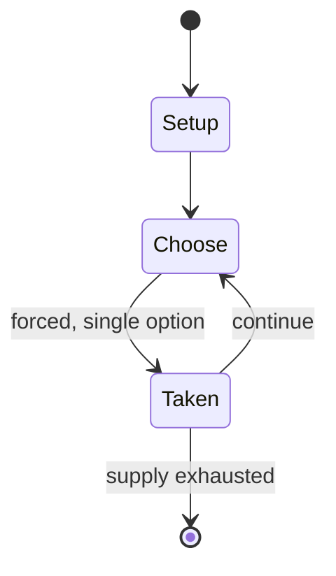

# Chessplus

*commercial chess variant revolving around merging*

`chessplus` &nbsp; state: **DEEPENED** &nbsp; method: **heuristic**

## Found layer (recorded, not trusted)

| field | value |
| --- | --- |
| wikidata | Q118875752 |
| wikipedia | Chessplus |
| genres (source) | -- |
| instance of (source) | chess variant |
| country of origin | -- |

## Declared layer (orders bench work)

| field | value |
| --- | --- |
| year created | -- |
| epoch | -- |
| region | -- |
| media | VIDEO |
| players | -- |
| age band | -- |
| exogenous process | -- |
| loss shape | -- |
| live axes | - |
| horizon | -- |
| scoring shape | -- |
| information | -- |
| interaction | -- |
| turn structure | -- |
| tractability | SAMPLING_ONLY |
| randomness | -- |
| luck factor | 0.35 |
| rules complexity | 1.74 |
| strategic depth | 2.0 |
| novelty | 0.0866 |
| solved status | -- |
| strategies | -- |
| algorithms | -- |

## Object model

```
Episode
  players      : ?
  turn_structure: ?
  horizon       : ?
  scoring       : ?

WorldState     -- simulation state advanced by the engine
Avatar         -- player-controlled agent
Clock          -- frame or tick counter
```

## State transition diagram



## Research item -- turn trace

```
# Chessplus -- simulated turn events
# generated from the DECLARED vector, not from a rulebook.
# structure: exo=None loss=None horizon=None scoring=None axes=-

t=0    SETUP        players=2  pot=0  capacity=3
t=1    FORCED       p1 single legal option taken (pot_gain=+1.0)
t=2    ENDTURN      turn passes to p2
t=3    FORCED       p2 single legal option taken (pot_gain=+0.6)
t=4    FORCED       p2 single legal option taken (pot_gain=+0.9)
t=5    FORCED       p2 single legal option taken (pot_gain=+1.4)
t=6    FORCED       p2 single legal option taken (pot_gain=+0.6)
t=7    ENDTURN      turn passes to p1
t=8    FORCED       p1 single legal option taken (pot_gain=+1.9)
t=9    ENDTURN      turn passes to p2
t=10   FORCED       p2 single legal option taken (pot_gain=+1.7)
t=11   FORCED       p2 single legal option taken (pot_gain=+1.2)
t=12   ENDTURN      turn passes to p1
t=13   FORCED       p1 single legal option taken (pot_gain=+0.9)
t=14   ENDTURN      turn passes to p2
t=15   FORCED       p2 single legal option taken (pot_gain=+1.3)
t=16   ENDTURN      turn passes to p1
t=17   FORCED       p1 single legal option taken (pot_gain=+0.8)
t=18   FORCED       p1 single legal option taken (pot_gain=+0.9)
t=19   FORCED       p1 single legal option taken (pot_gain=+1.6)
t=20   FORCED       p1 single legal option taken (pot_gain=+1.9)
t=21   FORCED       p1 single legal option taken (pot_gain=+1.5)
t=22   ENDTURN      turn passes to p2
t=23   FORCED       p2 single legal option taken (pot_gain=+0.7)
t=24   FORCED       p2 single legal option taken (pot_gain=+1.5)
t=25   FORCED       p2 single legal option taken (pot_gain=+0.8)
t=26   ENDTURN      turn passes to p1

terminal: VARIABLE
```

## Source extract

Chessplus is a commercial chess variant developed by the Australian family business Chessplus
Team.   == Appearance == Chessplus, as a physical variant, can come in 1 of 3 packages.  A bag,
containing all the pieces. A box featuring a pawn and knight combining into a knawn. A pseudo-
box with a wrap-around board and pieces. As for the pieces, they are designed so players can
merge them.   == Gameplay == Chessplus gameplay is similar to that of regular chess, but pieces
can merge. The only piece that can't be merged with is the king. Pieces can only merge with
other pieces of their own color. Only 2 pieces can be merged at a time. Pieces may split, in
which they use their original move to get away from the merged piece, separating them.   ===
Castling === Castling may be done with a combined rook. Just like in regular chess, the rook
must not have previously moved. In other words, if a knight moved to combine with a rook,
castling is possible, but if that rook moved to combine with the knight, then castling is no
longer allowed for that rook.   === En passant === Similar to the castling rules, en passant can
only be used on a combination of 2 pawns. If the combination is, for example

<sub>Wikipedia, CC BY-SA. Retained as evidence for the structural
classification above. Every rule inferred from it is HYPOTHESIZED
until audited against a rulebook.</sub>
