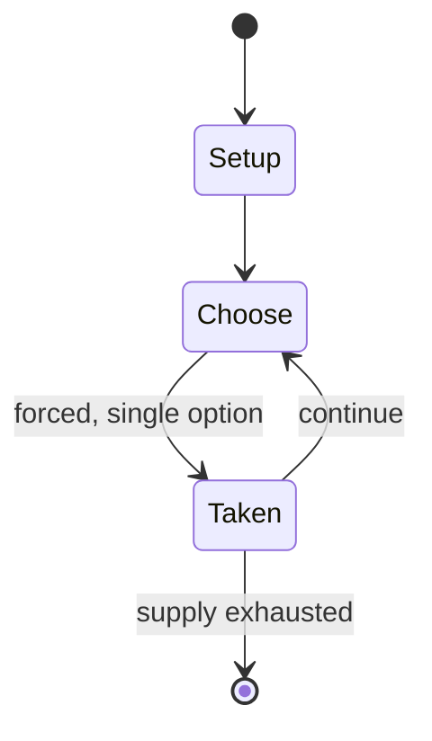

# Chinese checkers

*abstract strategy board game*

`chinese_checkers` &nbsp; state: **DEEPENED** &nbsp; method: **heuristic**

## Found layer (recorded, not trusted)

| field | value |
| --- | --- |
| wikidata | Q1045090 |
| wikipedia | Chinese checkers |
| genres (source) | -- |
| instance of (source) | abstract strategy game, board game |
| country of origin | Germany |

## Declared layer (orders bench work)

| field | value |
| --- | --- |
| year created | 1892 |
| epoch | INDUSTRIAL |
| region | EUROPE_WEST |
| media | ABSTRACT, BOARD |
| players | 2-6 |
| age band | -- |
| exogenous process | NONE |
| loss shape | OPPORTUNITY_ONLY |
| live axes | ORDER, SPATIAL |
| horizon | VARIABLE |
| scoring shape | RACE_POSITION |
| information | PERFECT |
| interaction | COMPETITIVE |
| turn structure | STRICT_TURN |
| tractability | EXACT_WITH_CUT |
| randomness | NONE |
| luck factor | 0.02 |
| rules complexity | 2.6 |
| strategic depth | 2.65 |
| novelty | 0.7625 |
| solved status | -- |
| strategies | set_collection |
| algorithms | -- |

## Object model

```
Episode
  players      : 2-6
  turn_structure: STRICT_TURN
  horizon       : VARIABLE
  scoring       : RACE_POSITION

Board          -- spatial substrate; cells carry position and occupancy
Piece          -- movable token owned by a player
Sequence       -- the permutation under the player's control
Placement      -- position subject to geometric legality
```

## State transition diagram



## Research item -- turn trace

```
# Chinese checkers -- simulated turn events
# generated from the DECLARED vector, not from a rulebook.
# structure: exo=NONE loss=OPPORTUNITY_ONLY horizon=VARIABLE scoring=RACE_POSITION axes=ORDER,SPATIAL

t=0    SETUP        players=2  pot=0  capacity=7
t=1    FORCED       p1 single legal option taken (pot_gain=+1.2)
t=2    SPATIAL      p1 places at (7,1); adjacency legal
t=3    ENDTURN      turn passes to p2
t=4    FORCED       p2 single legal option taken (pot_gain=+1.2)
t=5    ENDTURN      turn passes to p1
t=6    FORCED       p1 single legal option taken (pot_gain=+0.6)
t=7    SPATIAL      p1 places at (5,3); adjacency legal
t=8    ENDTURN      turn passes to p2
t=9    FORCED       p2 single legal option taken (pot_gain=+0.7)
t=10   SPATIAL      p2 places at (1,0); adjacency legal
t=11   ENDTURN      turn passes to p1
t=12   FORCED       p1 single legal option taken (pot_gain=+0.8)
t=13   FORCED       p1 single legal option taken (pot_gain=+1.9)
t=14   FORCED       p1 single legal option taken (pot_gain=+1.1)
t=15   SPATIAL      p1 places at (7,0); adjacency legal
t=16   ENDTURN      turn passes to p2
t=17   FORCED       p2 single legal option taken (pot_gain=+0.7)
t=18   ENDTURN      turn passes to p1
t=19   FORCED       p1 single legal option taken (pot_gain=+1.4)
t=20   SPATIAL      p1 places at (3,6); adjacency legal
t=21   FORCED       p1 single legal option taken (pot_gain=+0.7)
t=22   FORCED       p1 single legal option taken (pot_gain=+1.2)
t=23   FORCED       p1 single legal option taken (pot_gain=+1.1)
t=24   SPATIAL      p1 places at (3,0); adjacency legal
t=25   FORCED       p1 single legal option taken (pot_gain=+0.9)
t=26   SPATIAL      p1 places at (4,4); adjacency legal

terminal: VARIABLE
```

## Conditions

| kind | threshold | effect | trigger |
| --- | --- | --- | --- |
| WIN | -- | -- | The first team to advance both sets to their home destination corners is the winner. |
| WIN | -- | -- | The player with the most captured pieces is the winner. |
| TERMINATE | -- | -- | Only jumping moves are allowed; the game ends when no further jumps are possible. |

## Source extract

Chinese checkers (US) or Chinese chequers (UK), known as Sternhalma in German, is a strategy
board game of German origin that can be played by two, three, four, or six people, playing
individually or with partners. The game is a modern and simplified variation of the game Halma.
The objective is to be first to race all of one's pieces across the hexagram-shaped board into
"home"—the corner of the star opposite one's starting corner—using single-step moves or moves
that jump over other pieces. The remaining players continue the game to establish second-,
third-, fourth-, fifth-, and last-place finishers.    == History and nomenclature ==  The game
was invented in Germany in 1892 under the name "Stern-Halma" as a variation of the older
American game Halma. Like all Halma games, there is a similarity to checkers. The Stern (German
for 'star') refers to the board's star shape (in contrast to the square board used in Halma).
The name "Chinese checkers" originated in the United States as a marketing scheme by Bill and
Jack Pressman in 1928. The Pressman company's game was originally called "Hop Ching checkers".
The game is known as tiaoqi (Chinese: 跳棋; pinyin: tiàoqí; lit. 'jump game') i

<sub>Wikipedia, CC BY-SA. Retained as evidence for the structural
classification above. Every rule inferred from it is HYPOTHESIZED
until audited against a rulebook.</sub>
