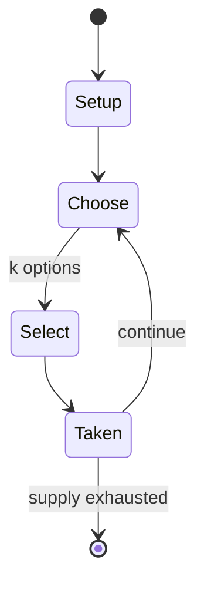

# Choko (game)

`choko_game` &nbsp; state: **DEEPENED** &nbsp; method: **heuristic**

## Found layer (recorded, not trusted)

| field | value |
| --- | --- |
| wikidata | Q5104243 |
| wikipedia | Choko (game) |
| genres (source) | -- |
| instance of (source) | -- |
| country of origin | -- |

## Declared layer (orders bench work)

| field | value |
| --- | --- |
| year created | -- |
| epoch | -- |
| region | -- |
| media | ABSTRACT, BOARD |
| players | -- |
| age band | -- |
| exogenous process | -- |
| loss shape | -- |
| live axes | SELECT, SPATIAL, TIMING |
| horizon | -- |
| scoring shape | -- |
| information | -- |
| interaction | COMPETITIVE |
| turn structure | -- |
| tractability | SAMPLING_ONLY |
| randomness | -- |
| luck factor | 0.35 |
| rules complexity | 2.68 |
| strategic depth | 2.25 |
| novelty | 0.3553 |
| solved status | -- |
| strategies | tempo |
| algorithms | -- |

## Object model

```
Episode
  players      : ?
  turn_structure: ?
  horizon       : ?
  scoring       : ?

Board          -- spatial substrate; cells carry position and occupancy
Piece          -- movable token owned by a player
OptionSet      -- the choices available after an exogenous draw
Placement      -- position subject to geometric legality
Initiative     -- who acts, and when, relative to others
```

## State transition diagram



## Research item -- turn trace

```
# Choko (game) -- simulated turn events
# generated from the DECLARED vector, not from a rulebook.
# structure: exo=None loss=None horizon=None scoring=None axes=SELECT,SPATIAL,TIMING

t=0    SETUP        players=2  pot=0  capacity=6
t=1    SELECT       p1 1 options; take #1  (pot_gain=+1.0, capacity=-0)
t=2    SPATIAL      p1 places at (0,2); adjacency legal
t=3    SELECT       p1 3 options; take #1  (pot_gain=+0.6, capacity=-2)
t=4    SPATIAL      p1 places at (7,7); adjacency legal
t=5    SELECT       p1 1 options; take #1  (pot_gain=+1.2, capacity=-2)
t=6    SPATIAL      p1 places at (7,7); adjacency legal
t=7    SELECT       p1 1 options; take #1  (pot_gain=+2.7, capacity=-2)
t=8    SPATIAL      p1 places at (4,7); adjacency legal
t=9    ENDTURN      turn passes to p2
t=10   SELECT       p2 3 options; take #1  (pot_gain=+1.2, capacity=-2)
t=11   ENDTURN      turn passes to p1
t=12   SELECT       p1 1 options; take #1  (pot_gain=+3.4, capacity=-2)
t=13   ENDTURN      turn passes to p2
t=14   SELECT       p2 2 options; take #1  (pot_gain=+3.3, capacity=-0)
t=15   SPATIAL      p2 places at (5,3); adjacency legal
t=16   SELECT       p2 1 options; take #1  (pot_gain=+2.0, capacity=-2)
t=17   SPATIAL      p2 places at (1,7); adjacency legal
t=18   SELECT       p2 4 options; take #1  (pot_gain=+1.4, capacity=-1)
t=19   ENDTURN      turn passes to p1
t=20   SELECT       p1 1 options; take #1  (pot_gain=+1.9, capacity=-0)
t=21   ENDTURN      turn passes to p2
t=22   SELECT       p2 4 options; take #4  (pot_gain=+0.5, capacity=-2)
t=23   SELECT       p2 4 options; take #1  (pot_gain=+3.4, capacity=-2)
t=24   SELECT       p2 3 options; take #3  (pot_gain=+2.9, capacity=-1)
t=25   ENDTURN      turn passes to p1
t=26   SELECT       p1 3 options; take #3  (pot_gain=+0.7, capacity=-1)
t=27   SPATIAL      p1 places at (7,6); adjacency legal

terminal: VARIABLE
```

## Source extract

Choko is a two-player abstract strategy board game from Gambia Valley, West Africa. It is played
specifically by the Mandinka and Fula tribes. It is related to Yote.   == Goal == The goal of
choko is for a player to capture all the pieces of an opponent.   == Equipment == 5 x 5 holes
set in the ground or on a board.  Each player has 12 pieces. One plays the white pieces, and the
other plays the black pieces; however, any two colors or distinguishable objects will suffice.
== Rules and Game Play == 1. The board is empty in the beginning. Players decide what colors to
play, and who starts first. Players alternate their turns. 2. Players first drop their pieces.
They drop one piece per turn.   3. The first player drops their first piece anywhere on the
board. The first player has the drop initiative. It is not necessary to drop on every turn, but
as long as the first player continues to drop, then so does the second player.  If the first
player decides to make a move (non-capturing move or capturing move), then the second player has
the option to drop or move. If the second player decides to drop, then he or she has the drop
initiative until he or she decides to move. This means tha

<sub>Wikipedia, CC BY-SA. Retained as evidence for the structural
classification above. Every rule inferred from it is HYPOTHESIZED
until audited against a rulebook.</sub>
