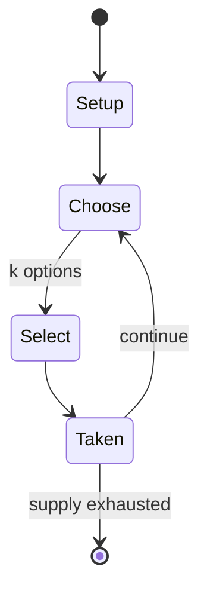

# Chomp

*abstract strategy game*

`chomp` &nbsp; state: **DEEPENED** &nbsp; method: **heuristic**

## Found layer (recorded, not trusted)

| field | value |
| --- | --- |
| wikidata | Q1076016 |
| wikipedia | Chomp |
| genres (source) | -- |
| instance of (source) | abstract strategy game |
| country of origin | -- |

## Declared layer (orders bench work)

| field | value |
| --- | --- |
| year created | -- |
| epoch | -- |
| region | -- |
| media | ABSTRACT |
| players | -- |
| age band | -- |
| exogenous process | NONE |
| loss shape | -- |
| live axes | SELECT, SPATIAL |
| horizon | -- |
| scoring shape | NONLINEAR |
| information | PERFECT |
| interaction | COMPETITIVE |
| turn structure | STRICT_TURN |
| tractability | EXACT_WITH_CUT |
| randomness | NONE |
| luck factor | 0.02 |
| rules complexity | 2.43 |
| strategic depth | 2.4 |
| novelty | 0.7669 |
| solved status | -- |
| strategies | -- |
| algorithms | -- |

## Object model

```
Episode
  players      : ?
  turn_structure: STRICT_TURN
  horizon       : ?
  scoring       : NONLINEAR

OptionSet      -- the choices available after an exogenous draw
Placement      -- position subject to geometric legality
```

## State transition diagram



## Research item -- turn trace

```
# Chomp -- simulated turn events
# generated from the DECLARED vector, not from a rulebook.
# structure: exo=NONE loss=None horizon=None scoring=NONLINEAR axes=SELECT,SPATIAL

t=0    SETUP        players=2  pot=0  capacity=7
t=1    SELECT       p1 4 options; take #1  (pot_gain=+2.2, capacity=-2)
t=2    SELECT       p1 3 options; take #2  (pot_gain=+1.8, capacity=-0)
t=3    SPATIAL      p1 places at (6,0); adjacency legal
t=4    SELECT       p1 3 options; take #1  (pot_gain=+0.8, capacity=-2)
t=5    SELECT       p1 1 options; take #1  (pot_gain=+2.1, capacity=-0)
t=6    SELECT       p1 2 options; take #2  (pot_gain=+2.0, capacity=-0)
t=7    SPATIAL      p1 places at (2,4); adjacency legal
t=8    SELECT       p1 2 options; take #2  (pot_gain=+3.1, capacity=-0)
t=9    SELECT       p1 1 options; take #1  (pot_gain=+2.3, capacity=-1)
t=10   SELECT       p1 1 options; take #1  (pot_gain=+2.5, capacity=-2)
t=11   SELECT       p1 4 options; take #1  (pot_gain=+1.0, capacity=-2)
t=12   SELECT       p1 2 options; take #2  (pot_gain=+1.9, capacity=-1)
t=13   ENDTURN      turn passes to p2
t=14   SELECT       p2 3 options; take #3  (pot_gain=+2.9, capacity=-0)
t=15   SELECT       p2 2 options; take #2  (pot_gain=+1.4, capacity=-0)
t=16   SELECT       p2 4 options; take #3  (pot_gain=+1.9, capacity=-0)
t=17   SPATIAL      p2 places at (7,1); adjacency legal
t=18   ENDTURN      turn passes to p1
t=19   SELECT       p1 3 options; take #2  (pot_gain=+1.3, capacity=-2)
t=20   SPATIAL      p1 places at (3,3); adjacency legal
t=21   SELECT       p1 3 options; take #3  (pot_gain=+2.4, capacity=-0)
t=22   SELECT       p1 2 options; take #1  (pot_gain=+1.3, capacity=-2)
t=23   SELECT       p1 1 options; take #1  (pot_gain=+2.9, capacity=-1)
t=24   SPATIAL      p1 places at (7,6); adjacency legal
t=25   SELECT       p1 3 options; take #3  (pot_gain=+1.0, capacity=-1)
t=26   ENDTURN      turn passes to p2

terminal: VARIABLE
```

## Conditions

| kind | threshold | effect | trigger |
| --- | --- | --- | --- |
| BOUNDARY | -- | -- | Note that since it is provable that player A can win when starting from a 4 × 5 bar, at least one of A's moves is a mistake. |

## Source extract

Chomp is a two-player strategy game played on a rectangular grid made up of smaller square
cells, which can be thought of as the blocks of a chocolate bar. The players take it in turns to
choose one block and "eat it" (remove from the board), together with those that are below it and
to its right. The top left block is "poisoned" and the player who eats it loses. The chocolate-
bar formulation of Chomp is due to David Gale, but an equivalent game expressed in terms of
choosing divisors of a fixed integer was published earlier by Frederik Schuh. Chomp is a special
case of a poset game where the partially ordered set on which the game is played is a product of
total orders with the minimal element (poisonous block) removed.   == Example game == Below
shows the sequence of moves in a typical game starting with a 4 × 5 bar:  Player A eats two
blocks from the bottom right corner; Player B eats three from the bottom row; Player A picks the
block to the right of the poisoned block and eats eleven blocks; Player B eats three blocks from
the remaining column, leaving only the poisoned block. Player A must eat the last block and so
loses. Note that since it is provable that player A can win w

<sub>Wikipedia, CC BY-SA. Retained as evidence for the structural
classification above. Every rule inferred from it is HYPOTHESIZED
until audited against a rulebook.</sub>
