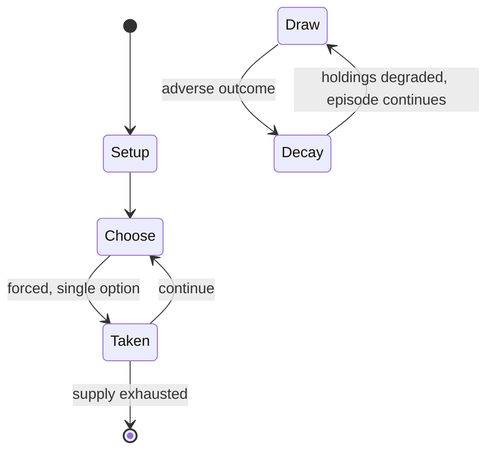

# chovgan

*traditional Karabakh horse-riding game in the Republic of Azerbaijan*

`chovgan` &nbsp; state: **DEEPENED** &nbsp; method: **heuristic**

## Found layer (recorded, not trusted)

| field | value |
| --- | --- |
| wikidata | Q4517024 |
| wikipedia | Chovgan |
| genres (source) | -- |
| instance of (source) | traditional game |
| country of origin | Iran |

## Declared layer (orders bench work)

| field | value |
| --- | --- |
| year created | -- |
| epoch | -- |
| region | WEST_ASIA |
| media | SPORT |
| players | -- |
| age band | -- |
| exogenous process | -- |
| loss shape | PARTIAL_DECAY |
| live axes | - |
| horizon | -- |
| scoring shape | -- |
| information | -- |
| interaction | -- |
| turn structure | -- |
| tractability | SAMPLING_ONLY |
| randomness | -- |
| luck factor | 0.35 |
| rules complexity | 1.82 |
| strategic depth | 2.0 |
| novelty | 0.4816 |
| solved status | -- |
| strategies | -- |
| algorithms | -- |

## Object model

```
Episode
  players      : ?
  turn_structure: ?
  horizon       : ?
  scoring       : ?

Pitch          -- bounded physical region
Player         -- embodied agent with a foul count
Clock          -- counts down; stoppages are rule events
Official       -- detects infractions and applies penalties
```

## State transition diagram



## Research item -- turn trace

```
# chovgan -- simulated turn events
# generated from the DECLARED vector, not from a rulebook.
# structure: exo=None loss=PARTIAL_DECAY horizon=None scoring=None axes=-

t=0    SETUP        players=2  pot=0  capacity=3
t=1    FORCED       p1 single legal option taken (pot_gain=+1.7)
t=2    ENDTURN      turn passes to p2
t=3    FORCED       p2 single legal option taken (pot_gain=+1.5)
t=4    FORCED       p2 single legal option taken (pot_gain=+0.8)
t=5    FORCED       p2 single legal option taken (pot_gain=+1.0)
t=6    FORCED       p2 single legal option taken (pot_gain=+1.0)
t=7    FORCED       p2 single legal option taken (pot_gain=+1.3)
t=8    FORCED       p2 single legal option taken (pot_gain=+1.0)
t=9    FORCED       p2 single legal option taken (pot_gain=+2.0)
t=10   FORCED       p2 single legal option taken (pot_gain=+1.0)
t=11   FORCED       p2 single legal option taken (pot_gain=+1.3)
t=12   FORCED       p2 single legal option taken (pot_gain=+0.5)
t=13   ENDTURN      turn passes to p1
t=14   FORCED       p1 single legal option taken (pot_gain=+0.8)
t=15   FORCED       p1 single legal option taken (pot_gain=+1.9)
t=16   ENDTURN      turn passes to p2
t=17   FORCED       p2 single legal option taken (pot_gain=+1.7)
t=18   FORCED       p2 single legal option taken (pot_gain=+1.3)
t=19   FORCED       p2 single legal option taken (pot_gain=+0.8)
t=20   FORCED       p2 single legal option taken (pot_gain=+1.6)
t=21   FORCED       p2 single legal option taken (pot_gain=+1.1)
t=22   ENDTURN      turn passes to p1
t=23   FORCED       p1 single legal option taken (pot_gain=+1.4)
t=24   FORCED       p1 single legal option taken (pot_gain=+1.9)
t=25   FORCED       p1 single legal option taken (pot_gain=+0.5)
t=26   FORCED       p1 single legal option taken (pot_gain=+1.1)

terminal: VARIABLE
```

## Conditions

| kind | threshold | effect | trigger |
| --- | --- | --- | --- |
| PENALTY | -- | -- | Goals can be scored behind the borders of the penalty area. |

## Source extract

Chovgan (Persian: چوگان, romanized: čawgân) is a team sport with horses that originated in
ancient Iran (Persia). It was considered an aristocratic game and held in a separate field, on
specially trained horses. The game was widespread among the Asian peoples. It is played in Iran,
Azerbaijan, Tajikistan, and Uzbekistan. It was later adopted in the Western World, known today
as polo.   == History == Chovgan originated in ancient Iran and was a Persian national sport
played extensively by the nobility. Women played Chovgan as well as men. Chovgan originated in
the middle of the first millennium A.D., as a team game. It was popular during the centuries in
the Middle East. Fragments of the game were periodically portrayed in ancient miniatures, and
detailed descriptions and rules of the game were also given in the ancient manuscripts. Chogān
is an Iranian traditional horse-riding game accompanied by music and storytelling. It has a
history of over 2,000 years in Iran and has mostly been played in royal courts and urban fields.
Some authors give dates as early as the 5th century BC (or earlier) to the 1st century AD for
its origin by the Persians. Certainly, the earliest records of pol

<sub>Wikipedia, CC BY-SA. Retained as evidence for the structural
classification above. Every rule inferred from it is HYPOTHESIZED
until audited against a rulebook.</sub>
