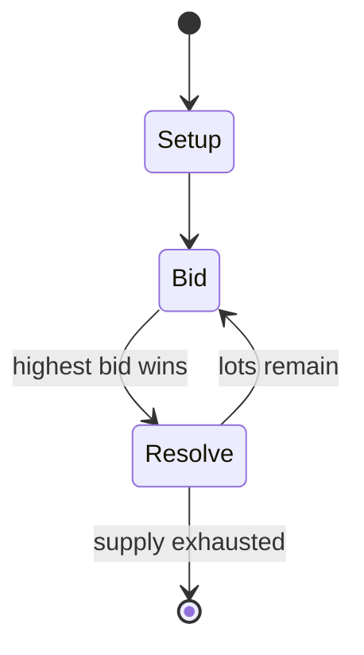

# Chratze

`chratze` &nbsp; state: **DEEPENED** &nbsp; method: **heuristic**

## Found layer (recorded, not trusted)

| field | value |
| --- | --- |
| wikidata | Q1076878 |
| wikipedia | Chratze |
| genres (source) | -- |
| instance of (source) | -- |
| country of origin | -- |

## Declared layer (orders bench work)

| field | value |
| --- | --- |
| year created | -- |
| epoch | -- |
| region | -- |
| media | TRICK_TAKING |
| players | 4-5 |
| age band | -- |
| exogenous process | -- |
| loss shape | -- |
| live axes | BID |
| horizon | -- |
| scoring shape | -- |
| information | -- |
| interaction | -- |
| turn structure | AUCTION_ROUND |
| tractability | SAMPLING_ONLY |
| randomness | -- |
| luck factor | 0.35 |
| rules complexity | 2.1 |
| strategic depth | 2.25 |
| novelty | 0.5345 |
| solved status | -- |
| strategies | spatial_packing |
| algorithms | -- |

## Object model

```
Episode
  players      : 4-5
  turn_structure: AUCTION_ROUND
  horizon       : ?
  scoring       : ?

Trick          -- one card per player; a winner is determined
Trump          -- suit that dominates the ordering
Auction        -- priced competition resolving to one winner
```

## State transition diagram



## Research item -- turn trace

```
# Chratze -- simulated turn events
# generated from the DECLARED vector, not from a rulebook.
# structure: exo=None loss=None horizon=None scoring=None axes=BID

t=0    SETUP        players=4  pot=0  capacity=6
t=1    FORCED       p1 single legal option taken (pot_gain=+1.1)
t=2    BID          p1 sealed bid of 3 against 3 rivals
t=3    FORCED       p1 single legal option taken (pot_gain=+1.8)
t=4    FORCED       p1 single legal option taken (pot_gain=+1.2)
t=5    FORCED       p1 single legal option taken (pot_gain=+1.8)
t=6    BID          p1 sealed bid of 1 against 3 rivals
t=7    ENDTURN      turn passes to p2
t=8    FORCED       p2 single legal option taken (pot_gain=+1.7)
t=9    FORCED       p2 single legal option taken (pot_gain=+0.9)
t=10   FORCED       p2 single legal option taken (pot_gain=+0.6)
t=11   ENDTURN      turn passes to p3
t=12   FORCED       p3 single legal option taken (pot_gain=+0.5)
t=13   FORCED       p3 single legal option taken (pot_gain=+1.8)
t=14   FORCED       p3 single legal option taken (pot_gain=+1.4)
t=15   FORCED       p3 single legal option taken (pot_gain=+1.1)
t=16   BID          p3 sealed bid of 8 against 3 rivals
t=17   FORCED       p3 single legal option taken (pot_gain=+1.1)
t=18   ENDTURN      turn passes to p4
t=19   FORCED       p4 single legal option taken (pot_gain=+1.0)
t=20   FORCED       p4 single legal option taken (pot_gain=+0.5)
t=21   FORCED       p4 single legal option taken (pot_gain=+1.2)
t=22   BID          p4 sealed bid of 3 against 3 rivals
t=23   ENDTURN      turn passes to p1
t=24   FORCED       p1 single legal option taken (pot_gain=+1.1)
t=25   FORCED       p1 single legal option taken (pot_gain=+0.6)
t=26   BID          p1 sealed bid of 3 against 3 rivals

terminal: VARIABLE
```

## Conditions

| kind | threshold | effect | trigger |
| --- | --- | --- | --- |
| BOUNDARY | 2 tricks | -- | "Chratze" (German pronunciation: [xʀatsɛ]): "rake" i.e. the player elects to become the declarer (known as the "Chratzer" - the "Raker") and commits to making at least 2 tricks |
| BOUNDARY | 1 trick | -- | "with you") i.e. the player will play the current game aiming to make at least 1 trick |
| BOUNDARY | 4 tricks | -- | At the end of 4 tricks, the Chratzer must have 2 tricks or more to win a share of the pot; the other active players must have at least 1 trick to win a share of the pot. |
| BOUNDARY | 2 tricks | -- | If the Chratzer fails to take at least 2 tricks, the pot is divided equally by the remaining active players who took at least 1 trick. |
| BOUNDARY | -- | -- | Double blind: before dealing or at least before turning for trump, the dealer may opt to play double blind. |
| BOUNDARY | -- | -- | Playing a single blind makes some sense, for example if the trump upcard is an Ace, which assures the dealer of at least 1 certain trick. |
| PENALTY | -- | -- | In addition, any player who fails to make the required number of tricks must pay a penalty to the pot as follows: |
| PENALTY | -- | -- | The current stake is distributed to the winner(s) of the current game before the penalties are paid in for the next game. |

## Source extract

Chratze (German pronunciation: [xratsə]; "raking") is a trick taking card game, mainly played in
the German-speaking part of Switzerland as well as in Bavaria (there known as Zwicken and played
with 3 cards). It is one of over 70 variants of Jass and played with a pack of 36 cards, either
a Swiss-German or French one. It appears to be related to the Austrian game, Kratzen.
Theoretically it can be played by 2-7 people, however it is most common and enjoyable are 4-5
players. Four cards are dealt, therefore there are 4 tricks to be taken.   == Basics == Chratze
is played with a pack of four suits, each of 9 cards however, unlike other Jass games, the cards
have no point value and only the trick itself counts. Each player receive 4 cards and there is
an auction during which players may bid to be the declarer (the Chratzer), to stay in or to drop
out of the current game. After the auction, active players may improve their hand by exchanging.
== Rules == Deal, auction and play are anticlockwise.   === Deal === Before dealing starts every
player antes the basic stake, usually 20 cents, to the middle of the table. The first dealer is
chosen by prior agreement; thereafter the deal rotate

<sub>Wikipedia, CC BY-SA. Retained as evidence for the structural
classification above. Every rule inferred from it is HYPOTHESIZED
until audited against a rulebook.</sub>
