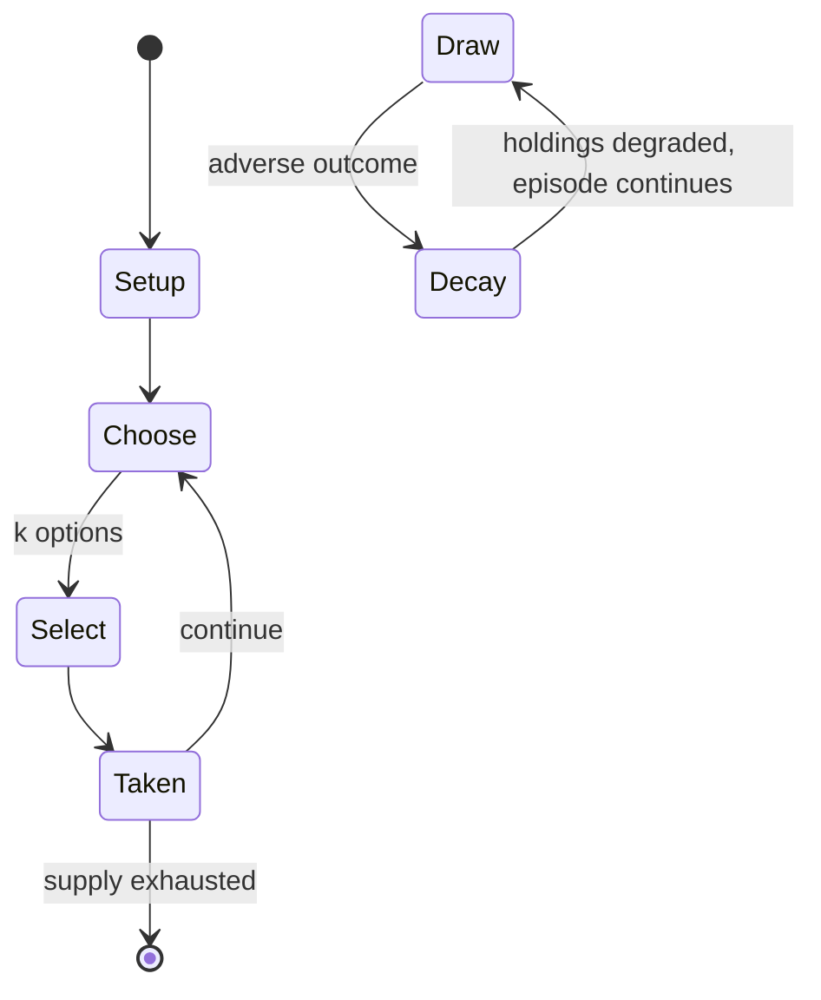

# Chu shogi

*12×12 grid variant of Japanese chess*

`chu_shogi` &nbsp; state: **DEEPENED** &nbsp; method: **heuristic**

## Found layer (recorded, not trusted)

| field | value |
| --- | --- |
| wikidata | Q1067132 |
| wikipedia | Chu shogi |
| genres (source) | -- |
| instance of (source) | shogi variant |
| country of origin | Japan |

## Declared layer (orders bench work)

| field | value |
| --- | --- |
| year created | -- |
| epoch | -- |
| region | EAST_ASIA |
| media | BOARD |
| players | 2 |
| age band | -- |
| exogenous process | NONE |
| loss shape | PARTIAL_DECAY |
| live axes | COMMIT_BLIND, SELECT, SPATIAL |
| horizon | -- |
| scoring shape | SET_COLLECTION_CONVEX |
| information | PERFECT |
| interaction | SOLITAIRE |
| turn structure | -- |
| tractability | SAMPLING_ONLY |
| randomness | NONE |
| luck factor | 0.02 |
| rules complexity | 3.3 |
| strategic depth | 3.15 |
| novelty | 0.691 |
| solved status | -- |
| strategies | memory_recall, set_collection, signalling |
| algorithms | -- |

## Object model

```
Episode
  players      : 2
  turn_structure: ?
  horizon       : ?
  scoring       : SET_COLLECTION_CONVEX

Board          -- spatial substrate; cells carry position and occupancy
Piece          -- movable token owned by a player
SealedChoice   -- irrevocable choice made without observation
OptionSet      -- the choices available after an exogenous draw
Placement      -- position subject to geometric legality
```

## State transition diagram



## Research item -- turn trace

```
# Chu shogi -- simulated turn events
# generated from the DECLARED vector, not from a rulebook.
# structure: exo=NONE loss=PARTIAL_DECAY horizon=None scoring=SET_COLLECTION_CONVEX axes=COMMIT_BLIND,SELECT,SPATIAL

t=0    SETUP        players=2  pot=0  capacity=8
t=1    SELECT       p1 2 options; take #2  (pot_gain=+2.5, capacity=-2)
t=2    SPATIAL      p1 places at (6,7); adjacency legal
t=3    SELECT       p1 3 options; take #3  (pot_gain=+1.4, capacity=-1)
t=4    SELECT       p1 2 options; take #2  (pot_gain=+2.4, capacity=-0)
t=5    SELECT       p1 1 options; take #1  (pot_gain=+2.5, capacity=-2)
t=6    SPATIAL      p1 places at (4,7); adjacency legal
t=7    SELECT       p1 2 options; take #1  (pot_gain=+2.3, capacity=-2)
t=8    SPATIAL      p1 places at (3,2); adjacency legal
t=9    SELECT       p1 4 options; take #1  (pot_gain=+2.5, capacity=-2)
t=10   SPATIAL      p1 places at (0,7); adjacency legal
t=11   SELECT       p1 1 options; take #1  (pot_gain=+3.4, capacity=-1)
t=12   SELECT       p1 1 options; take #1  (pot_gain=+0.8, capacity=-0)
t=13   SELECT       p1 2 options; take #1  (pot_gain=+2.4, capacity=-1)
t=14   ENDTURN      turn passes to p2
t=15   SELECT       p2 1 options; take #1  (pot_gain=+1.6, capacity=-0)
t=16   SPATIAL      p2 places at (1,0); adjacency legal
t=17   SELECT       p2 2 options; take #1  (pot_gain=+0.5, capacity=-1)
t=18   SPATIAL      p2 places at (3,4); adjacency legal
t=19   SELECT       p2 1 options; take #1  (pot_gain=+2.9, capacity=-2)
t=20   SPATIAL      p2 places at (2,3); adjacency legal
t=21   SELECT       p2 1 options; take #1  (pot_gain=+1.0, capacity=-0)
t=22   SELECT       p2 2 options; take #2  (pot_gain=+2.1, capacity=-0)
t=23   ENDTURN      turn passes to p1
t=24   SELECT       p1 3 options; take #2  (pot_gain=+2.4, capacity=-1)
t=25   SELECT       p1 4 options; take #1  (pot_gain=+2.9, capacity=-0)
t=26   SPATIAL      p1 places at (3,6); adjacency legal

terminal: VARIABLE
```

## Conditions

| kind | threshold | effect | trigger |
| --- | --- | --- | --- |
| WIN | -- | -- | If a player's king or prince is in check and no legal move by that player will get it out of check, the checking move is also mate, and effectively wins the game. |
| WIN | -- | -- | A player who captures the opponent's sole remaining king or prince wins the game. |
| TERMINATE | -- | -- | Alternatively, under the rules of the Japanese Chu Shogi Association, it suffices to capture all the opponent's other pieces, leaving a bare king or a bare prince, whereupon the player wins and the game ends early, provi |
| LOSE | -- | -- | The king and prince are additionally considered royal pieces, as losing both of them loses the game. |
| BOUNDARY | -- | -- | Note that certain pieces have the ability to pass in certain situations (a lion, when at least one square immediately adjacent to it is unoccupied, a horned falcon, when the square immediately in front of it is unoccupie |
| PENALTY | -- | -- | (That is, the piece cannot be moved to a different square, even if one's hand does not leave the piece.) Under the rules of the Japanese Chu Shogi Association, if a piece is touched but it cannot move, there is no penalt |

## Source extract

Chu shogi (中将棋 chū shōgi or Middle Shogi) is a strategy board game native to Japan. It is
similar to modern shogi (sometimes called Japanese chess) in its rules and gameplay. Its name
means "mid-sized shogi", from a time when there were three sizes of shogi variants that were
regularly being played. Chu shogi seems to have been developed in the early 14th century as a
derivative of dai shogi ('large shogi'). There are earlier references, but it is not clear that
they refer to the game as we now know it. With fewer pieces than dai shogi, the game is
considered more exciting, and was still commonly played in Japan in 1928–1939, especially in the
Keihanshin region. The game largely died out after World War II despite the advocacy of
prominent shogi players such as Okazaki Shimei and Ōyama Yasuharu (who played chu shogi when
young and credited it with the development of his personal cautious and tenacious shogi style).
In 1976, there were about 30–40 masters of the game. It has gained some adherents in the West,
having been praised as "the best of all large chess games" by David Pritchard, and still
maintains a society (the Chushogi Renmei, or Japanese Chu Shogi Association) and an onl

<sub>Wikipedia, CC BY-SA. Retained as evidence for the structural
classification above. Every rule inferred from it is HYPOTHESIZED
until audited against a rulebook.</sub>
