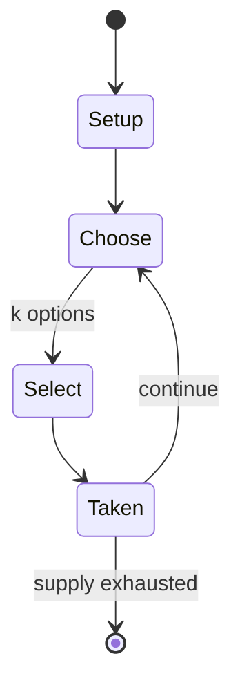

# circe chess

*chess variant in which captured pieces are reborn on their starting positions*

`circe_chess` &nbsp; state: **DEEPENED** &nbsp; method: **heuristic**

## Found layer (recorded, not trusted)

| field | value |
| --- | --- |
| wikidata | Q1092765 |
| wikipedia | Circe chess |
| genres (source) | -- |
| instance of (source) | chess variant |
| country of origin | France |

## Declared layer (orders bench work)

| field | value |
| --- | --- |
| year created | 1967 |
| epoch | MODERN |
| region | EUROPE_WEST |
| media | - |
| players | -- |
| age band | -- |
| exogenous process | -- |
| loss shape | -- |
| live axes | SELECT |
| horizon | -- |
| scoring shape | -- |
| information | -- |
| interaction | COMPETITIVE |
| turn structure | -- |
| tractability | SAMPLING_ONLY |
| randomness | -- |
| luck factor | 0.35 |
| rules complexity | 2.11 |
| strategic depth | 2.25 |
| novelty | 0.3479 |
| solved status | -- |
| strategies | signalling |
| algorithms | -- |

## Object model

```
Episode
  players      : ?
  turn_structure: ?
  horizon       : ?
  scoring       : ?

OptionSet      -- the choices available after an exogenous draw
```

## State transition diagram



## Research item -- turn trace

```
# circe chess -- simulated turn events
# generated from the DECLARED vector, not from a rulebook.
# structure: exo=None loss=None horizon=None scoring=None axes=SELECT

t=0    SETUP        players=2  pot=0  capacity=4
t=1    SELECT       p1 4 options; take #4  (pot_gain=+0.8, capacity=-0)
t=2    SELECT       p1 1 options; take #1  (pot_gain=+2.9, capacity=-2)
t=3    SELECT       p1 2 options; take #1  (pot_gain=+3.4, capacity=-1)
t=4    SELECT       p1 4 options; take #2  (pot_gain=+2.3, capacity=-2)
t=5    SELECT       p1 2 options; take #1  (pot_gain=+2.7, capacity=-1)
t=6    ENDTURN      turn passes to p2
t=7    SELECT       p2 2 options; take #1  (pot_gain=+3.5, capacity=-0)
t=8    ENDTURN      turn passes to p1
t=9    SELECT       p1 4 options; take #1  (pot_gain=+2.2, capacity=-0)
t=10   SELECT       p1 3 options; take #1  (pot_gain=+2.4, capacity=-0)
t=11   SELECT       p1 3 options; take #3  (pot_gain=+1.8, capacity=-2)
t=12   SELECT       p1 3 options; take #2  (pot_gain=+3.0, capacity=-2)
t=13   SELECT       p1 2 options; take #2  (pot_gain=+3.4, capacity=-2)
t=14   ENDTURN      turn passes to p2
t=15   SELECT       p2 3 options; take #3  (pot_gain=+1.1, capacity=-2)
t=16   SELECT       p2 1 options; take #1  (pot_gain=+1.8, capacity=-0)
t=17   SELECT       p2 1 options; take #1  (pot_gain=+1.6, capacity=-0)
t=18   SELECT       p2 1 options; take #1  (pot_gain=+1.4, capacity=-2)
t=19   SELECT       p2 1 options; take #1  (pot_gain=+3.2, capacity=-2)
t=20   SELECT       p2 3 options; take #3  (pot_gain=+1.4, capacity=-2)
t=21   ENDTURN      turn passes to p1
t=22   SELECT       p1 3 options; take #3  (pot_gain=+2.2, capacity=-0)
t=23   SELECT       p1 1 options; take #1  (pot_gain=+1.4, capacity=-1)
t=24   SELECT       p1 1 options; take #1  (pot_gain=+1.4, capacity=-1)
t=25   SELECT       p1 1 options; take #1  (pot_gain=+3.5, capacity=-1)
t=26   SELECT       p1 2 options; take #1  (pot_gain=+1.4, capacity=-1)

terminal: VARIABLE
```

## Source extract

Circe chess (or just Circe) is a chess variant in which captured pieces return to their starting
positions as soon as they are captured. The game was invented by French composer Pierre Monréal
in 1967 and the rules of Circe chess were first detailed by  Monréal and Jean-Pierre Boyer in an
article in Problème, 1968. It is named for the enchantress Circe, who in the Odyssey instructs
Odysseus on how to enter the Underworld and return, just as pieces in Circe chess can return
after being killed. Circe is rarely played as a variant game (when it is, it is usually combined
with progressive chess), but very often employed in composed fairy chess problems.   == Rules ==
These are the most usual rules employed in Circe—there are numerous other forms of the game in
which the rules of rebirth may vary.  Pawns return to the start position on the same file they
are captured on. Rooks, knights and bishops return to the starting square which is the same
colour as the square they are captured on. Captured queens are returned to the queen's square.
For instance, a white pawn captured on b4 is reborn on b2; a black knight captured on f6 is
reborn on b8; a black rook captured on the same square is r

<sub>Wikipedia, CC BY-SA. Retained as evidence for the structural
classification above. Every rule inferred from it is HYPOTHESIZED
until audited against a rulebook.</sub>
