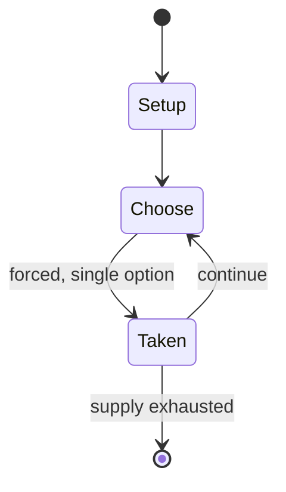

# Circular chess

`circular_chess` &nbsp; state: **DEEPENED** &nbsp; method: **heuristic**

## Found layer (recorded, not trusted)

| field | value |
| --- | --- |
| wikidata | Q945460 |
| wikipedia | Circular chess |
| genres (source) | -- |
| instance of (source) | -- |
| country of origin | -- |

## Declared layer (orders bench work)

| field | value |
| --- | --- |
| year created | -- |
| epoch | -- |
| region | -- |
| media | - |
| players | -- |
| age band | -- |
| exogenous process | NONE |
| loss shape | OPPORTUNITY_ONLY |
| live axes | - |
| horizon | -- |
| scoring shape | SET_COLLECTION_CONVEX |
| information | PERFECT |
| interaction | COMPETITIVE |
| turn structure | -- |
| tractability | EXACT_WITH_CUT |
| randomness | NONE |
| luck factor | 0.02 |
| rules complexity | 1.89 |
| strategic depth | 2.65 |
| novelty | 0.7562 |
| solved status | -- |
| strategies | set_collection |
| algorithms | -- |

## Object model

```
Episode
  players      : ?
  turn_structure: ?
  horizon       : ?
  scoring       : SET_COLLECTION_CONVEX

State          -- opaque; no medium or axis evidence was found
Player         -- an agent that selects among legal successors
```

## State transition diagram



## Research item -- turn trace

```
# Circular chess -- simulated turn events
# generated from the DECLARED vector, not from a rulebook.
# structure: exo=NONE loss=OPPORTUNITY_ONLY horizon=None scoring=SET_COLLECTION_CONVEX axes=-

t=0    SETUP        players=2  pot=0  capacity=8
t=1    FORCED       p1 single legal option taken (pot_gain=+1.8)
t=2    FORCED       p1 single legal option taken (pot_gain=+1.8)
t=3    FORCED       p1 single legal option taken (pot_gain=+1.3)
t=4    FORCED       p1 single legal option taken (pot_gain=+1.5)
t=5    FORCED       p1 single legal option taken (pot_gain=+1.8)
t=6    ENDTURN      turn passes to p2
t=7    FORCED       p2 single legal option taken (pot_gain=+0.9)
t=8    FORCED       p2 single legal option taken (pot_gain=+2.0)
t=9    FORCED       p2 single legal option taken (pot_gain=+1.3)
t=10   FORCED       p2 single legal option taken (pot_gain=+1.1)
t=11   FORCED       p2 single legal option taken (pot_gain=+1.7)
t=12   FORCED       p2 single legal option taken (pot_gain=+1.8)
t=13   FORCED       p2 single legal option taken (pot_gain=+1.7)
t=14   ENDTURN      turn passes to p1
t=15   FORCED       p1 single legal option taken (pot_gain=+1.0)
t=16   FORCED       p1 single legal option taken (pot_gain=+1.7)
t=17   ENDTURN      turn passes to p2
t=18   FORCED       p2 single legal option taken (pot_gain=+1.4)
t=19   FORCED       p2 single legal option taken (pot_gain=+1.4)
t=20   FORCED       p2 single legal option taken (pot_gain=+1.4)
t=21   FORCED       p2 single legal option taken (pot_gain=+0.8)
t=22   ENDTURN      turn passes to p1
t=23   FORCED       p1 single legal option taken (pot_gain=+1.5)
t=24   FORCED       p1 single legal option taken (pot_gain=+2.0)
t=25   FORCED       p1 single legal option taken (pot_gain=+1.5)
t=26   FORCED       p1 single legal option taken (pot_gain=+1.1)

terminal: VARIABLE
```

## Conditions

| kind | threshold | effect | trigger |
| --- | --- | --- | --- |
| TERMINATE | 5 points | -- | Howell won the tournament, scoring a maximum 5 points after beating Bowers in the final round, although he commented afterwards "This is the first time I have played in a circular chess contest and it was difficult. |
| TERMINATE | 4 players | -- | Kok beat Beasley in the third round, while Stamp and Jones remained in contention after both winning; Bowers also won, although, since the top four players would be drawn against each other in the final round, his chance |
| BOUNDARY | 4 points | -- | Lewis lost his third-round game to tournament founder Reynolds, but the other four leaders all won, ensuring the need for a tiebreak unless one of the last round games was drawn; Kok beat Clark and Bowers beat Kidals to  |
| TERMINATE | -- | -- | The draw for the final round pitted Kok against Jones and Bowers against Stamp – in each case an experienced player against a tournament newcomer. |

## Source extract

Circular chess, also known as round chess or Byzantine chess, is a chess variant played using
the standard set of pieces on a circular board consisting of four rings, each of sixteen
squares. This is topologically equivalent to playing on the curved surface of a cylinder.   ==
History == The history of circular chess goes back at least to the Byzantine Empire, as
suggested by its alternate name. According to the Circular Chess Society, the Arab historian al-
Masudi wrote about "Byzantine round chess" among other variants in his 967 history of the world
The Meadows of Gold. In 1983, Lincoln amateur historian David Reynolds came across a 1905
reference to the game being played in the Middle Ages and set about attempting to revive
interest in it. He invented a new set of rules, based around those of orthodox chess. In 1993,
he founded the Circular Chess Society, which held its first world championship in 1996.   ==
Historical circular chess ==   === Rules ===  One set of rules for medieval circular chess is
from the Persian author Muhammad ibn Mahmud Amuli's 'Treasury of the Sciences' (1325). In this
version, called shatranj al-muddawara (circular chess) or shatranj ar-Rūmīya (Roman or

<sub>Wikipedia, CC BY-SA. Retained as evidence for the structural
classification above. Every rule inferred from it is HYPOTHESIZED
until audited against a rulebook.</sub>
