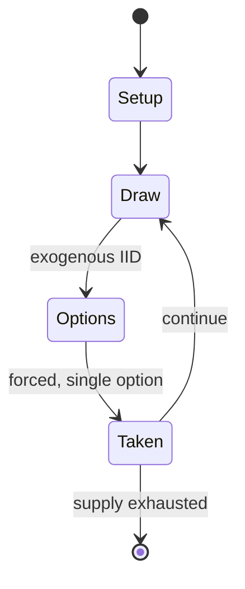

# Cirqus Voltaire

*1997 pinball machine*

`cirqus_voltaire` &nbsp; state: **DEEPENED** &nbsp; method: **heuristic**

## Found layer (recorded, not trusted)

| field | value |
| --- | --- |
| wikidata | Q5121981 |
| wikipedia | Cirqus Voltaire |
| genres (source) | -- |
| instance of (source) | pinball machine game, video game |
| country of origin | -- |

## Declared layer (orders bench work)

| field | value |
| --- | --- |
| year created | 1996 |
| epoch | DIGITAL |
| region | -- |
| media | VIDEO, WORD |
| players | -- |
| age band | -- |
| exogenous process | IID |
| loss shape | -- |
| live axes | SPATIAL |
| horizon | -- |
| scoring shape | -- |
| information | -- |
| interaction | -- |
| turn structure | PHASE_STRUCTURED |
| tractability | SAMPLING_ONLY |
| randomness | HIDDEN_INFO, SPINNER |
| luck factor | 0.47 |
| rules complexity | 3.28 |
| strategic depth | 2.25 |
| novelty | 0.5654 |
| solved status | -- |
| strategies | spatial_packing |
| algorithms | -- |

## Object model

```
Episode
  players      : ?
  turn_structure: PHASE_STRUCTURED
  horizon       : ?
  scoring       : ?

WorldState     -- simulation state advanced by the engine
Avatar         -- player-controlled agent
Clock          -- frame or tick counter
Placement      -- position subject to geometric legality
```

## State transition diagram



## Research item -- turn trace

```
# Cirqus Voltaire -- simulated turn events
# generated from the DECLARED vector, not from a rulebook.
# structure: exo=IID loss=None horizon=None scoring=None axes=SPATIAL

t=0    SETUP        players=2  pot=0  capacity=5
t=1    DRAW         p1 roll from d6 pool -> outcome #6  (p=0.192)
t=2    FORCED       p1 single legal option taken (pot_gain=+0.9)
t=3    DRAW         p1 roll from d6 pool -> outcome #1  (p=0.186)
t=4    FORCED       p1 single legal option taken (pot_gain=+1.7)
t=5    SPATIAL      p1 places at (1,0); adjacency legal
t=6    DRAW         p1 roll from d6 pool -> outcome #6  (p=0.278)
t=7    FORCED       p1 single legal option taken (pot_gain=+1.5)
t=8    DRAW         p1 roll from d6 pool -> outcome #2  (p=0.268)
t=9    FORCED       p1 single legal option taken (pot_gain=+0.9)
t=10   DRAW         p1 roll from d6 pool -> outcome #6  (p=0.066)
t=11   FORCED       p1 single legal option taken (pot_gain=+1.2)
t=12   DRAW         p1 roll from d6 pool -> outcome #1  (p=0.187)
t=13   FORCED       p1 single legal option taken (pot_gain=+1.1)
t=14   SPATIAL      p1 places at (1,6); adjacency legal
t=15   DRAW         p1 roll from d6 pool -> outcome #1  (p=0.200)
t=16   FORCED       p1 single legal option taken (pot_gain=+0.7)
t=17   DRAW         p1 roll from d6 pool -> outcome #3  (p=0.036)
t=18   FORCED       p1 single legal option taken (pot_gain=+0.8)
t=19   SPATIAL      p1 places at (1,5); adjacency legal
t=20   ENDTURN      turn passes to p2
t=21   DRAW         p2 roll from d6 pool -> outcome #4  (p=0.244)
t=22   FORCED       p2 single legal option taken (pot_gain=+1.6)
t=23   DRAW         p2 roll from d6 pool -> outcome #2  (p=0.278)
t=24   FORCED       p2 single legal option taken (pot_gain=+0.7)
t=25   DRAW         p2 roll from d6 pool -> outcome #6  (p=0.241)
t=26   FORCED       p2 single legal option taken (pot_gain=+0.8)
t=27   SPATIAL      p2 places at (6,0); adjacency legal

terminal: VARIABLE
```

## Conditions

| kind | threshold | effect | trigger |
| --- | --- | --- | --- |
| BOUNDARY | -- | -- | This phase starts with one ball and adds one for each successful shot, to a maximum of three. |

## Source extract

Cirqus Voltaire is a 1997 pinball game, designed by John Popadiuk and released by Williams
Electronics Games (under the Bally label). The theme involves the player performing many
different marvels in order to join the circus. Some of the game's distinctive features include a
neon light running along the right ramp return, a pop bumper that rises up from the middle of
the playfield at certain times, and a magnet at the top of the left ramp that can catch balls
and divert them into the locks. The most notable feature is the Ringmaster, a head that rises at
certain times and taunts the player.   == Design == The name of the game is partly based on
Voltaire. It was the first Williams/Bally pinball machine missing a real replay-knocker, a
device driven by a coil to produce a loud bang when hammering against the wood of the cabinet or
backbox. Instead this sound effect was pre-recorded and played via the speakers. It was also the
second machine (after Capcom's Flipper Football released in 1996) to move the dot-matrix display
(DMD) from the backbox right into the cabinet, but the idea of placing the display there was
conceived earlier by John Trudeau in a canceled game called Aces. in or

<sub>Wikipedia, CC BY-SA. Retained as evidence for the structural
classification above. Every rule inferred from it is HYPOTHESIZED
until audited against a rulebook.</sub>
