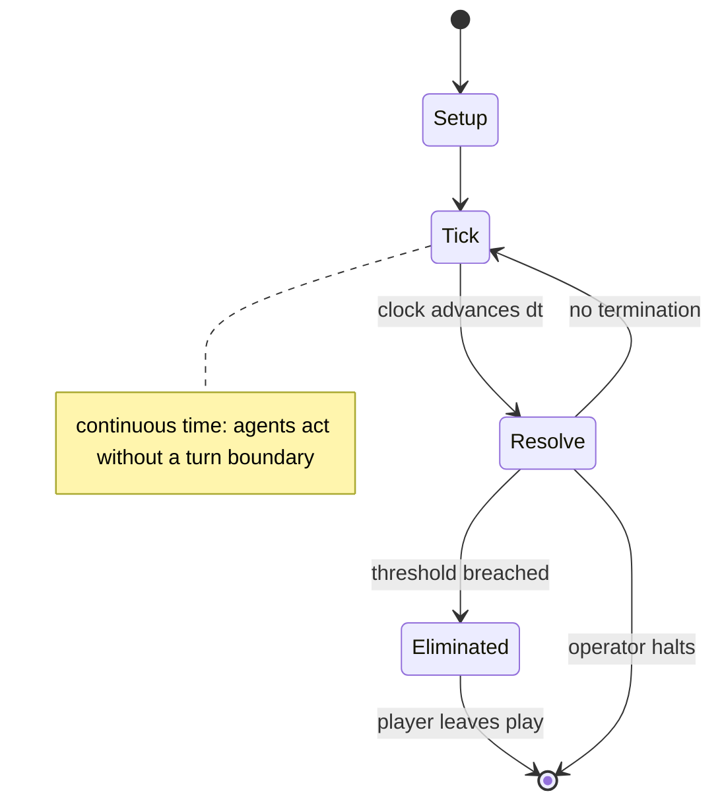

# Civilization (video game)

`civilization_video_game` &nbsp; state: **DEEPENED** &nbsp; method: **heuristic**

## Found layer (recorded, not trusted)

| field | value |
| --- | --- |
| wikidata | Q368286 |
| wikipedia | Civilization (video game) |
| genres (source) | -- |
| instance of (source) | -- |
| country of origin | -- |

## Declared layer (orders bench work)

| field | value |
| --- | --- |
| year created | -4000 |
| epoch | DEEP_ANTIQUITY |
| region | -- |
| media | VIDEO |
| players | -- |
| age band | -- |
| exogenous process | CONTINUOUS_TIME |
| loss shape | ELIMINATION |
| live axes | NEGOTIATE, ORDER, TRADE |
| horizon | OPEN_ENDED |
| scoring shape | RACE_POSITION |
| information | SIMULTANEOUS |
| interaction | NEGOTIATION |
| turn structure | REAL_TIME |
| tractability | SAMPLING_ONLY |
| randomness | HIDDEN_INFO |
| luck factor | 0.35 |
| rules complexity | 3.93 |
| strategic depth | 2.5 |
| novelty | 0.6418 |
| solved status | -- |
| strategies | coalition_forming, route_optimisation |
| algorithms | -- |

## Object model

```
Episode
  players      : ?
  turn_structure: REAL_TIME
  horizon       : OPEN_ENDED
  scoring       : RACE_POSITION

WorldState     -- simulation state advanced by the engine
Avatar         -- player-controlled agent
Clock          -- frame or tick counter
Agreement      -- non-binding or binding commitment between agents
Sequence       -- the permutation under the player's control
Offer          -- proposed exchange between two agents
```

## State transition diagram



## Research item -- clock trace

```
# Civilization (video game) -- simulated clock trace (no turn boundary)
# generated from the DECLARED vector, not from a rulebook.
# structure: exo=CONTINUOUS_TIME loss=ELIMINATION horizon=OPEN_ENDED scoring=RACE_POSITION axes=NEGOTIATE,ORDER,TRADE

clk=0.000s  START        agents=4  clock=free running
clk=2.370s  INFRACTION   a3 commits infraction (count=1)
clk=3.847s  STOPPAGE     clock halts; state frozen
clk=5.241s  STOPPAGE     clock halts; state frozen
clk=6.821s  CONTEST      a1 and a2 contend for the same resource
clk=9.009s  CONTEST      a1 and a2 contend for the same resource
clk=9.375s  ACTION       a4 acts continuously; no turn boundary crossed
clk=10.266s  CONTEST      a2 and a3 contend for the same resource
clk=10.531s  ACTION       a2 acts continuously; no turn boundary crossed
clk=11.129s  STOPPAGE     clock halts; state frozen
clk=12.630s  SCORE        a4 scores (+1)
clk=12.860s  CONTEST      a4 and a1 contend for the same resource
clk=15.565s  SCORE        a4 scores (+3)
clk=18.093s  ACTION       a1 acts continuously; no turn boundary crossed
clk=20.856s  INFRACTION   a2 commits infraction (count=1)
clk=22.717s  CONTEST      a2 and a3 contend for the same resource
clk=24.150s  ACTION       a2 acts continuously; no turn boundary crossed
clk=24.833s  INFRACTION   a3 commits infraction (count=2)
clk=27.446s  ACTION       a4 acts continuously; no turn boundary crossed
clk=29.413s  ACTION       a2 acts continuously; no turn boundary crossed
clk=31.870s  CONTEST      a1 and a2 contend for the same resource
clk=33.726s  INFRACTION   a2 commits infraction (count=2)
clk=34.054s  ACTION       a1 acts continuously; no turn boundary crossed
clk=35.672s  STOPPAGE     clock halts; state frozen
clk=36.694s  STOPPAGE     clock halts; state frozen
clk=39.657s  SCORE        a3 scores (+3)
clk=41.292s  SCORE        a3 scores (+1)

note: elapsed time, not move count, is the episode's ordering variable.
```

## Conditions

| kind | threshold | effect | trigger |
| --- | --- | --- | --- |
| ELIMINATE | -- | -- | He eliminated the potential for any civilization to fall on its own, believing this would be punishing to the player. |
| ELIMINATE | -- | -- | They also eliminated a secondary branch of the technology tree with minor skills like beer brewing, and spent time reworking the existing technologies and units to make sure they felt appropriate and did not break the ga |
| ELIMINATE | -- | -- | Stealey eventually sold his shares in MicroProse and left the company, and Spectrum HoloByte opted to consolidate the two companies under the name MicroProse in 1996, eliminating numerous positions at MicroProse in the p |
| BOUNDARY | -- | -- | Along with the larger tasks of exploration, warfare and diplomacy, the player has to make decisions about where to build new cities, which improvements or units to build in each city, which advances in knowledge should b |
| BOUNDARY | -- | -- | There were at least two attempts to make a computerized version of Tresham's game prior to 1990. |
| BOUNDARY | -- | -- | It was theorized that the game started Gandhi's "aggression value" at 1 out of a maximum 255 possible for an 8-bit unsigned integer, making a computer-controlled Gandhi tend to avoid armed conflict. |

## Source extract

Sid Meier's Civilization is a 1991 turn-based strategy 4X video game developed and published by
MicroProse. The game was originally developed for MS-DOS running on a PC, and it has undergone
numerous revisions for various platforms. The player is tasked with leading an entire human
civilization over the course of several millennia by controlling various areas such as urban
development, exploration, government, trade, research, and military. The player can control
individual units and advance the exploration, conquest and settlement of the game's world. The
player can also make such decisions as setting forms of government, tax rates and research
priorities. The player's civilization is in competition with other computer-controlled
civilizations, with which the player can enter diplomatic relationships that can either end in
alliances or lead to war. Civilization was designed by Sid Meier and Bruce Shelley following the
successes of Silent Service, Sid Meier's Pirates! and Railroad Tycoon. Civilization has sold 1.5
million copies since its release and is considered one of the most influential computer games in
history due to its establishment of the 4X genre. In addition to its comm

<sub>Wikipedia, CC BY-SA. Retained as evidence for the structural
classification above. Every rule inferred from it is HYPOTHESIZED
until audited against a rulebook.</sub>
