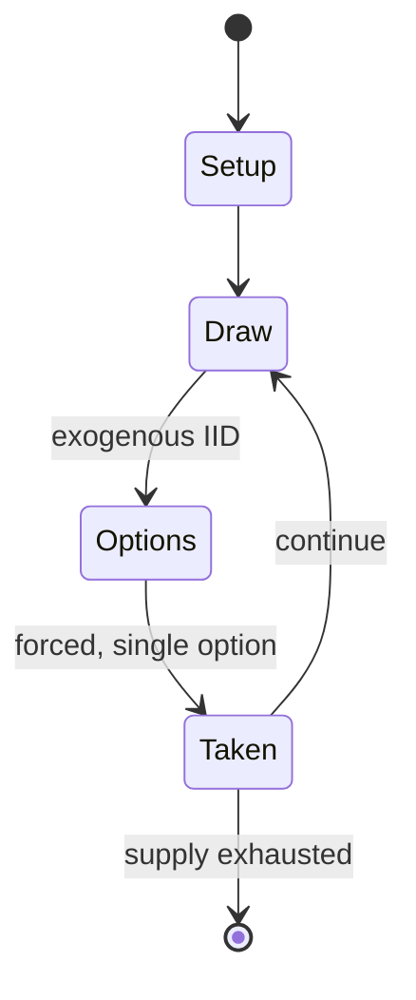

# Class of 1812

*1991 pinball machine*

`class_of_1812` &nbsp; state: **DEEPENED** &nbsp; method: **heuristic**

## Found layer (recorded, not trusted)

| field | value |
| --- | --- |
| wikidata | Q20875555 |
| wikipedia | Class of 1812 (pinball) |
| genres (source) | -- |
| instance of (source) | video game |
| country of origin | -- |

## Declared layer (orders bench work)

| field | value |
| --- | --- |
| year created | 1991 |
| epoch | DIGITAL |
| region | -- |
| media | VIDEO |
| players | -- |
| age band | -- |
| exogenous process | IID |
| loss shape | -- |
| live axes | ORDER |
| horizon | -- |
| scoring shape | NONLINEAR |
| information | -- |
| interaction | -- |
| turn structure | -- |
| tractability | SAMPLING_ONLY |
| randomness | SPINNER |
| luck factor | 0.42 |
| rules complexity | 2.0 |
| strategic depth | 2.0 |
| novelty | 0.5763 |
| solved status | -- |
| strategies | -- |
| algorithms | -- |

## Object model

```
Episode
  players      : ?
  turn_structure: ?
  horizon       : ?
  scoring       : NONLINEAR

WorldState     -- simulation state advanced by the engine
Avatar         -- player-controlled agent
Clock          -- frame or tick counter
Sequence       -- the permutation under the player's control
```

## State transition diagram



## Research item -- turn trace

```
# Class of 1812 -- simulated turn events
# generated from the DECLARED vector, not from a rulebook.
# structure: exo=IID loss=None horizon=None scoring=NONLINEAR axes=ORDER

t=0    SETUP        players=2  pot=0  capacity=6
t=1    DRAW         p1 roll from d6 pool -> outcome #4  (p=0.031)
t=2    FORCED       p1 single legal option taken (pot_gain=+0.8)
t=3    DRAW         p1 roll from d6 pool -> outcome #5  (p=0.235)
t=4    FORCED       p1 single legal option taken (pot_gain=+1.5)
t=5    DRAW         p1 roll from d6 pool -> outcome #5  (p=0.035)
t=6    FORCED       p1 single legal option taken (pot_gain=+1.9)
t=7    DRAW         p1 roll from d6 pool -> outcome #6  (p=0.168)
t=8    FORCED       p1 single legal option taken (pot_gain=+1.9)
t=9    DRAW         p1 roll from d6 pool -> outcome #6  (p=0.281)
t=10   FORCED       p1 single legal option taken (pot_gain=+0.9)
t=11   DRAW         p1 roll from d6 pool -> outcome #3  (p=0.250)
t=12   FORCED       p1 single legal option taken (pot_gain=+1.9)
t=13   ENDTURN      turn passes to p2
t=14   DRAW         p2 roll from d6 pool -> outcome #1  (p=0.173)
t=15   FORCED       p2 single legal option taken (pot_gain=+0.9)
t=16   DRAW         p2 roll from d6 pool -> outcome #2  (p=0.132)
t=17   FORCED       p2 single legal option taken (pot_gain=+0.8)
t=18   DRAW         p2 roll from d6 pool -> outcome #3  (p=0.240)
t=19   FORCED       p2 single legal option taken (pot_gain=+1.7)
t=20   DRAW         p2 roll from d6 pool -> outcome #6  (p=0.163)
t=21   FORCED       p2 single legal option taken (pot_gain=+1.4)
t=22   ENDTURN      turn passes to p1
t=23   DRAW         p1 roll from d6 pool -> outcome #5  (p=0.084)
t=24   FORCED       p1 single legal option taken (pot_gain=+1.6)
t=25   ENDTURN      turn passes to p2
t=26   DRAW         p2 roll from d6 pool -> outcome #2  (p=0.274)
t=27   FORCED       p2 single legal option taken (pot_gain=+2.0)

terminal: VARIABLE
```

## Source extract

Class of 1812 is a pinball machine designed by Ray Tanzer and Joe Kaminkow and released in 1991
by Gottlieb. It features a supernatural monster theme and was advertised with the slogan
"Frightful fun for all ages!".   == Description == During the design process the name of the
game was changed from "Monster Mash" to Class of 1812 to save on licensing fees. Class of 1812
has a dark theme featuring the reunion of a long dead class. The back glass is a vacuum formed
3D image. During Multiball Madness, a large mechanical beating heart and chattering teeth are
synchronized along to chickens clucking the 1812 Overture by Pyotr Tchaikovsky. The top of the
playfield contains upper rollovers that advance bonus multiplier. The white target sequence
advances the BAT-O-METER.  Completing the left drop-targets lights the ball lock, then it is
possible to lock the ball with the right ramp.  Completing the C-O-F-F-I-N letters collects a
2,000,000 point jackpot. The playfield contains elements such as for example pop-bumpers,
stationary targets, drop-targets, rollovers, ramps, saucer holes and spinners. The back glass
features an image of Lon Chaney from the infamous lost film London After Midnigh

<sub>Wikipedia, CC BY-SA. Retained as evidence for the structural
classification above. Every rule inferred from it is HYPOTHESIZED
until audited against a rulebook.</sub>
