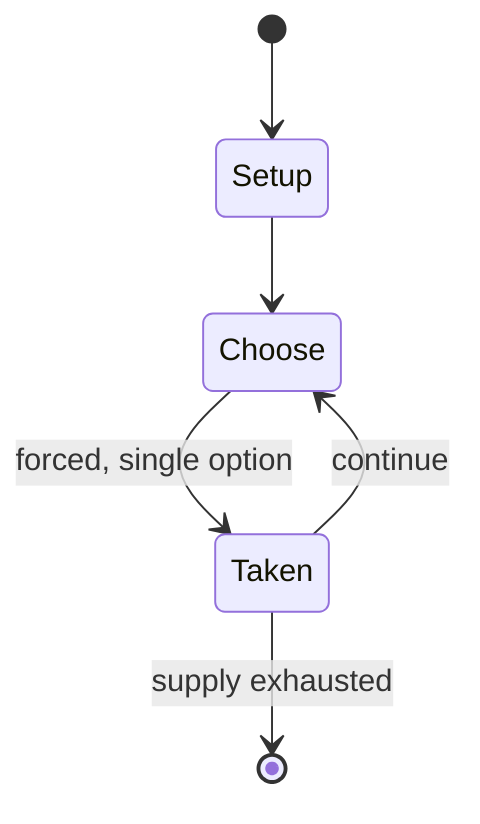

# Clowns and Balloons

*1982 video game*

`clowns_and_balloons` &nbsp; state: **DEEPENED** &nbsp; method: **heuristic**

## Found layer (recorded, not trusted)

| field | value |
| --- | --- |
| wikidata | Q105095637 |
| wikipedia | Clowns and Balloons |
| genres (source) | -- |
| instance of (source) | video game |
| country of origin | -- |

## Declared layer (orders bench work)

| field | value |
| --- | --- |
| year created | 1982 |
| epoch | DIGITAL |
| region | -- |
| media | VIDEO |
| players | -- |
| age band | -- |
| exogenous process | -- |
| loss shape | -- |
| live axes | - |
| horizon | -- |
| scoring shape | SET_COLLECTION_CONVEX |
| information | -- |
| interaction | -- |
| turn structure | -- |
| tractability | SAMPLING_ONLY |
| randomness | REAL_TIME_PHYSICAL |
| luck factor | 0.35 |
| rules complexity | 1.7 |
| strategic depth | 2.0 |
| novelty | 0.0876 |
| solved status | -- |
| strategies | set_collection |
| algorithms | -- |

## Object model

```
Episode
  players      : ?
  turn_structure: ?
  horizon       : ?
  scoring       : SET_COLLECTION_CONVEX

WorldState     -- simulation state advanced by the engine
Avatar         -- player-controlled agent
Clock          -- frame or tick counter
```

## State transition diagram



## Research item -- turn trace

```
# Clowns and Balloons -- simulated turn events
# generated from the DECLARED vector, not from a rulebook.
# structure: exo=None loss=None horizon=None scoring=SET_COLLECTION_CONVEX axes=-

t=0    SETUP        players=2  pot=0  capacity=8
t=1    FORCED       p1 single legal option taken (pot_gain=+1.7)
t=2    FORCED       p1 single legal option taken (pot_gain=+1.4)
t=3    ENDTURN      turn passes to p2
t=4    FORCED       p2 single legal option taken (pot_gain=+1.7)
t=5    FORCED       p2 single legal option taken (pot_gain=+1.5)
t=6    FORCED       p2 single legal option taken (pot_gain=+1.0)
t=7    FORCED       p2 single legal option taken (pot_gain=+1.8)
t=8    FORCED       p2 single legal option taken (pot_gain=+1.3)
t=9    FORCED       p2 single legal option taken (pot_gain=+1.5)
t=10   FORCED       p2 single legal option taken (pot_gain=+0.7)
t=11   FORCED       p2 single legal option taken (pot_gain=+1.2)
t=12   FORCED       p2 single legal option taken (pot_gain=+0.8)
t=13   FORCED       p2 single legal option taken (pot_gain=+0.7)
t=14   ENDTURN      turn passes to p1
t=15   FORCED       p1 single legal option taken (pot_gain=+1.1)
t=16   ENDTURN      turn passes to p2
t=17   FORCED       p2 single legal option taken (pot_gain=+1.2)
t=18   FORCED       p2 single legal option taken (pot_gain=+1.6)
t=19   FORCED       p2 single legal option taken (pot_gain=+0.8)
t=20   FORCED       p2 single legal option taken (pot_gain=+0.9)
t=21   FORCED       p2 single legal option taken (pot_gain=+0.6)
t=22   ENDTURN      turn passes to p1
t=23   FORCED       p1 single legal option taken (pot_gain=+1.6)
t=24   FORCED       p1 single legal option taken (pot_gain=+1.3)
t=25   FORCED       p1 single legal option taken (pot_gain=+1.3)
t=26   ENDTURN      turn passes to p2

terminal: VARIABLE
```

## Source extract

Clowns and Balloons is a circus-themed video game written by Frank Cohen for Atari 8-bit
computers and published in 1982 by Datasoft. The game was also released for the TRS-80 Color
Computer, written by Steve Bjork who had released a similar game called Space Ball for the
TRS-80 in 1980. Clowns and Balloons is a clone of the 1977 arcade game Circus. A variant of
Breakout, the player moves a trampoline left and right to catch a bouncing clown who pops rows
of balloons at the top of the screen with his head.   == Gameplay ==  The object of Clowns and
Balloons is to move a trampoline under a clown and bounce it high enough into the air to burst
the balloons at the top of the screen. The player moves the trampoline horizontally with the
joystick or paddles. There are three levels of difficulty. There is a bonus for clearing each
row of balloons completely starting from the bottom and working up. If the balloons are not
cleared in order, the row refills. The clown bounces at different angles depending on where they
land on the trampoline.   == Reception == Charles Brannon, who reviewed the game for Compute!
magazine, liked the game: "The animation remains fairly simple, though smooth. T

<sub>Wikipedia, CC BY-SA. Retained as evidence for the structural
classification above. Every rule inferred from it is HYPOTHESIZED
until audited against a rulebook.</sub>
