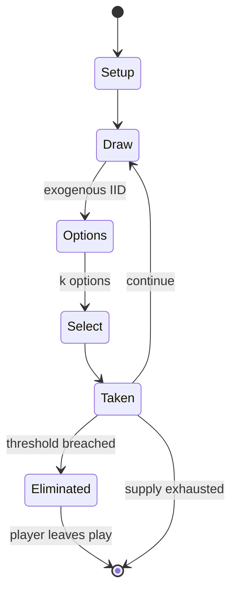

# Cluedo

`cluedo` &nbsp; state: **DEEPENED** &nbsp; method: **heuristic**

## Found layer (recorded, not trusted)

| field | value |
| --- | --- |
| wikidata | Q17245 |
| wikipedia | Cluedo |
| genres (source) | -- |
| instance of (source) | -- |
| country of origin | -- |

## Declared layer (orders bench work)

| field | value |
| --- | --- |
| year created | 1943 |
| epoch | MODERN |
| region | -- |
| media | BOARD, DICE |
| players | -- |
| age band | -- |
| exogenous process | IID |
| loss shape | ELIMINATION |
| live axes | COMMIT_BLIND, SELECT, TRADE |
| horizon | -- |
| scoring shape | SET_COLLECTION_CONVEX |
| information | IMPERFECT |
| interaction | SOLITAIRE |
| turn structure | STRICT_TURN |
| tractability | EXACT_WITH_CUT |
| randomness | DICE, HIDDEN_INFO |
| luck factor | 0.63 |
| rules complexity | 2.3 |
| strategic depth | 2.54 |
| novelty | 0.707 |
| solved status | -- |
| strategies | blocking, deduction, set_collection |
| algorithms | -- |

## Object model

```
Episode
  players      : ?
  turn_structure: STRICT_TURN
  horizon       : ?
  scoring       : SET_COLLECTION_CONVEX

Board          -- spatial substrate; cells carry position and occupancy
Piece          -- movable token owned by a player
DicePool       -- n dice, each an iid categorical draw
Roll           -- realised outcome of a pool
SealedChoice   -- irrevocable choice made without observation
OptionSet      -- the choices available after an exogenous draw
Offer          -- proposed exchange between two agents
```

## State transition diagram



## Research item -- turn trace

```
# Cluedo -- simulated turn events
# generated from the DECLARED vector, not from a rulebook.
# structure: exo=IID loss=ELIMINATION horizon=None scoring=SET_COLLECTION_CONVEX axes=COMMIT_BLIND,SELECT,TRADE

t=0    SETUP        players=2  pot=0  capacity=6
t=1    DRAW         p1 roll from d6 pool -> outcome #4  (p=0.235)
t=2    SELECT       p1 4 options; take #1  (pot_gain=+1.3, capacity=-1)
t=3    DRAW         p1 roll from d6 pool -> outcome #5  (p=0.125)
t=4    SELECT       p1 1 options; take #1  (pot_gain=+2.6, capacity=-0)
t=5    ENDTURN      turn passes to p2
t=6    DRAW         p2 roll from d6 pool -> outcome #4  (p=0.186)
t=7    SELECT       p2 1 options; take #1  (pot_gain=+0.6, capacity=-1)
t=8    DRAW         p2 roll from d6 pool -> outcome #3  (p=0.046)
t=9    SELECT       p2 3 options; take #1  (pot_gain=+2.0, capacity=-2)
t=10   DRAW         p2 roll from d6 pool -> outcome #1  (p=0.005)
t=11   SELECT       p2 3 options; take #3  (pot_gain=+2.0, capacity=-1)
t=12   DRAW         p2 roll from d6 pool -> outcome #5  (p=0.032)
t=13   SELECT       p2 4 options; take #2  (pot_gain=+3.0, capacity=-1)
t=14   TRADE        p2 offers 2:1 exchange to p1
t=15   DRAW         p2 roll from d6 pool -> outcome #5  (p=0.163)
t=16   SELECT       p2 1 options; take #1  (pot_gain=+3.4, capacity=-0)
t=17   TRADE        p2 offers 2:1 exchange to p1
t=18   DRAW         p2 roll from d6 pool -> outcome #2  (p=0.175)
t=19   SELECT       p2 2 options; take #2  (pot_gain=+1.7, capacity=-2)
t=20   ENDTURN      turn passes to p1
t=21   DRAW         p1 roll from d6 pool -> outcome #5  (p=0.112)
t=22   SELECT       p1 3 options; take #3  (pot_gain=+1.5, capacity=-0)
t=23   DRAW         p1 roll from d6 pool -> outcome #1  (p=0.290)
t=24   SELECT       p1 4 options; take #2  (pot_gain=+0.6, capacity=-0)
t=25   DRAW         p1 roll from d6 pool -> outcome #6  (p=0.070)
t=26   SELECT       p1 1 options; take #1  (pot_gain=+0.5, capacity=-0)
t=27   TRADE        p1 offers 2:1 exchange to p2

terminal: VARIABLE
```

## Conditions

| kind | threshold | effect | trigger |
| --- | --- | --- | --- |
| ELIMINATE | -- | -- | These ten included the eliminated Mr. |
| ELIMINATE | -- | -- | Originally there were eleven rooms, including the eliminated gun room and cellar. |
| ELIMINATE | -- | -- | Traditionally, Miss Scarlett had the advantage of moving first, although this has been eliminated with the implementation of the high-roll rule in modern versions. |
| ELIMINATE | -- | -- | A player makes a suggestion to learn which cards may be eliminated from suspicion, but in some cases, it may be advantageous for a player to include one of their own cards in a suggestion. |
| ELIMINATE | -- | out of the game | There are eight clocks—the first seven drawn do nothing—whoever draws the eighth is killed by the murderer and is out of the game. |

## Source extract

Cluedo (), known as Clue in North America, is a murder mystery game for three to six players
(depending on editions) that was devised in 1943 by British board game designer Anthony E.
Pratt. The game was first manufactured by Waddingtons in the United Kingdom in 1949. Since then,
it has been relaunched and updated several times, and it is currently owned and published by the
American game and toy company Hasbro. The object of the game is to determine who murdered the
game's victim, where the crime took place, and which weapon was used. Each player assumes the
role of one of the six suspects and attempts to deduce the correct answer by strategically
moving around a game board representing the rooms of a mansion and collecting clues about the
circumstances of the murder from the other players. Numerous games, books, a film, television
series, and theatre adaptations have been released as part of the Cluedo franchise. Several
spinoffs have been released, featuring various extra characters, weapons, rooms, or different
gameplay. The original game is marketed as the "Classic Detective Game", and the various
spinoffs are all distinguished by different slogans. In 2008, Cluedo: Discover t

<sub>Wikipedia, CC BY-SA. Retained as evidence for the structural
classification above. Every rule inferred from it is HYPOTHESIZED
until audited against a rulebook.</sub>
