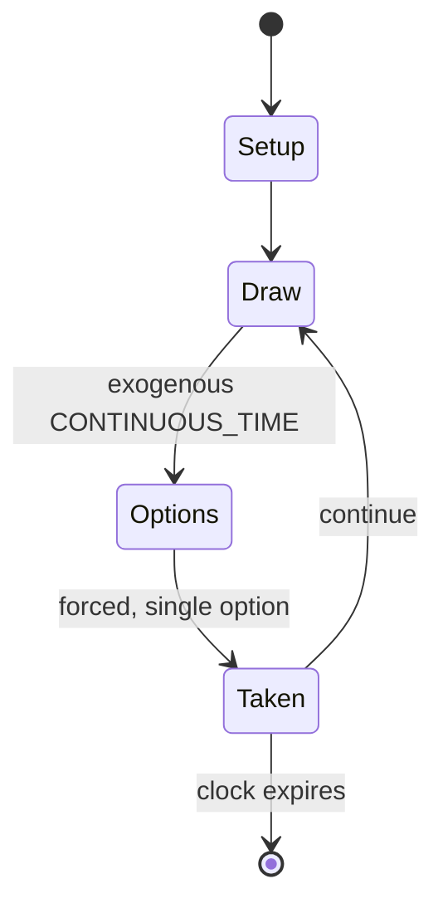

# Codenames

*2015 spy-themed word-affiliation board game*

`codenames` &nbsp; state: **DEEPENED** &nbsp; method: **heuristic**

## Found layer (recorded, not trusted)

| field | value |
| --- | --- |
| wikidata | Q25203543 |
| wikipedia | Codenames (board game) |
| genres (source) | -- |
| instance of (source) | board game |
| country of origin | Czech Republic |

## Declared layer (orders bench work)

| field | value |
| --- | --- |
| year created | 2016 |
| epoch | CONTEMPORARY |
| region | EUROPE_EAST |
| media | BOARD |
| players | 4-8 |
| age band | -- |
| exogenous process | CONTINUOUS_TIME |
| loss shape | -- |
| live axes | SPATIAL |
| horizon | CLOCK_LIMITED |
| scoring shape | -- |
| information | -- |
| interaction | SOLITAIRE |
| turn structure | STRICT_TURN |
| tractability | SAMPLING_ONLY |
| randomness | HIDDEN_INFO, REAL_TIME_PHYSICAL |
| luck factor | 0.35 |
| rules complexity | 2.22 |
| strategic depth | 2.25 |
| novelty | 0.6813 |
| solved status | -- |
| strategies | spatial_packing |
| algorithms | -- |

## Object model

```
Episode
  players      : 4-8
  turn_structure: STRICT_TURN
  horizon       : CLOCK_LIMITED
  scoring       : ?

Board          -- spatial substrate; cells carry position and occupancy
Piece          -- movable token owned by a player
Placement      -- position subject to geometric legality
```

## State transition diagram



## Research item -- turn trace

```
# Codenames -- simulated turn events
# generated from the DECLARED vector, not from a rulebook.
# structure: exo=CONTINUOUS_TIME loss=None horizon=CLOCK_LIMITED scoring=None axes=SPATIAL

t=0    SETUP        players=4  pot=0  capacity=4
t=1    DRAW         p1 tick from clock -> outcome #5  (p=0.168)
t=2    FORCED       p1 single legal option taken (pot_gain=+1.2)
t=3    SPATIAL      p1 places at (1,2); adjacency legal
t=4    DRAW         p1 tick from clock -> outcome #4  (p=0.093)
t=5    FORCED       p1 single legal option taken (pot_gain=+0.8)
t=6    ENDTURN      turn passes to p2
t=7    DRAW         p2 tick from clock -> outcome #5  (p=0.219)
t=8    FORCED       p2 single legal option taken (pot_gain=+1.0)
t=9    SPATIAL      p2 places at (6,5); adjacency legal
t=10   DRAW         p2 tick from clock -> outcome #6  (p=0.286)
t=11   FORCED       p2 single legal option taken (pot_gain=+1.5)
t=12   ENDTURN      turn passes to p3
t=13   DRAW         p3 tick from clock -> outcome #1  (p=0.164)
t=14   FORCED       p3 single legal option taken (pot_gain=+1.1)
t=15   SPATIAL      p3 places at (5,5); adjacency legal
t=16   ENDTURN      turn passes to p4
t=17   DRAW         p4 tick from clock -> outcome #1  (p=0.124)
t=18   FORCED       p4 single legal option taken (pot_gain=+0.6)
t=19   SPATIAL      p4 places at (2,1); adjacency legal
t=20   DRAW         p4 tick from clock -> outcome #4  (p=0.071)
t=21   FORCED       p4 single legal option taken (pot_gain=+1.0)
t=22   DRAW         p4 tick from clock -> outcome #2  (p=0.278)
t=23   FORCED       p4 single legal option taken (pot_gain=+1.4)
t=24   SPATIAL      p4 places at (5,2); adjacency legal
t=25   DRAW         p4 tick from clock -> outcome #6  (p=0.092)
t=26   FORCED       p4 single legal option taken (pot_gain=+0.7)
t=27   SPATIAL      p4 places at (7,0); adjacency legal

terminal: CLOCK_LIMITED
```

## Conditions

| kind | threshold | effect | trigger |
| --- | --- | --- | --- |
| WIN | -- | -- | Victory is achieved when one team guesses all of their spymaster's assigned words. |
| WIN | -- | -- | Given the nature of the gameplay, it is entirely possible for a team to win the game during their opponents' turn. |
| TERMINATE | -- | -- | If an invalid clue is given, the turn ends immediately, and the opposing team gets to reveal one of their own agents. |
| TERMINATE | -- | -- | However, if a bystander or an opposing agent is revealed, the guess is considered incorrect and the turn ends immediately. |
| TERMINATE | -- | -- | If the assassin is revealed, the game ends immediately with a loss for the guessing team. |
| TERMINATE | -- | -- | Assuming that the assassin hasn't been revealed, the game ends once all of one team's agents are found, thus achieving victory. |
| BOUNDARY | -- | -- | At most, the maximum number of guesses for a turn is the number given in the verbal clue plus one. |

## Source extract

Codenames (cz. Krycí jména) is a 2015 party board game designed by Vlaada Chvátil and published
by Czech Games Edition (CGE). In it, two teams compete by each having a "spymaster" give one-
word clues that can point to specific words on the board. The other players on the team must
attempt to guess their team's words while avoiding the words of the other team as well as an
assassin square; if the latter is selected, then the team which selected it instantly loses.
Victory is achieved when one team guesses all of their spymaster's assigned words. Codenames
received positive reviews and won many awards including the 2016 Spiel des Jahres award for the
best board game of the year.   == Rules == Codenames is a game played by 4 or more players.
Players are split into two teams, red and blue. One player from each team is the spymaster; the
others play as field operatives. During setup, 25 cards are randomly laid out in a 5x5 grid.
Each card has a word, and cards are face-up, so all players can see all words.  But what is
hidden is what each card represents: some cards represent red agents (red squares); others
represent blue agents (blue squares); one represents the assassin (black square

<sub>Wikipedia, CC BY-SA. Retained as evidence for the structural
classification above. Every rule inferred from it is HYPOTHESIZED
until audited against a rulebook.</sub>
