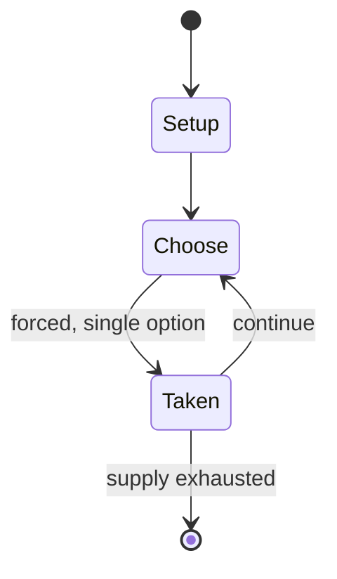

# Color Robot Battle

*1981 video game*

`color_robot_battle` &nbsp; state: **DEEPENED** &nbsp; method: **heuristic**

## Found layer (recorded, not trusted)

| field | value |
| --- | --- |
| wikidata | Q5148573 |
| wikipedia | Color Robot Battle |
| genres (source) | programming game |
| instance of (source) | video game |
| country of origin | United States |

## Declared layer (orders bench work)

| field | value |
| --- | --- |
| year created | 1981 |
| epoch | DIGITAL |
| region | NORTH_AMERICA |
| media | VIDEO |
| players | -- |
| age band | -- |
| exogenous process | -- |
| loss shape | -- |
| live axes | - |
| horizon | -- |
| scoring shape | -- |
| information | -- |
| interaction | COMPETITIVE |
| turn structure | -- |
| tractability | SAMPLING_ONLY |
| randomness | -- |
| luck factor | 0.35 |
| rules complexity | 1.66 |
| strategic depth | 2.0 |
| novelty | 0.3528 |
| solved status | -- |
| strategies | -- |
| algorithms | -- |

## Object model

```
Episode
  players      : ?
  turn_structure: ?
  horizon       : ?
  scoring       : ?

WorldState     -- simulation state advanced by the engine
Avatar         -- player-controlled agent
Clock          -- frame or tick counter
```

## State transition diagram



## Research item -- turn trace

```
# Color Robot Battle -- simulated turn events
# generated from the DECLARED vector, not from a rulebook.
# structure: exo=None loss=None horizon=None scoring=None axes=-

t=0    SETUP        players=2  pot=0  capacity=5
t=1    FORCED       p1 single legal option taken (pot_gain=+1.3)
t=2    ENDTURN      turn passes to p2
t=3    FORCED       p2 single legal option taken (pot_gain=+1.4)
t=4    FORCED       p2 single legal option taken (pot_gain=+0.5)
t=5    ENDTURN      turn passes to p1
t=6    FORCED       p1 single legal option taken (pot_gain=+1.2)
t=7    ENDTURN      turn passes to p2
t=8    FORCED       p2 single legal option taken (pot_gain=+0.7)
t=9    FORCED       p2 single legal option taken (pot_gain=+1.3)
t=10   FORCED       p2 single legal option taken (pot_gain=+1.4)
t=11   FORCED       p2 single legal option taken (pot_gain=+1.6)
t=12   FORCED       p2 single legal option taken (pot_gain=+1.3)
t=13   FORCED       p2 single legal option taken (pot_gain=+1.7)
t=14   FORCED       p2 single legal option taken (pot_gain=+0.7)
t=15   FORCED       p2 single legal option taken (pot_gain=+0.8)
t=16   FORCED       p2 single legal option taken (pot_gain=+0.8)
t=17   FORCED       p2 single legal option taken (pot_gain=+0.8)
t=18   FORCED       p2 single legal option taken (pot_gain=+1.0)
t=19   FORCED       p2 single legal option taken (pot_gain=+1.7)
t=20   FORCED       p2 single legal option taken (pot_gain=+1.9)
t=21   FORCED       p2 single legal option taken (pot_gain=+0.8)
t=22   FORCED       p2 single legal option taken (pot_gain=+0.6)
t=23   FORCED       p2 single legal option taken (pot_gain=+0.8)
t=24   FORCED       p2 single legal option taken (pot_gain=+1.0)
t=25   ENDTURN      turn passes to p1
t=26   FORCED       p1 single legal option taken (pot_gain=+0.8)
t=27   ENDTURN      turn passes to p2

terminal: VARIABLE
```

## Source extract

Color Robot Battle is a programming game developed by Glenn Sogge and Del Ogren for the TRS-80
Color Computer and published by Radio Shack in 1981.   == Robot Programming == The aim of the
game is to write a computer program that controls a (simulated) robot. Two programs are selected
to do battle in an arena with the last robot standing being the winner. One of the examples from
the manual follows:  *OMEGA ROB> =R:XM WAL> =W:T-2 START> CROB:CWAL:F8:=?:T1 GSTART  The robot
controlled by this program follows the wall of the arena making an occasional random turn to
break the movement pattern. The program scans for an opponent and attacks if one is found.   ==
See also == RobotWar   == References ==   == External links == Color Robot Battle on the
Programming Games Wiki Core Robot Battle: Adventures in Programming Tandy/TRS-80 Color Computer
Robot Battle Color Robot Battle - Adventures in Programming on YouTube

<sub>Wikipedia, CC BY-SA. Retained as evidence for the structural
classification above. Every rule inferred from it is HYPOTHESIZED
until audited against a rulebook.</sub>
